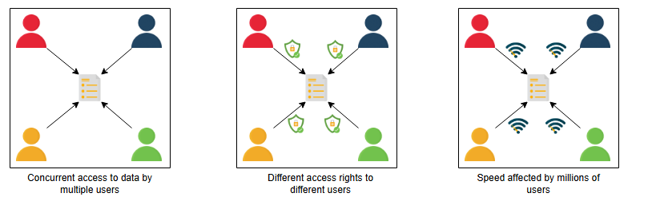
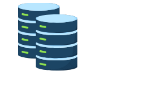
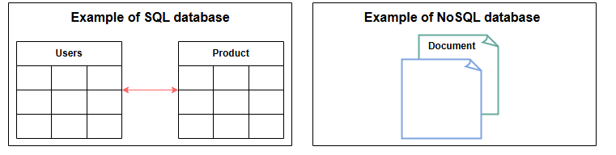

**Введение в базы данных**

Понимание того, что такое база данных и каковы ее варианты использования при проектировании систем.

**Постановка проблемы**

Давайте начнем с простого вопроса. Можем ли мы создать программное приложение, не используя базы данных? Предположим, у нас есть приложение, подобное WhatsApp. Люди используют наше приложение для общения со своими друзьями. Итак, где и как мы можем постоянно хранить информацию (список имен людей и их сообщения) и извлекать ее?

Мы можем использовать простой файл для хранения всех записей на отдельных строках и извлекать их из того же файла. Но использование файла для хранения имеет некоторые ограничения.

**Ограничения файлового хранилища**
*   Мы не можем обеспечить одновременное управление для разных пользователей, обращающихся к файлам хранилища из разных мест.
*   Мы не можем предоставлять разные права доступа разным пользователям.
*   Как система будет масштабироваться и оставаться доступной при добавлении тысяч записей?
*   Как мы будем искать контент для разных пользователей за короткое время?

**Решение**

Вышеупомянутые ограничения можно устранить с помощью баз данных.

База данных — это организованная совокупность данных, которой можно легко управлять и к которой можно легко получить доступ. Базы данных создаются для упрощения хранения, извлечения, изменения и удаления данных в связи с различными процедурами их обработки.

Примерами приложений, где мы используем управление базами данных, являются банковские системы, интернет-магазины и так далее. Разные организации имеют базы данных разного размера в соответствии со своими потребностями.

**Примечание:** Согласно одному из источников, Всемирный центр климатических данных (WDCC) является крупнейшей базой данных в мире. Он содержит 220 терабайт веб-данных и 6 петабайт дополнительных данных.

Существует два основных типа баз данных:

*   **SQL (реляционные базы данных)**
*   **NoSQL (нереляционные базы данных)**

Они различаются по предполагаемому сценарию использования, типу хранимой информации и используемому методу хранения.

Реляционные базы данных, подобно телефонным справочникам, которые хранят контактные номера и адреса, являются организованными и имеют предопределенные схемы. Нереляционные базы данных, подобно файловым каталогам, которые хранят все что угодно — от контактной информации человека до его покупательских предпочтений — неструктурированы, разрозненны и имеют динамическую схему. Мы подробно обсудим их различия и типы в следующем уроке.

**Преимущества**

Правильно организованная база данных необходима для любого бизнеса или организации. Это связано с тем, что база данных хранит всю важную информацию об организации, такую как записи о персонале, транзакции, информация о зарплате и так далее. Ниже приведены некоторые причины, по которым база данных важна:

*   **Управление большими объемами данных:** С помощью базы данных можно легко обрабатывать большие объемы данных, что было бы невозможно с использованием других инструментов.
*   **Получение точных данных (согласованность данных):** Благодаря различным ограничениям в базах данных мы можем получать точные данные в любое время.
*   **Простота обновления:** Обновлять данные в базах данных довольно просто с помощью языка манипулирования данными (DML).
*   **Безопасность:** Базы данных обеспечивают безопасность данных. База данных разрешает доступ к данным только авторизованным пользователям.
*   **Целостность данных:** Базы данных обеспечивают целостность данных, используя различные ограничения для данных.
*   **Доступность:** Базы данных могут быть реплицированы (с помощью репликации данных) на разные серверы, которые могут обновляться одновременно. Эти реплики обеспечивают доступность.
*   **Масштабируемость:** Базы данных разделяются (с помощью секционирования данных) для управления нагрузкой на один узел. Это повышает масштабируемость.

**Как мы будем рассказывать о базах данных?**
Мы разделили главу о базах данных на четыре урока:

1.  **Типы баз данных:** Мы обсудим различные типы баз данных, их преимущества и недостатки.
2.  **Репликация данных:** Мы обсудим, что такое репликация данных, и ее различные модели с их плюсами и минусами.
3.  **Секционирование данных:** Мы обсудим, что такое секционирование данных, и его различные модели с их плюсами и минусами.
4.  **Анализ затрат и выгод:** Мы обсудим, какой подход к шардированию баз данных лучше всего подходит для различных типов баз данных.

Давайте начнем с изучения различных типов баз данных и предпочитаемых сценариев их использования.