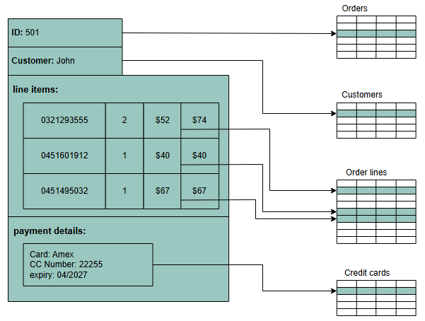
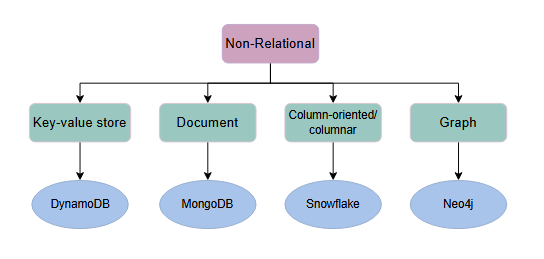
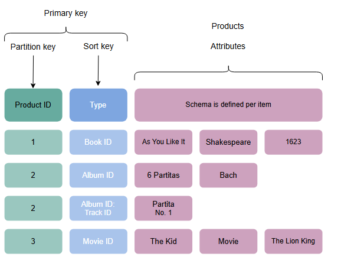
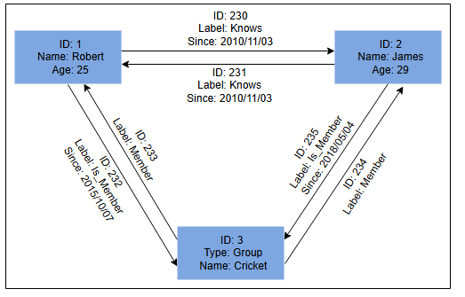
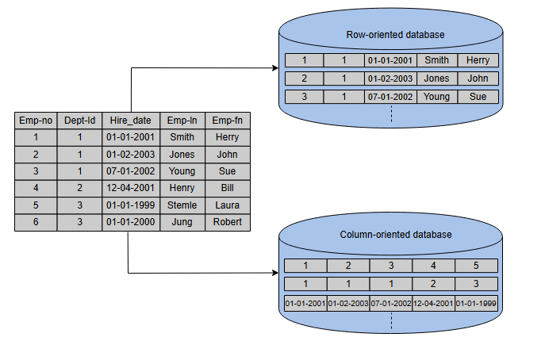

**Типы баз данных**

Понимание различных типов баз данных и их вариантов использования при проектировании систем.

Как мы уже обсуждали, базы данных делятся на два типа: реляционные и нереляционные. Давайте подробно рассмотрим эти типы.

**Реляционные базы данных**

Реляционные базы данных придерживаются определенных схем перед сохранением данных. Данные, хранящиеся в реляционных базах данных, имеют
заранее заданную структуру. В основном, эта модель организует данные в одно или несколько отношений (также называемых таблицами), с
уникальным ключом для каждого кортежа (экземпляра). Каждая сущность данных состоит из экземпляров и атрибутов, где экземпляры хранятся в
строках, а атрибуты каждого экземпляра — в столбцах. Поскольку каждый кортеж имеет уникальный ключ, кортеж в одной таблице может быть связан
с кортежем в других таблицах путем хранения первичных ключей в этих таблицах; такие ключи обычно называют внешними ключами.

Для манипулирования базой данных используется язык структурированных запросов (SQL). Это включает вставку, удаление и извлечение данных.

Существует несколько причин популярности и доминирования реляционных баз данных, среди которых простота, надежность, гибкость,
производительность, масштабируемость и совместимость в управлении общими данными.

Реляционные базы данных обеспечивают свойства **атомарности, согласованности, изолированности и долговечности (ACID)** для поддержания
целостности базы данных. ACID — это мощная абстракция, которая упрощает сложные взаимодействия с данными и скрывает множество аномалий (
таких как грязные чтения, грязные записи, рассогласование чтения, потерянные обновления, рассогласование записи и фантомные чтения) за
простым откатом транзакции.

Но по своей сути ACID — это как большой молоток, разработанный так, чтобы быть достаточно универсальным для всех проблем. Если какому-то
конкретному приложению нужно бороться лишь с несколькими аномалиями, появляется возможность использовать индивидуальное решение для
повышения производительности, хотя это и добавляет сложности.

Давайте подробно рассмотрим ACID:

* **Атомарность (Atomicity):** Транзакция рассматривается как атомарная единица. Следовательно, либо все операторы в рамках транзакции будут
  успешно выполнены, либо ни один из них не будет выполнен. Если оператор в транзакции завершается сбоем, транзакция должна быть прервана и
  отменена (rolled back).
* **Согласованность (Consistency):** В любой момент времени база данных должна находиться в согласованном состоянии, и она должна оставаться
  в согласованном состоянии после каждой транзакции. Например, если несколько пользователей хотят просмотреть запись из базы данных, они
  должны каждый раз получать одинаковый результат.
* **Изолированность (Isolation):** В случае одновременного выполнения нескольких транзакций, они не должны влиять друг на друга. Конечное
  состояние базы данных должно быть таким же, как если бы транзакции выполнялись последовательно.
* **Долговечность (Durability):** Система должна гарантировать, что завершенные транзакции навсегда сохранятся в базе данных даже в случае
  сбоев системы.

Для определения схемы реляционной базы данных, а также для других операций, таких как хранение, извлечение и выполнение SQL-запросов к
данным, используются различные системы управления базами данных (СУБД). Некоторые из популярных СУБД:

* MySQL
* Oracle Database
* Microsoft SQL Server
* IBM DB2
* Postgres
* SQLite

**Почему реляционные базы данных?**

Реляционные базы данных являются выбором по умолчанию для специалистов по разработке программного обеспечения при хранении структурированных
данных. У этих баз данных есть ряд преимуществ. Одной из величайших сил реляционной базы данных являются ее абстракции ACID-транзакций и
связанная с ними семантика программирования. Это делает использование реляционной базы данных очень удобным для конечного программиста.
Давайте рассмотрим некоторые важные особенности реляционных баз данных:

* **Гибкость:** В контексте SQL язык определения данных (DDL) предоставляет нам гибкость для изменения базы данных, включая таблицы,
  столбцы, переименование таблиц и другие изменения. DDL даже позволяет нам изменять схему во время выполнения других запросов и работы
  сервера базы данных.
* **Уменьшение избыточности:** Одним из самых больших преимуществ реляционной базы данных является устранение избыточности данных.
  Информация, относящаяся к определенной сущности, появляется в одной таблице, в то время как соответствующие данные для этой сущности
  появляются в других таблицах, связанных через внешние ключи. Этот процесс называется нормализацией и имеет дополнительное преимущество в
  устранении несогласованной зависимости.
* **Конкурентность:** Конкурентность является важным фактором при проектировании корпоративной базы данных. В таком случае данные читаются и
  записываются многими пользователями одновременно. Нам необходимо координировать такие взаимодействия, чтобы избежать несогласованности
  данных, например, двойного бронирования гостиничных номеров. Конкурентность в реляционной базе данных управляется через транзакционный
  доступ к данным. Как объяснялось ранее, транзакция считается атомарной операцией, поэтому она также работает при обработке ошибок,
  откатывая или фиксируя транзакцию при успешном выполнении.
* **Интеграция:** Процесс агрегации данных из нескольких источников является обычной практикой в корпоративных приложениях. Распространенный
  способ выполнения этой агрегации — интеграция общей базы данных, где несколько приложений хранят свои данные. Таким образом, все
  приложения могут легко получать доступ к данным друг друга, в то время как меры контроля конкурентности управляют доступом нескольких
  приложений.
* **Резервное копирование и аварийное восстановление:** Реляционные базы данных гарантируют, что состояние данных согласовано в любой момент
  времени. Операции экспорта и импорта облегчают резервное копирование и восстановление. Большинство облачных реляционных баз данных
  выполняют непрерывное зеркалирование, чтобы избежать потери данных и сделать процесс восстановления проще и быстрее.

**Недостаток**

* **Несоответствие импеданса (Impedance Mismatch):** Несоответствие импеданса — это различие между реляционной моделью и структурами данных
  в памяти. Реляционная модель организует данные в табличную структуру с отношениями и кортежами. SQL-операции над этими структурированными
  данными возвращают отношения, соответствующие реляционной алгебре. Однако у этого есть некоторые ограничения. В частности, значения в
  таблице принимают простые значения, которые не могут быть структурой или списком. В памяти дело обстоит иначе, где может храниться сложная
  структура данных. Чтобы сделать сложные структуры совместимыми с отношениями, нам потребуется преобразование данных в свете реляционной
  алгебры. Таким образом, несоответствие импеданса требует преобразования между двумя представлениями, как показано на следующем рисунке:

**Почему нереляционные (NoSQL) базы данных?**

NoSQL-база данных предназначена для различных моделей данных для доступа и управления данными. Существуют различные типы NoSQL-баз данных,
которые мы объясним в следующем разделе. Эти базы данных используются в приложениях, требующих большого объема полуструктурированных и
неструктурированных данных, низкой задержки и гибких моделей данных. Этого можно достичь, ослабив некоторые ограничения по согласованности
данных других баз данных. Ниже приведены некоторые характеристики NoSQL-баз данных:

* **Простая архитектура:** В отличие от реляционных баз данных, NoSQL не требует борьбы с несоответствием импеданса — например, можно
  хранить все данные сотрудников в одном документе вместо нескольких таблиц, требующих операций соединения (join). Эта стратегия упрощает и
  облегчает написание меньшего количества кода, отладку и поддержку.
* **Горизонтальное масштабирование:** В первую очередь NoSQL предпочитают из-за его способности запускать базы данных на большом кластере.
  Это решает проблему, когда количество одновременных пользователей увеличивается. NoSQL упрощает горизонтальное масштабирование, поскольку
  данные, относящиеся к конкретному сотруднику, хранятся в одном документе, а не в нескольких таблицах на разных узлах. NoSQL-базы данных
  часто автоматически распределяют данные по нескольким узлам и балансируют данные и запросы между ними. В случае сбоя узла его можно
  прозрачно заменить без прерывания работы приложения.
* **Доступность:** Для повышения доступности данных замена узла может быть выполнена без простоя приложения. Большинство вариантов
  нереляционных баз данных поддерживают репликацию данных для обеспечения высокой доступности и аварийного восстановления.
* **Поддержка неструктурированных и полуструктурированных данных:** Многие NoSQL-базы данных работают с данными, у которых нет схемы на
  момент конфигурации базы данных или записи данных. Например, документо-ориентированные базы данных не имеют строгой структуры; они
  позволяют документам (JSON, XML, BSON и т.д.) иметь разные поля. Например, один JSON-документ может иметь меньше полей, чем другой.
* **Стоимость:** Лицензии на многие РСУБД довольно дороги, в то время как многие NoSQL-базы данных являются открытыми и бесплатными.
  Аналогично, некоторые РСУБД полагаются на дорогое проприетарное оборудование и системы хранения, в то время как NoSQL-базы данных обычно
  используют кластеры недорогих стандартных серверов.

NoSQL-базы данных делятся на различные категории в зависимости от характера операций и функций, включая хранилища типа "ключ-значение",
колоночные базы данных, документо-ориентированные и графовые базы данных. Мы обсудим каждую из них вместе с их вариантами использования с
точки зрения проектирования систем в следующих разделах.

**Типы NoSQL-баз данных**

Ниже описаны различные типы NoSQL-баз данных:

* **База данных "ключ-значение" (Key-value database):**

Базы данных типа "ключ-значение" используют методы, подобные хэш-таблицам, для хранения данных в парах "ключ-значение". Это можно увидеть на
рисунке ниже. Здесь ключ служит уникальным или первичным ключом, а значения могут быть чем угодно, от простых скалярных значений до сложных
объектов. Эти базы данных позволяют легко секционировать и горизонтально масштабировать данные. Некоторые популярные базы данных "
ключ-значение" включают Amazon DynamoDB, Redis и Memcached DB.

**Вариант использования:** Базы данных "ключ-значение" эффективны для приложений, ориентированных на сессии. Такие приложения, как
веб-приложения, хранят данные пользователей в основной памяти или в базе данных во время сессии. Эти данные могут включать информацию о
профиле пользователя, рекомендации, целевые акции, скидки и многое другое. Каждой сессии пользователя присваивается уникальный ID (ключ) для
легкого доступа и хранения. Поэтому лучшим выбором для хранения таких данных является база данных "ключ-значение".

На следующем рисунке показан пример базы данных "ключ-значение". ID продукта и тип товара вместе считаются первичным ключом. Это
рассматривается как ключ для этой базы данных "ключ-значение". Кроме того, схема для хранения атрибутов товара определяется на основе
характера товара и количества его атрибутов.

* **Документо-ориентированная база данных (Document database):**

Документо-ориентированная база данных предназначена для хранения и извлечения документов в форматах, таких как XML, JSON, BSON и т.д. Эти
документы состоят из иерархической древовидной структуры данных, которая может включать карты, коллекции и скалярные значения. Документы в
этом типе базы данных могут иметь различную структуру и данные. Примерами документо-ориентированных баз данных являются MongoDB и Google
Cloud Firestore.

* **Вариант использования:** Документо-ориентированные базы данных подходят для неструктурированных каталожных данных, таких как JSON-файлы
  или другие сложные иерархические данные. Например, в приложениях электронной коммерции товар имеет тысячи атрибутов, что нецелесообразно
  хранить в реляционной базе данных из-за влияния на производительность чтения. Здесь на помощь приходит документо-ориентированная база
  данных, которая может эффективно хранить каждый атрибут в одном файле для удобного управления и более быстрой скорости чтения. Кроме того,
  это хороший вариант для приложений управления контентом, таких как блоги и видеоплатформы. Сущность, необходимая для приложения, хранится
  как один документ в таких приложениях.

В следующем примере показаны данные, хранящиеся в документе JSON. Это данные о человеке. В файле хранятся различные атрибуты, включая id,
имя, email и так далее.

**Графовая база данных (Graph database):**

Графовые базы данных используют графовую структуру данных для хранения данных, где узлы представляют сущности, а ребра показывают
отношения между сущностями. Организация узлов на основе отношений приводит к интересным закономерностям между узлами. Эта база данных
позволяет нам хранить данные один раз, а затем интерпретировать их по-разному на основе отношений. Популярные графовые базы данных
включают Neo4J, OrientDB и InfiniteGraph. Графовые данные хранятся в файлах хранилища для постоянного хранения. Каждый из файлов содержит
данные для определенной части графа, такой как узлы, связи, свойства и т.д.

На следующем рисунке некоторые данные хранятся с использованием графовой структуры данных в узлах, соединенных друг с другом через ребра,
представляющие отношения между узлами. Каждый узел имеет некоторые свойства, такие как Имя, ID и Возраст. Узел с ID: 2 имеет имя James и
возраст 29 лет.

**Вариант использования:** Графовые базы данных могут использоваться в социальных приложениях и предоставлять интересные факты и цифры
   о различных типах пользователей и их действиях. Основное внимание графовых баз данных уделяется хранению данных и созданию
   возможностей для анализа и принятия решений на основе отношений между сущностями. Природа графовых баз данных делает их подходящими
   для различных приложений, таких как регулирование данных и конфиденциальность, исследования в области машинного обучения, приложения
   на основе финансовых услуг и многих других.

**Колоночная база данных (Columnar database):**

  Колоночные базы данных организуют данные по столбцам, а не по строкам. Такая конструкция делает извлечение конкретных полей намного
  быстрее и эффективнее, что особенно полезно при выполнении аналитики или агрегировании больших наборов данных. В результате они хорошо
  подходят для систем, где данные часто читаются, но реже обновляются. Популярные колоночные базы данных включают Amazon Redshift, Google
  BigQuery и Snowflake, которые широко используются для высокопроизводительной аналитики и хранилищ данных.

**Вариант использования:** Эти базы данных превосходно справляются с аналитическими задачами, которые включают обработку больших
      объемов данных, такими как агрегация или анализ тенденций. Например, в финансовых системах, которым необходимо рассчитать общие суммы
      транзакций за определенный период, колоночная база данных может быстро извлечь только поле "сумма", не загружая несвязанные данные,
      такие как имена клиентов или даты.

**Примечание:** Другой тип базы данных, который часто путают с колоночными, — это **ширококолоночная база данных (wide-column database)**.
  В то время как колоночные базы данных хранят данные каждого столбца вместе на диске для ускорения аналитических запросов и агрегаций,
  ширококолоночные базы данных, такие как Apache Cassandra и HBase, организуют данные в строках, сгруппированных в семейства столбцов, что
  делает их более подходящими для рабочих нагрузок с высокой интенсивностью записи и для гибких, полуструктурированных данных.

На следующем рисунке показан пример колоночной базы данных, где данные хранятся в колоночно-ориентированном формате. Это отличается от
  реляционных баз данных, которые хранят данные в строчно-ориентированном виде:

**Недостатки NoSQL-баз данных**

* **Отсутствие стандартизации:** NoSQL не следует какому-либо конкретному стандарту, как реляционные базы данных следуют реляционной
  алгебре. Перенос приложений с одного типа NoSQL-базы данных на другой может быть проблемой.
* **Согласованность:** NoSQL-базы данных предлагают различные продукты, основанные на конкретных компромиссах между согласованностью и
  доступностью в случае возможных сбоев. Мы не получим строгой целостности данных, как первичная и ссылочная целостность в реляционной базе
  данных. Данные могут быть не строго согласованными(strongly consistent), а медленно сходящимися, используя слабую модель, такую как конечная согласованность (eventual consistency).

---
*Давайте оценим наше понимание содержания урока с помощью следующего вопроса.*

*Представьте, что мы проектируем систему рекомендаций для социальной сети с миллионами пользователей. Цель состоит в том, чтобы
предоставлять персонализированные рекомендации пользователям для установления контактов с другими на основе их интересов, действий и связей.
Какая база данных наилучшим образом подойдет для моделирования и выполнения запросов к сложным взаимосвязям в социальной сети и почему?*

    
Ответ

    Лучшим выбором для моделирования и анализа сложных взаимосвязей в системе рекомендаций социальных сетей является графовая база данных. Этот тип базы данных разработан специально для эффективной обработки взаимосвязанных данных, используя узлы для представления пользователей, интересов или действий, а ребра - для представления их взаимосвязей. Это позволяет быстро просматривать эти взаимосвязи, что важно для выработки персонализированных рекомендаций на основе сложной сети связей. Графические базы данных также отличаются гибкостью благодаря динамическим схемам и возможностью масштабирования для больших наборов данных, что делает их идеальными для платформ социальных сетей. Продолжайте изучать!

---

**Выберите правильную базу данных**

На выбор базы данных для использования в приложении влияют различные факторы. Сравнение между реляционными и нереляционными базами данных
представлено в следующей таблице, чтобы помочь нам сделать выбор:

| Реляционная база данных                                                   | Нереляционная база данных                                      |
|:--------------------------------------------------------------------------|:---------------------------------------------------------------|
| Если хранимые данные структурированы                                      | Если хранимые данные неструктурированы                         |
| Если требуются свойства ACID                                              | Если есть необходимость сериализовать и десериализовать данные |
| Если размер данных относительно невелик и может поместиться на одном узле | Если размер хранимых данных велик                              |

**Примечание:** Когда NoSQL-базы данных только появились, программирование для них и их использование кардинально отличались от традиционных
баз данных. Однако благодаря обширным исследованиям в академической и промышленной сферах за последние годы, различия, видимые программисту,
между NoSQL и традиционными хранилищами стираются. Мы можем использовать те же SQL-конструкции для взаимодействия с NoSQL-хранилищем и
получать такой же уровень производительности и согласованности, как и в традиционном хранилище. Google Cloud Spanner — одна из таких баз
данных, которая геореплицируема, с автоматическим горизонтальным шардингом и возможностью создания высокоскоростных глобальных снимков
данных.

**Тест**
Проверьте свои знания о различных типах баз данных с помощью теста.

1) Какую базу данных следует использовать, если у нас есть неструктурированные данные и требуется высокая производительность?

    А. MongoDB
    
    Б. MySQL
    
    В. Oracle

2) В каких случаях нам следует избегать выбора реляционной базы данных для нашего приложения?

    A. Когда мы пишем приложение, которое рассчитано на обработку большого количества операций чтения-записи и одновременных пользователей, но строгая согласованность не требуется

    B. Когда мы пишем финансовое приложение, например, приложение для торговли акциями, и нам нужно, чтобы наши данные всегда были согласованными

    C. Когда мы пишем приложение для хранения большого количества сложных структурированных данных

3) Какую базу данных нам следует использовать, если мы создаем приложение для розничного магазина, требующее хранения данных в табличном формате?

    A.Реляционная база данных

    B. Нереляционная база данных

4) Какую базу данных мы должны использовать для создания приложения, подобного Facebook?

    A. Реляционная база данных
    
    B. Нереляционная база данных

5) (Выберите все, что применимо.) Для каких приложений нам следует использовать базу данных, ориентированную на документы?

    A. Многопользовательские игры в Интернете
    
    B. Банковское приложение, требующее согласованности
    
    C. Приложение социальной сети, например Facebook, содержащее сложные взаимосвязи
    
    D. Каналы в режиме реального времени

6) (Выберите все, что применимо.) Для каких сценариев нам следует использовать базу данных "ключ-значение"?

    А. Когда мы создаем социальную сеть, подобную Facebook, с множеством сложных взаимосвязей
    
    Б. Когда нам нужно сохранить состояние пользователя в нашем приложении
    
    C. Когда мы реализуем кэширование в нашем приложении