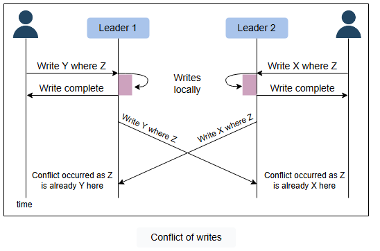

**Репликация данных**

Понимание моделей, с помощью которых данные реплицируются между несколькими узлами.

Данные являются активом для организации, потому что они двигают весь бизнес. Данные предоставляют критически важные бизнес-инсайты о том,
что важно и что нуждается в изменении. Организациям также необходимо безопасно сохранять и предоставлять данные своих клиентов по
требованию. Своевременный доступ к необходимым данным в различных условиях (увеличение числа чтений и записей, сбои дисков и узлов,
отключения сети и электропитания и т.д.) необходим для успешного ведения онлайн-бизнеса.

Нам требуются следующие характеристики от нашего хранилища данных:

* **Доступность** при сбоях (Availability under faults) (отказ некоторых дисков, узлов, а также отключения сети и электропитания).
* **Масштабируемость (Scalability)** (при увеличении числа чтений, записей и других операций).
* **Производительность (Performance)** (низкая задержка и высокая пропускная способность для клиентов).

Достичь вышеуказанных характеристик на одном узле сложно, а то и вовсе невозможно.

**Репликация**

Репликация означает хранение нескольких копий данных на различных узлах (предпочтительно географически распределенных) для достижения
доступности, масштабируемости и производительности. В этом уроке мы предполагаем, что одного узла достаточно для хранения всех наших данных.
Мы не будем использовать это предположение при обсуждении секционирования данных на несколько узлов. Часто концепции репликации и
секционирования идут рука об руку.

Однако, наряду с множеством преимуществ, таких как доступность, репликация сопряжена со своими сложностями. Репликация относительно проста,
если реплицируемые данные не требуют частых изменений. Основная проблема репликации возникает, когда нам необходимо поддерживать изменения в
реплицированных данных с течением времени.

Дополнительные сложности, которые могут возникнуть из-за репликации, следующие:

* Как поддерживать согласованность нескольких копий данных друг с другом?
* Как справляться с отказавшими узлами-репликами?
* Следует ли реплицировать синхронно или асинхронно?
* Как справляться с задержкой репликации в случае асинхронной репликации?
* Как обрабатывать одновременные записи?
* Какую модель согласованности необходимо предоставить конечным программистам?

В этом уроке мы рассмотрим ответы на эти вопросы.

Прежде чем мы объясним различные типы репликации, давайте разберемся в синхронном и асинхронном подходах к репликации.

**Синхронная и асинхронная репликация**

Существует два способа распространения изменений на узлы-реплики:

* **Синхронная репликация**
* **Асинхронная репликация**

При **синхронной репликации** основной узел (primary) ожидает подтверждений от вторичных узлов (secondary) об обновлении данных. После
получения подтверждения от всех вторичных узлов основной узел сообщает об успехе клиенту. В то время как при **асинхронной репликации**
основной узел не ждет подтверждения от вторичных узлов и сообщает об успехе клиенту после обновления самого себя.

Преимущество синхронной репликации в том, что все вторичные узлы полностью синхронизированы с основным узлом. Однако у этого подхода есть и
недостаток. Если один из вторичных узлов не отправляет подтверждение из-за сбоя или неисправности в сети, основной узел не сможет
подтвердить операцию клиенту до тех пор, пока не получит успешное подтверждение от вышедшего из строя узла. Это вызывает высокую задержку в
ответе от основного узла к клиенту.

С другой стороны, преимущество асинхронной репликации заключается в том, что основной узел может продолжать свою работу, даже если все
вторичные узлы вышли из строя. Однако, если основной узел откажет, записи, которые не были скопированы на вторичные узлы, будут потеряны.

Вышеупомянутый абзац объясняет компромисс между согласованностью данных и доступностью, когда различные компоненты системы могут выходить из
строя.

---
*Давайте оценим наше понимание материала этого урока с помощью следующего вопроса:*

*Представьте, что вы руководите архитектурой базы данных для финансовой торговой платформы, работающей в режиме реального времени по всему
миру. Платформа требует обновления данных с чрезвычайно низкой задержкой, чтобы трейдеры получали самую свежую информацию для принятия
решений за доли секунды. Существующая инфраструктура базы данных с трудом справляется со строгими требованиями к задержке. В этом случае
низкая задержка имеет первостепенное значение, и определенная степень конечной согласованности (eventual consistency) приемлема. Какой из
двух следующих вариантов вы бы порекомендовали для обновления данных в базе данных и почему?*

* *Синхронные обновления*
* *Асинхронные обновления*

      
Ответ

В этом случае лучшим выбором является асинхронное обновление. Поскольку низкая задержка имеет решающее значение, а некоторая согласованность в конечном итоге является приемлемой, асинхронная репликация позволяет основной базе данных продолжать обработку, не дожидаясь подтверждений от вспомогательных узлов. Это сокращает задержку и гарантирует трейдерам оперативное получение обновлений данных в режиме реального времени. Синхронные обновления, обеспечивая немедленную согласованность, могут привести к задержкам, если вторичные узлы работают медленно или не отвечают на запросы, что не идеально для высокоскоростной торговой среды. Продолжайте изучать!

---

**Модели репликации данных**

Теперь давайте обсудим различные механизмы репликации данных. В этом разделе мы обсудим следующие модели, а также их сильные и слабые
стороны:

* Репликация с одним лидером (primary-secondary)
* Репликация с несколькими лидерами (multi-leader)
* Одноранговая репликация (peer-to-peer или leaderless)

**Репликация с одним лидером / primary-secondary**

При репликации primary-secondary данные реплицируются на несколько узлов. Один узел назначается **основным (primary)**. Он отвечает за
обработку любых записей данных, хранящихся в кластере. Он также отправляет все записи на **вторичные узлы (secondary)** и поддерживает их в
синхронизированном состоянии.

Репликация primary-secondary подходит, когда наша рабочая нагрузка в основном состоит из операций чтения. Для лучшего масштабирования при
увеличении числа читателей мы можем добавить больше ведомых узлов (followers) и распределить нагрузку чтения между доступными ведомыми.
Однако репликация данных на множество ведомых узлов может сделать основной узел узким местом. Кроме того, репликация primary-secondary не
подходит, если наша рабочая нагрузка в основном состоит из операций записи.

Еще одним преимуществом репликации primary-secondary является ее **устойчивость к чтению (read resilient)**. Вторичные узлы все еще могут
обрабатывать запросы на чтение в случае отказа основного узла. Поэтому это полезный подход для приложений с интенсивным чтением.

Репликация с помощью этого подхода сопряжена с несогласованностью, если мы используем асинхронную репликацию. Клиенты, читающие с разных
реплик, могут видеть несогласованные данные в случае отказа основного узла, который не смог распространить обновленные данные на вторичные
узлы. Таким образом, если основной узел выходит из строя, любые пропущенные обновления, не переданные на вторичные узлы, могут быть
потеряны.

**Вопрос на размышление**

1. *Что происходит, когда основной узел выходит из строя?*

    
Ответ

В случае выхода из строя основного узла в качестве основного может быть назначен дополнительный узел, что ускоряет процесс восстановления исходного основного узла. Существует два подхода к выбору нового основного узла: ручной и автоматический.
    
При ручном подходе оператор решает, какой узел должен быть основным, и уведомляет об этом все второстепенные узлы.
    
При автоматическом подходе, когда второстепенные узлы обнаруживают, что основной узел вышел из строя, они назначают новый основной узел путем проведения выборов, известных как выборы лидера.

---

### **Методы репликации primary-secondary**

Существует много различных методов репликации в модели primary-secondary:

* Репликация на основе операторов (Statement-based replication)
* Пересылка журнала упреждающей записи (Write-ahead log (WAL) shipping)
* Логическая (построчная) репликация (Logical (row-based) replication)

Давайте подробно обсудим каждый из них.

**Репликация на основе операторов (Statement-based replication)**

Репликация на основе операторов (SBR) — это подход, используемый в базах данных MySQL. В этом подходе основной узел выполняет SQL-операторы,
такие как `INSERT`, `UPDATE`, `DELETE` и т.д., а затем эти операторы записываются в лог-файл. На следующем шаге лог-файл отправляется на
вторичные узлы для выполнения. Этот тип репликации использовался в MySQL до версии 5.1.

Хотя этот тип репликации кажется хорошим, у него есть и недостатки. Например, любые недетерминированные функции, такие как `NOW()`, могут
привести к различным записям на основном и вторичных узлах.

**Примечание:** Функция `NOW()` возвращает текущую дату и время в соответствии с системными часами.

**Пересылка журнала упреждающей записи (Write-ahead log (WAL) shipping)**

Пересылка WAL — это техника репликации данных, используемая как в PostgreSQL, так и в Oracle. В этой технике, когда происходит транзакция,
она сначала записывается в файл транзакционного журнала, и этот лог-файл записывается на диск. Впоследствии записанные операции выполняются
на основной базе данных, прежде чем быть переданными на вторичные узлы для выполнения. В отличие от SBR, WAL сохраняет в лог-файле
транзакционные логи, а не SQL-операторы, обеспечивая согласованность при работе с недетерминированными функциями. Запись на диск также
помогает при восстановлении в случае сбоев.

Например, когда в PostgreSQL выполняется операция, такая как `UPDATE`, она сначала записывается в файл транзакционного журнала и на диск,
прежде чем применяться к базе данных. Эта запись в транзакционном журнале может включать такие детали, как ID транзакции, тип операции,
затронутая таблица и новые значения, после чего изменения реплицируются на вторичные узлы. Однако недостатком WAL является его тесная связь
с внутренней структурой движка базы данных, что усложняет обновление программного обеспечения на ведущем и ведомых узлах.

**Логическая (построчная) репликация (Logical (row-based) replication)**

Логическая (построчная) репликация используется в различных реляционных базах данных, включая PostgreSQL и MySQL. В этом подходе изменения,
вносимые в базу данных, фиксируются на уровне отдельных строк, а затем реплицируются на вторичные узлы. Вместо репликации фактических
физических изменений, внесенных в базу данных, этот подход фиксирует операции в логическом формате, а затем выполняет их на вторичных узлах.

Например, при выполнении операций, таких как `INSERT` или `UPDATE`, на основном узле фиксируется вся затронутая строка, содержащая все
значения столбцов указанной строки. Это зафиксированное изменение затем выполняется на вторичных узлах, где они обеспечивают, что данные
остаются согласованными с данными на основном узле. Это предлагает преимущества в плане гибкости и совместимости с различными типами схем.

### **Репликация с несколькими лидерами (Multi-leader)**

Как обсуждалось выше, репликация с одним лидером, использующая асинхронную репликацию, имеет недостаток. Существует только один основной
узел, и все записи должны проходить через него, что ограничивает производительность. В случае отказа основного узла вторичные узлы могут не
иметь обновленной базы данных.

Репликация с несколькими лидерами является альтернативой репликации с одним лидером. Существует несколько основных узлов, которые
обрабатывают записи и отправляют их всем остальным основным и вторичным узлам для репликации. Этот тип репликации используется в базах
данных вместе с внешними инструментами, такими как Tungsten Replicator для MySQL.

Этот вид репликации весьма полезен в приложениях, в которых мы можем продолжать работу, даже если находимся в офлайне, например, в
приложении-календаре, где мы можем назначать встречи, даже не имея доступа к интернету. Как только мы выходим в онлайн, оно реплицирует свои
изменения из нашей локальной базы данных (наш мобильный телефон или ноутбук выступает в роли основного узла) на другие узлы.

**Конфликт**

Репликация с несколькими лидерами обеспечивает лучшую производительность и масштабируемость, чем репликация с одним лидером, но у нее также
есть существенный недостаток. Поскольку все основные узлы одновременно обрабатывают запросы на запись, они могут изменять одни и те же
данные, что может создать конфликт между ними. Например, предположим, что одни и те же данные редактируются двумя клиентами одновременно. В
этом случае их записи будут успешно выполнены на их соответствующих основных узлах, но когда они асинхронно достигнут других основных узлов,
это создаст конфликт.

**Обработка конфликтов**

Конфликты могут привести к тому, что на разных узлах будут разные данные. Их следует эффективно обрабатывать, не теряя никаких данных.
Давайте обсудим некоторые подходы к обработке конфликтов:

* **Избегание конфликтов (Conflict avoidance):** Простая стратегия борьбы с конфликтами — предотвратить их возникновение. Конфликтов можно
  избежать, если приложение может гарантировать, что все записи для данной записи проходят через одного и того же лидера. Однако конфликт
  все же может возникнуть, если пользователь переезжает в другое место и теперь находится рядом с другим дата-центром. Если это произойдет,
  нам нужно перенаправить трафик. В таких сценариях подход избегания конфликтов не срабатывает и приводит к одновременным записям.
* **Побеждает последняя запись (Last-write-wins):** Используя свои локальные часы, все узлы присваивают временную метку каждому обновлению.
  При возникновении конфликта выбирается обновление с самой последней временной меткой. Этот подход также может создавать трудности,
  поскольку синхронизация часов между узлами в распределенных системах является сложной задачей. Существует расхождение часов (clock skew),
  которое может привести к потере данных.
* **Пользовательская логика (Custom logic):** В этом подходе мы можем написать собственную логику для обработки конфликтов в соответствии с
  потребностями нашего приложения. Эта пользовательская логика может выполняться как при чтении, так и при записи. Когда система
  обнаруживает конфликт, она вызывает наш пользовательский обработчик конфликтов.

**Топологии репликации с несколькими лидерами**

Существует много топологий, через которые реализуется репликация с несколькими лидерами, такие как кольцевая топология, топология "звезда" и
топология "все со всеми". Наиболее распространенной является топология "все со всеми". В топологиях "звезда" и "кольцо" снова возникает
аналогичный недостаток: если один из узлов выходит из строя, это может повлиять на всю систему. Вот почему топология "все со всеми" является
наиболее используемой.

### **Одноранговая/безлидерная репликация (Peer-to-peer/leaderless)**

При репликации primary-secondary основной узел является узким местом и единственной точкой отказа. Более того, он помогает достичь
масштабируемости чтения, но не обеспечивает масштабируемость записи. Модель одноранговой репликации решает эти проблемы, не имея одного
основного узла. Все узлы имеют одинаковый вес и могут принимать запросы на чтение и запись. Эта схема репликации встречается в базе данных
Cassandra.

Как и репликация primary-secondary, эта репликация также может приводить к несогласованности. Это происходит потому, что когда несколько
узлов принимают запросы на запись, это может привести к одновременным записям. Полезным подходом, используемым для решения проблемы
несогласованности при одновременной записи, является **кворум (quorums)**.

**Кворумы**

Предположим, у нас есть три узла. Если гарантируется, что как минимум два из трех узлов вернут успешные обновления, это означает, что
отказал только один узел. Это значит, что если мы читаем с двух узлов, по крайней мере у одного из них будет обновленная версия, и наша
система сможет продолжать работу.

Если у нас есть **n** узлов, то каждая запись должна быть обновлена как минимум на **w** узлах, чтобы считаться успешной, и мы должны читать
с **r** узлов. Мы получим обновленное значение при чтении, пока **w + r > n**, потому что по крайней мере у одного из узлов должна быть
обновленная запись, с которой мы можем прочитать. Чтения и записи по кворуму придерживаются этих значений **r** и **w**. Эти **n**, **w** и
**r** настраиваются в базах данных в стиле Dynamo.

---
**Технический тест**

1. *Какой механизм репликации является наиболее подходящим (высокая пропускная способность, низкая задержка для клиента, низкие затраты на
   реализацию), когда наша рабочая нагрузка в основном состоит из операций чтения?*

    * *A. Репликация primary-secondary / с одним лидером*
    * *B. Репликация с несколькими лидерами*
    * *C. Одноранговая репликация*