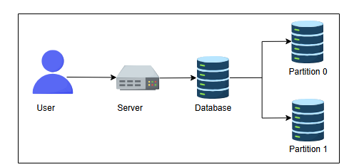
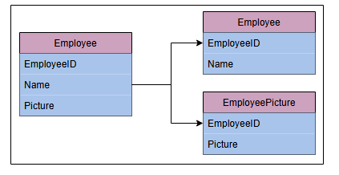
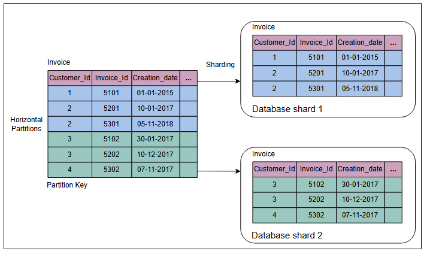
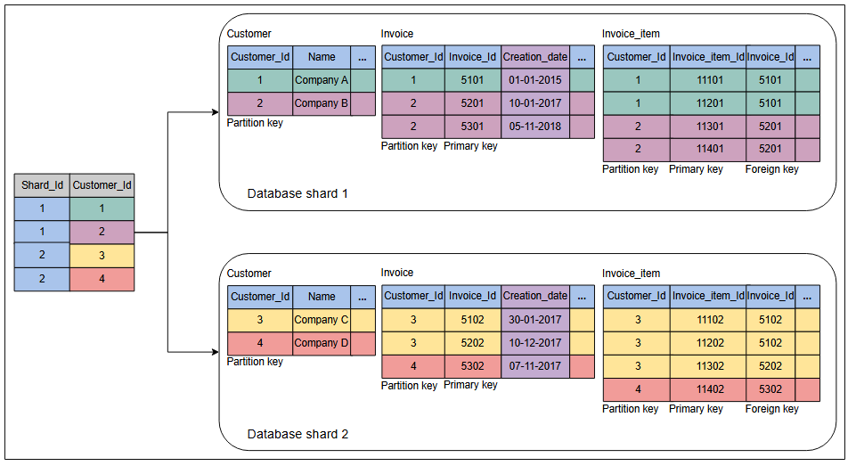
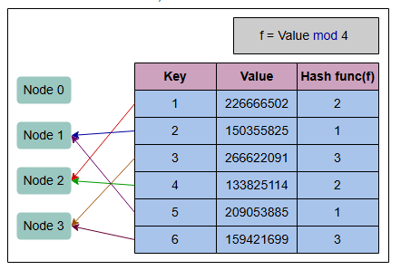
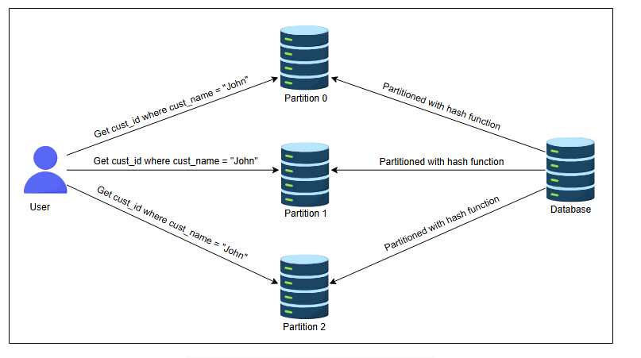
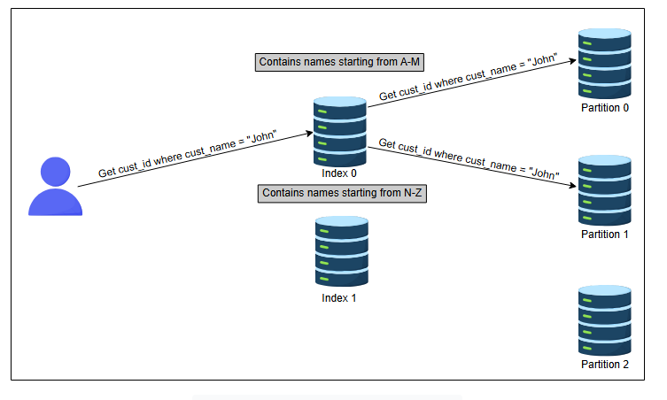
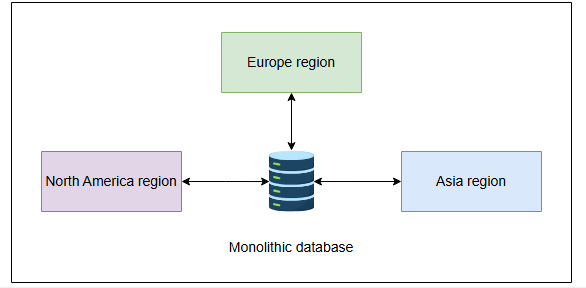

**Секционирование данных**

Изучение моделей секционирования данных, а также их преимуществ и недостатков.

**Зачем мы секционируем данные?**

Данные — это актив для любой организации. Растущий объем данных и одновременный трафик чтения/записи создают нагрузку на масштабируемость традиционных баз данных. В результате страдают задержка и пропускная способность. Традиционные базы данных привлекательны благодаря своим свойствам, таким как запросы по диапазону, вторичные индексы и транзакции со свойствами ACID.

В какой-то момент базы данных на одном узле становится недостаточно для обработки нагрузки. Нам может потребоваться распределить данные по многим узлам, но при этом сохранить все полезные свойства реляционных баз данных. На практике оказалось сложно обеспечить свойства, подобные одноузловой базе данных, в распределенной базе данных.

Одно из решений — перенести данные в систему типа NoSQL. Однако историческая кодовая база и ее тесная связь с традиционными базами данных делают решение этой проблемы дорогостоящим.

Организации могут масштабировать традиционные базы данных с помощью сторонних решений. Но часто интеграция стороннего решения сопряжена со своими сложностями. Что еще более важно, существует множество возможностей для оптимизации под конкретную задачу, что позволяет достичь гораздо лучшей производительности, чем у решения общего назначения.

**Секционирование данных (или шардинг)** позволяет нам использовать несколько узлов, где каждый узел управляет некоторой частью всех данных. Чтобы справиться с растущим количеством запросов и объемом данных, мы стремимся к сбалансированным секциям и сбалансированной нагрузке на чтение/запись.

В этом уроке мы обсудим различные способы секционирования данных, связанные с этим проблемы и их решения.

**Шардинг**

Чтобы распределить нагрузку между несколькими узлами, нам необходимо секционировать данные с помощью явления, известного как **партиционирование** или **шардинг**. При этом подходе мы разделяем большой набор данных на более мелкие фрагменты, хранящиеся на разных узлах в нашей сети.

Секционирование должно быть сбалансированным, чтобы каждая секция получала примерно одинаковое количество данных. Если секционирование несбалансированно, большинство запросов будет приходиться на несколько секций. Сильно загруженные секции создадут узкое место в системе. Эффективность секционирования пострадает, поскольку значительная часть запросов на извлечение данных будет отправляться на узлы, содержащие перегруженные секции. Такие секции известны как **горячие точки (hotspots)**. Обычно мы используем следующие два способа шардинга данных:

*   Вертикальный шардинг
*   Горизонтальный шардинг

**Вертикальный шардинг**

Мы можем разместить разные таблицы в разных экземплярах базы данных, которые могут работать на разных физических серверах. Мы можем разбить одну таблицу на несколько таблиц так, чтобы некоторые столбцы находились в одной таблице, а остальные — в другой. Следует быть осторожными, если между несколькими таблицами есть соединения (joins). Возможно, мы захотим сохранить такие таблицы вместе в одном шарде.

Часто вертикальный шардинг используется для увеличения скорости извлечения данных из таблицы, содержащей столбцы с очень широким текстом или большим двоичным объектом (BLOB). В этом случае столбец с большим текстом или BLOB выносится в отдельную таблицу.

Как показано на рисунке ниже, таблица `Employee` разделена на две таблицы: сокращенную таблицу `Employee` и таблицу `EmployeePicture`. Таблица `EmployeePicture` имеет всего два столбца, `EmployeeID` и `Picture`, отделенные от исходной таблицы. Кроме того, первичный ключ `EmployeeID` таблицы `Employee` добавлен в обе секционированные таблицы. Это упрощает чтение и запись данных, а восстановление таблицы выполняется эффективно.

Вертикальный шардинг имеет свои тонкости и больше подходит для ручного секционирования, когда заинтересованные стороны тщательно решают, как секционировать данные. В сравнении, горизонтальный шардинг подходит для автоматизации даже в динамических условиях.

**Примечание:** Создание шардов путем перемещения определенных таблиц базы данных также является формой вертикального шардинга. Обычно эти таблицы помещаются в один шард, потому что они часто появляются вместе в запросах, например, для соединений. Мы увидим пример такого использования далее в курсе.

**Горизонтальный шардинг**

Иногда некоторые таблицы в базах данных становятся слишком большими и влияют на задержку чтения/записи. Горизонтальный шардинг или секционирование используется для разделения одной таблицы на несколько таблиц путем **построчного разделения данных**, как показано на рисунке в следующем разделе. Каждая секция исходной таблицы, распределенная по серверам баз данных, называется **шардом**. Обычно доступны две стратегии:

*   Шардинг на основе диапазона ключей
*   Шардинг на основе хэширования

**Шардинг на основе диапазона ключей**

При шардинге на основе диапазона ключей каждой секции назначается непрерывный диапазон ключей.

На следующем рисунке выполняется горизонтальное секционирование таблицы `Invoice` с использованием шардинга на основе диапазона ключей с `Customer_Id` в качестве ключа секционирования. Две таблицы разного цвета представляют собой секции.

Иногда база данных состоит из нескольких таблиц, связанных отношениями по внешнему ключу. В таком случае горизонтальное секционирование выполняется с использованием одного и того же ключа секционирования для всех таблиц в отношении. Таблицы (или подтаблицы), принадлежащие одному и тому же ключу секционирования, распределяются в один шард базы данных. На следующем рисунке показано, что несколько таблиц с одним и тем же ключом секционирования размещены в одном шарде базы данных:

Основные методы проектирования, используемые при многотабличном шардинге, следующие:

*   В таблице сопоставления `Customer` есть ключ секционирования. Эта таблица находится на каждом шарде и хранит ключи секционирования, используемые в шарде. Приложения создают логику сопоставления между ключами секционирования и шардами базы данных, читая эту таблицу со всех шардов, чтобы сделать сопоставление эффективным. Иногда приложения используют продвинутые алгоритмы для определения местоположения ключа секционирования, принадлежащего определенному шарду.
*   Столбец ключа секционирования, `Customer_Id`, реплицируется во все другие таблицы как точка изоляции данных. Это компромисс между увеличением объема хранения и эффективным нахождением нужных шардов. Кроме того, это полезно для распределения данных и рабочей нагрузки по разным шардам базы данных. Логика маршрутизации данных использует ключ секционирования на уровне приложения для сопоставления запросов, предназначенных для определенного шарда.
*   Первичные ключи уникальны для всех шардов базы данных, чтобы избежать коллизий ключей при миграции данных между шардами и слиянии данных в среде онлайн-аналитической обработки (OLAP).
*   Столбец `Creation_date` служит точкой согласованности данных, при условии, что часы всех узлов синхронизированы. Этот столбец используется в качестве критерия для слияния данных со всех шардов в глобальное представление, когда это необходимо.

**Преимущества**
*   При использовании метода шардинга на основе диапазона ключей схема запросов по диапазону легко реализуется. Мы точно знаем, где (на каком узле, в каком шарде) искать определенный диапазон ключей.
*   Запросы по диапазону могут выполняться с использованием ключей секционирования, и они могут храниться в секциях в отсортированном порядке. Как именно происходит такая сортировка с течением времени по мере поступления новых данных, зависит от реализации.

**Недостатки**
*   Запросы по диапазону не могут выполняться с использованием ключей, отличных от ключа секционирования.
*   Если ключи выбраны неправильно, некоторым узлам, возможно, придется хранить больше данных из-за неравномерного распределения трафика.

**Шардинг на основе хэширования**

Шардинг на основе хэширования использует хэш-функцию для атрибута. Эта хэш-функция создает хэш-значение, которое используется для выполнения секционирования. Основная концепция заключается в использовании хэш-функции для ключа для получения хэш-значения, а затем взятии остатка от деления (mod) на количество секций. Как только мы нашли подходящую хэш-функцию для ключей, мы можем присвоить каждой секции диапазон хэшей (а не диапазон ключей). Любой ключ, хэш которого попадает в этот диапазон, будет храниться в этой секции.

На иллюстрации ниже мы используем хэш-функцию `Значение mod n`. `n` — это количество узлов, равное четырем. Мы распределяем ключи по узлам, проверяя остаток от деления для каждого ключа. Ключи со значением остатка 2 распределяются на узел 2. Ключи со значением остатка 1 — на узел 1. Ключи со значением остатка 3 — на узел 3. Поскольку нет ключа со значением остатка 0, узел 0 остается пустым.

**Преимущества**
*   Ключи равномерно распределены по узлам.

**Недостатки**
*   С помощью этого метода нельзя выполнять запросы по диапазону. Ключи будут разбросаны по всем секциям.

---
*Зачем вам нужны базы данных? Почему нельзя просто использовать файлы?*

      
Скрыть ответ

    Базы данных необходимы, поскольку они позволяют нам эффективно управлять большими объемами данных, обеспечивать точность и согласованность данных, упрощать обновление данных и обеспечивать безопасность. Они также поддерживают целостность данных с учетом ограничений, позволяют восстанавливать данные и создавать резервные копии, а также обеспечивают масштабируемость и быстрый поиск данных. Использование только файлов значительно усложнило бы обработку, обновление и защиту больших наборов данных и сделало бы их менее надежными. Продолжайте изучать!

---

**Примечание: Сколько шардов на базу данных?**

Эмпирически мы можем определить, сколько данных каждый узел может обслуживать с приемлемой производительностью. Это может помочь нам определить максимальный объем данных, который мы хотели бы хранить на любом одном узле. Например, если мы выясним, что можем разместить максимум 50 ГБ данных на одном узле, то получим:

Размер базы данных = 10 ТБ
Размер одного шарда = 50 ГБ
Количество шардов, на которые должна быть распределена база данных = 10 ТБ / 50 ГБ = 200 шардов

### **Консистентное хэширование**

Консистентное хэширование назначает каждому серверу или элементу в распределенной хэш-таблице место на абстрактном круге, называемом **кольцом**, независимо от количества серверов в таблице. Это позволяет серверам и объектам масштабироваться без ущерба для общей производительности системы.

**Преимущества консистентного хэширования**
*   Легко масштабироваться горизонтально.
*   Увеличивает пропускную способность и улучшает задержку приложения.

**Недостатки консистентного хэширования**
*   Случайное назначение узлов на кольце может вызвать неравномерное распределение.

### **Перебалансировка секций**

Нагрузка от запросов может быть несбалансированной между узлами по многим причинам, включая следующие:

*   Распределение данных неравномерно.
*   Слишком большая нагрузка на одну секцию.
*   Увеличение трафика запросов, и нам нужно добавить больше узлов, чтобы справиться с ним.

Мы можем применить следующие стратегии для перебалансировки секций.

**Избегайте `hash mod n`**

Обычно мы избегаем использования хэша ключа для секционирования (мы использовали такую схему ранее для простого объяснения концепции хэширования). Проблема с добавлением или удалением узлов в случае `hash mod n` заключается в том, что номер секции для каждого ключа меняется, и перемещается большое количество данных. Например, предположим, у нас `hash(key) = 1235`. Если у нас вначале пять узлов, ключ начнется на узле 0 (`1235 mod 5 = 0`). Теперь, если будет добавлен новый узел, ключ придется переместить на узел 5 (`1235 mod 6 = 5`), и так далее. Такое перемещение ключей с одного узла на другой делает перебалансировку дорогостоящей.

**Фиксированное количество секций**

При этом подходе количество создаваемых секций фиксируется в момент настройки нашей базы данных. Мы создаем большее количество секций, чем узлов, и назначаем эти секции узлам. Таким образом, когда в систему добавляется новый узел, он может забрать несколько секций у существующих узлов до тех пор, пока секции не будут разделены поровну.

У этого подхода есть недостаток. Размер каждой секции растет с общим объемом данных в кластере, поскольку все секции содержат небольшую часть общих данных. Если секция очень маленькая, это приведет к слишком большим накладным расходам, потому что нам, возможно, придется создавать большое количество небольших секций, каждая из которых будет стоить нам некоторых накладных расходов. Если секция очень большая, перебалансировка узлов и восстановление после сбоев узлов будут дорогостоящими. Очень важно выбрать правильное количество секций. Фиксированное количество секций используется в Elasticsearch, Riak и многих других.

**Динамическое секционирование**

При этом подходе, когда размер секции достигает порога, она делится поровну на две секции. Одна из двух разделенных секций назначается одному узлу, а другая — другому. Таким образом, нагрузка делится поровну. Количество секций адаптируется к общему объему данных, что является преимуществом динамического секционирования.

Однако у этого подхода есть недостаток. Трудно применять динамическую перебалансировку во время обслуживания чтений и записей. Динамическая перебалансировка во время чтений и записей сложна, поскольку включает перемещение данных между узлами, что вызывает задержки и потенциальные конфликты. Обеспечение согласованности данных (поскольку данные одновременно перемещаются и доступны) и доступности (потенциально требуя пауз в чтениях/записях во время перебалансировки) вносит сложности, которые могут повлиять на производительность и надежность системы. Этот подход используется в HBase и MongoDB.

**Секционирование пропорционально узлам**

При этом подходе количество секций пропорционально количеству узлов, что означает, что у каждого узла есть фиксированное количество секций. В предыдущих подходах количество секций зависело от размера набора данных. Здесь это не так. Пока количество узлов остается постоянным, размер каждой секции растет в соответствии с размером набора данных. Однако по мере увеличения количества узлов секции уменьшаются. Когда новый узел входит в сеть, он случайным образом разделяет определенное количество существующих секций, забирает одну половину разделения, а другую оставляет в покое. Это может привести к несправедливому разделению. Этот подход используется Cassandra и Ketama.

**Вопрос на размышление**

1.  *Кто выполняет перебалансировку? Это происходит автоматически или вручную?*

      
Ответ

Существует два способа выполнить перебалансировку: автоматический и ручной. При автоматической перебалансировке администратор не требуется. Система определяет, когда выполнять разбиение на разделы и когда перемещать данные с одного узла на другой.

При перебалансировке вручную администратор определяет, когда и как выполнять разделение. Организации выполняют перебалансировку в соответствии со своими потребностями. Некоторые используют автоматическую перебалансировку, а некоторые - ручную.

**Секционирование и вторичные индексы**

Мы обсудили схемы секционирования модели данных "ключ-значение", в которой записи извлекаются по первичным ключам. Но что, если нам нужно получить доступ к записям через **вторичные индексы**? Вторичные индексы — это способ поиска записей по значению, которое не является первичным ключом. Например, в приведенной выше иллюстрации горизонтального секционирования таблицы `customer` можно искать всех клиентов с одинаковым годом создания.

Мы можем секционировать вторичные индексы следующими способами.

**Секционирование вторичных индексов по документу**

При этом подходе к индексации каждая секция полностью независима. Каждая секция имеет свои собственные вторичные индексы, охватывающие только документы в этой секции. Она не заботится о данных, хранящихся в других секциях. Если мы хотим что-то записать в нашу базу данных, нам нужно работать только с той секцией, которая содержит ID документа, который мы записываем. Это также известно как **локальный индекс**. На иллюстрации ниже есть три секции, каждая со своей собственной идентификацией и данными. Если мы хотим получить все ID клиентов с именем "John", нам придется сделать запрос ко всем секциям.

Однако этот тип запросов по вторичным индексам может быть дорогостоящим. Из-за ограничения задержкой медленно работающей секции, задержки запросов на чтение могут увеличиться.

**Секционирование вторичных индексов по термину**

Вместо создания вторичного индекса для каждой секции (локального индекса), мы можем создать **глобальный индекс** для вторичных терминов, который охватывает данные из всех секций.

На иллюстрации ниже мы создаем индексы по именам (термину, по которому мы секционируем) и храним все индексы для имен на отдельных узлах. Чтобы получить `cust_id` всех клиентов по имени "John", мы должны определить, где находится наш индекс по термину. Индекс 0 содержит всех клиентов с именами, начинающимися с "A" до "M". Индекс 1 включает всех клиентов с именами, начинающимися с "N" до "Z". Поскольку "John" попадает в индекс 0, мы извлекаем список `cust_id` с именем "John" из индекса 0.

Секционирование вторичных индексов по термину более эффективно для чтения, чем секционирование по документу. Это потому, что оно обращается только к той секции, которая содержит термин. Однако одна запись при этом подходе затрагивает несколько секций, что делает метод интенсивным по записи и сложным.

**Маршрутизация запросов**

Мы узнали, как секционировать наши данные. Однако здесь возникает один вопрос: как клиент узнает, к какому узлу подключаться при выполнении запроса? Распределение секций по узлам меняется после перебалансировки. Если мы хотим прочитать определенный ключ, как мы узнаем, к какому IP-адресу нам нужно подключиться для чтения?

Эта проблема также известна как **обнаружение сервисов (service discovery)**. Существует несколько подходов к этой проблеме:

1.  Позволить клиентам запрашивать любой узел в сети. Если этот узел не содержит запрошенных данных, он пересылает этот запрос на узел, который содержит соответствующие данные.
2.  Второй подход содержит уровень маршрутизации. Все запросы сначала пересылаются на уровень маршрутизации, и он определяет, к какому узлу подключиться для выполнения запроса.
3.  Клиенты уже имеют информацию о секционировании и о том, какая секция к какому узлу подключена. Таким образом, они могут напрямую обращаться к узлу, который содержит нужные им данные.

Во всех этих подходах основной проблемой является определение того, как эти компоненты узнают об обновлениях в секционировании узлов.

**ZooKeeper**

Для отслеживания изменений в кластере многим распределенным системам данных требуется отдельный сервер управления, такой как **ZooKeeper**. ZooKeeper отслеживает все сопоставления в сети, и каждый узел подключается к ZooKeeper для получения информации. Всякий раз, когда происходит изменение в секционировании, или добавляется/удаляется узел, ZooKeeper обновляется и уведомляет уровень маршрутизации об изменении. HBase, Kafka и SolrCloud используют ZooKeeper.

---
*Давайте оценим наше понимание того, что описано в этом уроке, с помощью следующего вопроса:*

*Представьте, что вы архитектор баз данных для быстрорастущей платформы электронной коммерции с глобальной базой пользователей. Платформа испытывает различные уровни активности пользователей в разных регионах, как показано ниже. Существующая монолитная база данных с трудом справляется с растущей нагрузкой. Пользователи в разных регионах имеют разные наборы предпочтений и, как правило, больше взаимодействуют в пределах своих регионов. Теперь мы ищем эффективное и масштабируемое решение для оптимизации производительности, повышения масштабируемости и удовлетворения региональных различий в поведении пользователей. В связи с этим, какую из следующих стратегий вы бы выбрали и почему?*

*   *Шардинг базы данных*
*   *Репликация базы данных*

      
Ответ

Безусловно! Лучшей стратегией в данном сценарии является **шардинг базы данных**. Шардинг подразумевает горизонтальное разделение (секционирование) базы данных на более мелкие, управляемые части, называемые шардами, каждая из которых отвечает за свое подмножество данных. Этот подход помогает распределить нагрузку между несколькими серверами, улучшая масштабируемость и производительность. Он также хорошо согласуется с региональными различиями, поскольку каждый шард можно настроить под региональные данные и предпочтения пользователей, что снижает задержку и улучшает пользовательский опыт.

**Репликация базы данных** полезна для отказоустойчивости и масштабируемости чтения, но в данном контексте она не решает основную проблему обработки растущей нагрузки и регионального разделения данных так же эффективно, как это делает шардинг.

**Заключение**

Для всех современных распределенных систем секционирование стало стандартным протоколом. Поскольку системы содержат все большие объемы данных, секционирование данных имеет смысл, так как оно ускоряет как запись, так и чтение. Это повышает доступность, масштабируемость и производительность системы.