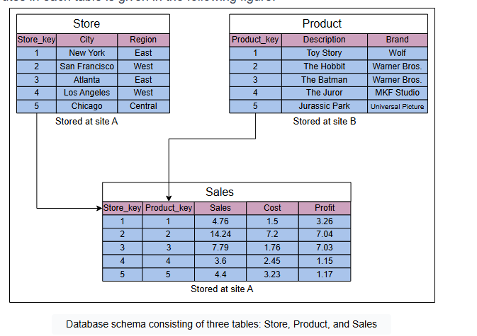

**Компромиссы в базах данных**

Изучение плюсов и минусов централизованных и распределенных баз данных, а также оптимизации запросов в распределенных базах данных.

**Какой подход к шардингу баз данных является лучшим?**

Как горизонтальный, так и вертикальный шардинг предполагают добавление ресурсов в нашу вычислительную инфраструктуру. Наши
бизнес-заинтересованные стороны должны решить, что подходит для нашей организации. Мы должны масштабировать наши ресурсы соответствующим
образом для роста нашей организации и бизнеса, чтобы предотвратить простои и уменьшить задержку. Мы можем масштабировать эти ресурсы путем
комбинации настроек процессора, требований к физической памяти, настроек жесткого диска и пропускной способности сети.

В следующих разделах объясняются плюсы и минусы централизованных и распределенных баз данных:

**Преимущества и недостатки централизованной базы данных**
**Преимущества**

* Обслуживание данных, такое как обновление и создание резервных копий централизованной базы данных, является простым.
* Централизованные базы данных обеспечивают более строгую согласованность и ACID-транзакции, чем распределенные базы данных.
* Централизованные базы данных предоставляют гораздо более простую модель программирования для конечных программистов по сравнению с
  распределенными базами данных.
* Это более эффективно для бизнесов, у которых небольшой объем данных для хранения, который может разместиться на одном узле.

**Недостатки**

* Централизованная база данных может замедляться, вызывая высокую задержку для конечных пользователей, когда количество запросов в секунду,
  обращающихся к централизованной базе данных, приближается к пределам одного узла.
* Централизованная база данных имеет единую точку отказа. Из-за этого вероятность ее недоступности гораздо выше.

**Преимущества и недостатки распределенной базы данных**
**Преимущества**

* Доступ к данным в распределенной базе данных быстрый и простой, поскольку данные извлекаются из ближайшего шарда базы данных или из того,
  который часто используется.
* Данные с разным уровнем прозрачности распределения могут храниться в отдельных местах.
* Интенсивные транзакции, состоящие из запросов, могут быть разделены на несколько оптимизированных подзапросов, которые могут
  обрабатываться параллельно.

**Недостатки**

* Иногда требуются данные с нескольких шардов, что занимает больше времени, чем ожидалось.
* Отношения (таблицы) секционируются вертикально или горизонтально между разными узлами. Поэтому операции, такие как соединения (joins),
  требуют восстановления полных отношений путем тщательного извлечения данных. Эти операции могут стать гораздо более дорогими и сложными.
* Трудно поддерживать согласованность данных между шардами в распределенной базе данных, и это требует дополнительных мер.
* Обновления и резервное копирование в распределенных базах данных требуют времени для синхронизации данных.

**Оптимизация запросов и скорость обработки в распределенной базе данных**

Транзакция в распределенной базе данных зависит от типа запроса, количества задействованных шардов, скорости связи и других
факторов, таких как базовое оборудование и тип используемой базы данных. Однако в качестве примера давайте предположим запрос, обращающийся
к трем таблицам: `Store`, `Product` и `Sales`, находящимся на разных шардах.

Количество атрибутов в каждой таблице приведено на следующем рисунке:



Предположим, что распределение таблиц по разным шардам следующее:

* Таблица `Store` содержит 10 000 кортежей и хранится на шарде A.
* Таблица `Product` содержит 100 000 кортежей и хранится на шарде B.
* Таблица `Sales` содержит 1 миллион кортежей и хранится на шарде A.

Теперь предположим, что нам нужно обработать следующий запрос:

```sql
Select Store_key
from (Store JOIN Sales JOIN Product)
where Region = 'East'
  AND Brand = 'Wolf';
```

Вышеуказанный запрос выполняет операции соединения для таблиц `Store`, `Sales` и `Product` и извлекает значения `Store_key` из таблицы,
полученной в результате операций соединения.

Далее предположим, что каждый хранящийся кортеж имеет длину 200 бит. Это равно 25 байтам. Кроме того, предполагаемые кардинальности
некоторых промежуточных результатов следующие:

* Количество товаров бренда 'Wolf' — 10.
* Количество магазинов в регионе 'East' — 3000 (поскольку в таблице `Store` 10 000 строк, и 3000 из них имеют регион 'East').

Предположения о связи следующие:

* Скорость передачи данных = 50 Мбит в секунду
* Задержка доступа = 0,1 секунды

**Предположения о параметрах**
Прежде чем обрабатывать запрос с использованием разных подходов, давайте определим некоторые параметры:

* `a` = Общая задержка доступа
* `b` = Скорость передачи данных
* `v` = Общий объем данных

Теперь давайте вычислим общее время связи, `T`, по следующей формуле:

T = a + v/b

Давайте рассмотрим следующие возможные подходы к выполнению запроса.

**Возможные подходы**

1. **Переместить таблицу `Product` на шард A и обработать запрос на шарде A.**

   T = 0,1 + (100 000 × 200) / 50 000 000 = 0,5 секунды

   Здесь 0,1 — это задержка доступа к таблице на шарде A, а 100 000 — количество кортежей в таблице `Product`. Размер каждого кортежа в
   битах — 200, а 50 000 000 — скорость передачи данных. Значения 200 и 50 000 000 одинаковы для всех следующих расчетов.

2. **Переместить `Store` и `Sales` на шард B и обработать запрос на шарде B:**

   T = 0,2 + ((10 000 + 1 000 000) × 200) / 50 000 000 = 4,24 секунды

   Здесь 0,2 — это задержка доступа к таблицам `Store` и `Sales`. Числа 10 000 и 1 000 000 — это количество кортежей в таблицах `Store`
   и `Sales` соответственно.

3. **Ограничить (выбрать) на шарде B записи с `Brand`='Wolf' (это называется выборкой) и переместить результат на шард A:**

   T = 0,1 + (10 × 200) / 50 000 000 ≈ 0,1 секунды

   Здесь 0,1 — это задержка доступа к таблице `Product`. Количество товаров бренда 'Wolf' — 10, отсюда и количество кортежей.

При сравнении трех подходов третий подход обеспечивает наименьшую задержку (0,1 секунды). Мы не рассчитывали фильтрацию на шарде A, потому
что количество строк будет намного больше, и, следовательно, объем данных будет больше, чем в третьем случае (фильтрация на шарде B и затем
получение данных). Этот пример показывает, что тщательная оптимизация запросов также критически важна в распределенной базе данных.

**Заключение**
Распределение данных (вертикальный и горизонтальный шардинг) по нескольким узлам направлено на улучшение следующих характеристик, при
условии, что запросы оптимизированы:

* Надежность (отказоустойчивость)
* Производительность
* Сбалансированная емкость хранения и денежные затраты

Как централизованные, так и распределенные базы данных имеют свои плюсы и минусы. Мы должны выбирать их в соответствии с потребностями
нашего приложения.