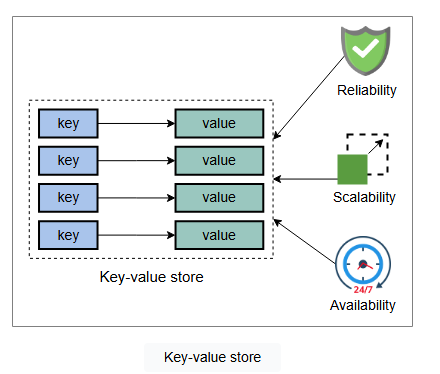

### Проектирование систем: Хранилище «ключ-значение»

Давайте разберемся в основах проектирования хранилища «ключ-значение».

#### Введение в хранилища «ключ-значение»

Хранилища «ключ-значение» — это распределенные хеш-таблицы (DHT). Ключ генерируется хеш-функцией и должен быть уникальным. В хранилище «ключ-значение» ключ связывается с определенным значением и не предполагает ничего о структуре этого значения. Значением может быть BLOB-объект, изображение, имя сервера или все что угодно, что пользователь хочет сохранить под уникальным ключом.

Обычно размер значения предпочтительно оставлять относительно небольшим (от КБ до МБ). Мы можем помещать большие данные в BLOB-хранилище, а в поле значения — ссылки на эти данные. Хранилища «ключ-значение» полезны во многих ситуациях, например, для хранения пользовательских сессий в веб-приложениях и создания баз данных NoSQL.

Масштабировать традиционные базы данных с их строгой согласованностью и высокой доступностью в распределенной среде — сложная задача. Многие реальные сервисы, такие как Amazon, Facebook, Instagram, Netflix и многие другие, используют доступ к хранилищу данных по первичному ключу вместо традиционных баз данных для оперативной обработки транзакций (OLTP). Примеры использования хранилищ «ключ-значение» включают: списки бестселлеров, корзины покупок, предпочтения клиентов, управление сессиями, рейтинги продаж и каталоги товаров.

Распределенная хэш-таблица (DHT) - это децентрализованная система хранения, которая предоставляет схемы поиска и хранения, аналогичные хэш-таблице, для хранения пар ключ-значение.

Оперативная обработка транзакций (OLTP) включает в себя сбор входной информации, обработку данных и обновление существующих данных для отражения собранной и обработанной информации. Базы данных OLTP выполняют повседневные задачи, такие как вставка, обновление и удаление данных в базе данных.

**Примечание:** Многим приложениям может не требоваться богатая модель программирования, предоставляемая традиционными реляционными системами управления базами данных (RDBMS/СУРБД). Использование RDBMS для таких приложений часто является дорогостоящим с точки зрения затрат и производительности.

#### Как мы будем проектировать хранилище «ключ-значение»?

Мы разделили проектирование системы «ключ-значение» на следующие четыре урока:

1.  **Проектирование хранилища «ключ-значение»:** Мы определим требования к хранилищу «ключ-значение» и спроектируем API.
2.  **Обеспечение масштабируемости и репликации:** Мы узнаем, как достичь масштабируемости с помощью консистентного хеширования и как реплицировать секционированные данные.
3.  **Версионирование данных и достижение настраиваемости:** Мы научимся разрешать конфликты, возникающие из-за изменений, внесенных несколькими сторонами, и сделаем нашу систему более настраиваемой для различных сценариев использования.
4.  **Обеспечение отказоустойчивости и обнаружение сбоев:** Мы узнаем, как сделать хранилище «ключ-значение» отказоустойчивым и как обнаруживать сбои в системе.