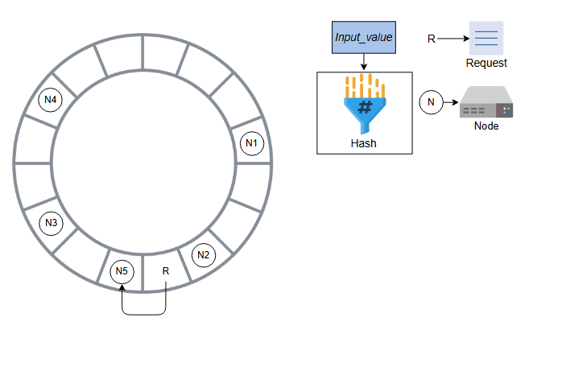

### Обеспечение масштабируемости и репликации

Узнайте, как консистентное хеширование обеспечивает масштабируемость и как мы реплицируем такие секционированные данные.

### Добавление масштабируемости

Давайте начнем с одного из ключевых требований к проектированию: масштабируемости. Мы храним данные «ключ-значение» на узлах хранения. При изменении спроса нам может потребоваться добавлять или удалять узлы хранения. Это означает, что нам нужно секционировать (partition) данные по узлам в системе, чтобы распределить нагрузку между всеми узлами.

Например, представим, что у нас есть четыре узла, и мы хотим, чтобы 25% запросов направлялись на каждый узел для равномерного распределения нагрузки. Традиционный способ решения этой задачи — использование оператора деления по модулю. Каждый поступающий запрос имеет связанный с ним ключ. Когда запрос приходит, мы вычисляем хеш ключа. Затем мы находим остаток, взяв результат хеширования по модулю от количества узлов `m`. Значение остатка `x` — это номер узла, и мы отправляем запрос на этот узел для обработки.

Следующие слайды объясняют этот процесс:

1) Мы получаем хэш ключа и берем модуль с количеством узлов, чтобы найти узел, который должен обработать запрос

2) Мы выполняем необходимые операции с ключом, чтобы получить узел

3) Узел 2 обработает запрос

Мы хотим добавлять и удалять узлы с минимальными изменениями в нашей инфраструктуре. Но при таком методе, когда мы добавляем или удаляем узел, нам приходится перемещать очень много ключей. Это неэффективно. Например, узел 2 удален, и предположим, что для того же ключа новым сервером для обработки запроса станет узел 1, потому что `10 % 3 = 1`. Узлы хранят информацию в своих локальных кешах, например, ключи и их значения. Поэтому нам нужно переместить данные этого запроса на следующий узел, который должен его обработать. Но такая репликация может быть дорогостоящей и вызывать большие задержки.

Далее мы узнаем, как эффективно копировать данные.

>
> 1.  Почему мы не использовали балансировщики нагрузки для распределения запросов по всем узлам?
> 

>   
Ответ

> Подсистемы балансировки нагрузки распределяют клиентские запросы в соответствии с определенным алгоритмом. Этот алгоритм может быть простым, как описано выше, или более подробным, как описано в следующем разделе. Следующий метод, который мы обсудим, может быть одним из способов, с помощью которых подсистемы балансировки нагрузки распределяют запросы между узлами.
> 

### Консистентное хеширование

Консистентное хеширование — это эффективный способ управления нагрузкой на множество узлов. В консистентном хешировании мы представляем, что у нас есть концептуальное кольцо хешей от `0` до `n−1`, где `n` — это количество доступных значений хеша. Мы используем ID каждого узла, вычисляем его хеш и размещаем его на кольце. Тот же процесс мы применяем к запросам. Каждый запрос выполняется следующим узлом, который он находит, двигаясь по кольцу в направлении по часовой стрелке.

Каждый раз, когда в кольцо добавляется новый узел, это затрагивает только следующий за ним узел. Ему приходится делиться своими данными с только что добавленным узлом, в то время как другие узлы остаются незатронутыми. Это упрощает масштабирование, поскольку мы можем свести изменения на наших узлах к минимуму. Это происходит потому, что перемещать нужно лишь небольшую часть от общего количества ключей. Хеши распределяются случайным образом, поэтому мы ожидаем, что нагрузка от запросов будет случайной и в среднем равномерно распределенной по кольцу.

Вот текст, извлеченный из элементов `` и переведенный на русский язык:

1. Рассмотрим концептуальное кольцо хешей от 0 до n-1, где n — это общее количество хеш-значений в кольце.
   
3. Хеш для Node1 вычисляется, и Node1 добавляется в кольцо.
   
3. Хеш для Node2 вычисляется, и Node2 добавляется в кольцо.
   
4. Хеши для других узлов вычисляются, и узлы добавляются в кольцо.
   
5. Аналогичным образом, хеш вычисляется для ключа, и запрос добавляется в кольцо.

6. Запрос выполняется следующим узлом, который находится при движении по часовой стрелке.
   
7. Хеш вычисляется для следующего запроса, и запрос добавляется в кольцо.
   
8. Запрос выполняется N2, так как это следующий узел в направлении по часовой стрелке.
   
9. Хеш вычисляется для нового запроса, и запрос добавляется в кольцо.
   
10. Запрос выполняется N3, так как это следующий узел в направлении по часовой стрелке.
    
11. Хеш вычисляется для нового узла, Node5, который добавляется в кольцо.
    
12. N3 передает ключи от N2 до N5 узлу N5, так как это ответственность N5 обрабатывать запросы, которые приходят после N2 и до N5.
    
14. Хеш вычисляется для нового запроса, и запрос добавляется в кольцо.
    
15. Запрос обрабатывается N5 вместо N3, так как N5 является следующим узлом в направлении по часовой стрелке.
    

Основное преимущество консистентного хеширования заключается в том, что при добавлении или удалении узлов оно гарантирует, что перемещать нужно минимальное количество ключей. Однако на практике нагрузка от запросов распределяется не совсем равномерно. Любой сервер, который обрабатывает большой объем данных, может стать узким местом в распределенной системе. Этот узел будет получать непропорционально большую долю запросов на хранение и извлечение данных, что снижает общую производительность системы. Такие узлы называют **горячими точками (hotspots)**.

Как показано на рисунке ниже, большинство запросов находится между узлами N4 и N1. Теперь N1 должен обрабатывать большинство запросов по сравнению с другими узлами, и он стал горячей точкой. Это означает, что неравномерное распределение нагрузки увеличило нагрузку на один сервер.

**Примечание:** Полезное упражнение — подумать о возможных решениях проблемы неравномерного распределения нагрузки, прежде чем читать дальше.

### Использование виртуальных узлов

Мы будем использовать виртуальные узлы, чтобы обеспечить более равномерное распределение нагрузки по узлам. Вместо того чтобы применять одну хеш-функцию, мы будем применять несколько хеш-функций к одному и тому же ключу.

Рассмотрим пример. Допустим, у нас есть три хеш-функции. Для каждого узла мы вычисляем три хеша и размещаем их на кольце. Для запроса мы используем только одну хеш-функцию. Где бы запрос ни оказался на кольце, он обрабатывается следующим узлом, найденным при движении по часовой стрелке. У каждого сервера есть три позиции, поэтому нагрузка от запросов распределяется более равномерно. Более того, если узел имеет большую аппаратную мощность, чем другие, мы можем добавить больше виртуальных узлов, используя дополнительные хеш-функции. Таким образом, у него будет больше позиций на кольце, и он сможет обслуживать больше запросов.

Вот текст, извлеченный из элементов `` и переведенный на русский язык:

1. Вычислите хеш для Node1 с использованием Hash 1 и поместите узел в кольцо.

2. Вычислите хеш для первого виртуального узла Node1 с использованием Hash 2 и поместите узел в кольцо.

4. Вычислите хеш для второго виртуального узла Node1 с использованием Hash 3 и поместите узел в кольцо.

5. Вычислите хеш для Node2 с использованием Hash 1 и поместите узел в кольцо.

6. Вычислите хеш для первого виртуального узла Node2 с использованием Hash 2 и поместите узел в кольцо.

7. Вычислите хеш для второго виртуального узла Node2 с использованием Hash 3 и поместите узел в кольцо.

8. Вычислите хеш для запроса с использованием Hash 1 и поместите запрос в кольцо.

9. Запрос будет обработан первым виртуальным узлом Node1, так как запросы обрабатываются в направлении по часовой стрелке.

### Преимущества виртуальных узлов

Ниже приведены некоторые преимущества использования виртуальных узлов:

*   Если узел выходит из строя или находится на плановом обслуживании, рабочая нагрузка равномерно распределяется по другим узлам. Когда он возвращается в онлайн или добавляется в систему, другие узлы получают почти равную нагрузку.
*   Каждый узел сам решает, за сколько виртуальных узлов он отвечает, учитывая гетерогенность (неоднородность) физической инфраструктуры. Например, если узел имеет примерно вдвое большую вычислительную мощность по сравнению с другими, он может взять на себя больше нагрузки.

Мы сделали предлагаемый проект хранилища «ключ-значение» масштабируемым. Следующая задача — сделать нашу систему высокодоступной.

>
> Опишите, как хранилище «ключ-значение» может поддерживать инкрементальную масштабируемость без нарушения доступности сервиса. Как добиться постепенной масштабируемости?
> 

>     
Ответ

> Хранилище "ключ-значение" может поддерживать постепенную масштабируемость без нарушения доступности сервиса, используя такие методы, как согласованное хэширование, для эффективного перераспределения ключей при добавлении или удалении узлов, сводя к минимуму перемещение данных. Кроме того, использование виртуальных узлов помогает сократить объем данных, которые необходимо переносить при масштабировании. Перенос данных может выполняться в фоновом режиме с минимальным воздействием на активные операции, а переадресация данных на чтение/запись обеспечивает бесперебойную обработку текущих запросов во время перехода.
> 

#### Репликация данных

У нас есть различные методы для репликации хранилища. Это может быть либо отношение «первичный-вторичный» (primary-secondary), либо одноранговое (peer-to-peer) отношение.

##### Подход «первичный-вторичный»

В подходе «первичный-вторичный» одна из областей хранения является первичной, а остальные — вторичными. Вторичные реплицируют свои данные с первичной. Первичная обслуживает запросы на запись, а вторичные — запросы на чтение. После записи возникает задержка репликации. Кроме того, если первичный узел выходит из строя, мы не можем производить запись в хранилище, и он становится единой точкой отказа.

>
> 1.  Соответствует ли подход «первичный-вторичный» требованиям к хранилищу «ключ-значение», которые мы определили в уроке «Проектирование систем: Хранилище «ключ-значение»»?
> 

>     
Ответ

>  Одно из наших требований заключается в том, что нам нужна возможность постоянной записи. Этот подход хорош для опции "всегда читать". Однако этот подход не предусматривает возможности постоянной записи, поскольку это приведет к перегрузке основного хранилища. Более того, если основной сервер выходит из строя, нам необходимо обновить дополнительный до основного. Это снизит доступность записи, поскольку мы не будем разрешать запись во время переключения.
> 

##### Одноранговый подход (Peer-to-peer)

В одноранговом подходе все задействованные области хранения являются первичными и реплицируют данные друг с другом, чтобы оставаться в актуальном состоянии. И чтение, и запись разрешены на всех узлах. Обычно репликация на все `n` узлов неэффективна и дорогостояща. Вместо этого для количества узлов, на которые производится репликация, обычно выбирают три или пять.

Ф

Мы будем использовать одноранговое отношение для репликации. Мы будем реплицировать данные на несколько хостов для достижения долговечности (durability) и высокой доступности. Каждый элемент данных будет реплицирован на `n` хостов, где `n` — это параметр, настраиваемый для каждого экземпляра хранилища «ключ-значение». Например, если мы выберем `n` равным `5`, это означает, что мы хотим, чтобы наши данные были реплицированы на пять узлов.

Каждый узел будет реплицировать свои данные на другие узлы. Мы будем называть **координатором** узел, который обрабатывает операции чтения или записи. Он несет прямую ответственность за ключи. Узел-координатор назначается для ключа «K». Он также отвечает за репликацию ключей на `n−1` последующих узлов на кольце (по часовой стрелке). Эти списки последующих виртуальных узлов называются **списками предпочтений (preference lists)**. Чтобы избежать размещения реплик на одних и тех же физических узлах, список предпочтений может пропускать те виртуальные узлы, чей физический узел уже есть в списке.

Рассмотрим иллюстрацию ниже. У нас есть фактор репликации, `n`, установленный в 3. Для ключа «K» репликация выполняется на следующие три узла: B, C и D. Аналогично, для ключа «L» репликация выполняется на узлы C, D и E.

>
> 1.  Каково влияние синхронной или асинхронной репликации?
> 

>    
Ответ

>     При синхронной репликации скорость записи низкая, поскольку данные должны быть реплицированы на все узлы перед подтверждением пользователя. Это влияет на нашу доступность, поэтому мы не можем ее применить. Когда мы выбираем асинхронную репликацию, это позволяет нам выполнять быструю запись на узлы.
> 

В контексте теоремы CAP, хранилища «ключ-значение» могут быть либо согласованными, либо доступными при наличии сетевых разделений. Для хранилищ «ключ-значение» мы предпочитаем доступность согласованности. Это означает, что если два узла хранения потеряли соединение для репликации, они продолжат обрабатывать отправленные им запросы, а когда соединение восстановится, они синхронизируются. В период отсутствия связи весьма вероятно, что данные на узлах станут несогласованными. Поэтому нам нужно разрешать такие конфликты. В следующем уроке мы изучим концепцию для обработки несогласованностей с помощью версионирования наших данных.