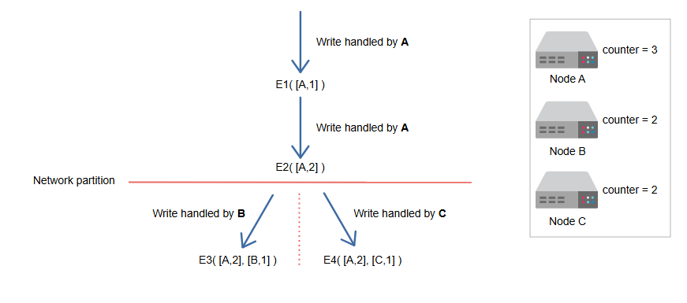
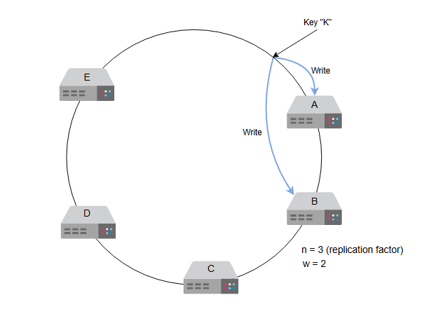

### Версионирование данных и обеспечение настраиваемости

Узнайте, как разрешать конфликты с помощью версионирования и как сделать хранилище «ключ-значение» настраиваемым сервисом.

---

### Версионирование данных

Когда во время обновления происходят сетевые разделения и сбои узлов, **история версий** (Журнал версий содержит подробную информацию об
объектах, которые были изменены) объекта может стать фрагментированной. В результате это требует от системы усилий по согласованию.
Необходимо создать способ, который явно допускает возможность существования нескольких копий одних и тех же данных, чтобы избежать потери
каких-либо обновлений. Крайне важно понимать, что некоторые сценарии сбоев могут привести к появлению в системе нескольких копий одних и тех
же данных. Эти копии могут быть одинаковыми или расходящимися. Разрешение конфликтов между этими расходящимися историями является
существенным и критически важным для обеспечения согласованности.

1. Два узла реплицируют свои данные при обработке запросов.
   
2. Сетевое соединение между двумя узлами разрывается.
   
3. Оба узла продолжают обрабатывать запросы.
   
4. Соединение восстановлено, но данные в обоих узлах не обязательно одинаковы.
   

Чтобы справиться с несогласованностью, нам необходимо поддерживать причинно-следственную связь между событиями. Мы можем сделать это с
помощью временных меток и обновлять все конфликтующие значения значением из последнего запроса. Но время в распределенной системе не
является надежным, поэтому мы не можем использовать его в качестве решающего фактора.

Другой подход для эффективного поддержания причинно-следственной связи — использование векторных часов. **Векторные часы** — это список
пар (узел, счетчик). Для каждой версии объекта существует одни векторные часы. Если у двух объектов разные векторные часы, мы можем
определить, связаны ли они причинно-следственной связью (подробнее об этом чуть позже). Если одно из двух изменений не будет согласовано,
считается, что они находятся в конфликте.

> **Вопрос для размышления:**
> Объясните, как метаданные, такие как версионирование и контрольные суммы (которые обнаруживают повреждение данных), помогают поддерживать
> целостность и согласованность данных в хранилище «ключ-значение».
> <details>
>     <summary>Ответ</summary>
> Такие метаданные, как управление версиями и контрольные суммы, жизненно важны для поддержания целостности и согласованности данных в хранилище ключей и значений.
>
>    Управление версиями помогает отслеживать изменения в данных, упрощая разрешение конфликтов во время репликации и обеспечивая клиентам
> возможность идентифицировать самую последнюю версию данных в конечном итоге в согласованных системах.
>
> Контрольные суммы проверяют, что данные не были подделаны или повреждены во время передачи или хранения, обеспечивая целостность данных.
> Обычно они вычисляются после сжатия или шифрования, чтобы соответствовать формату сохраненных данных.
>
> В совокупности эти механизмы повышают надежность и поддерживают восстановление в распределенных средах.
> </details> 

---

### Изменение дизайна API

Мы говорили о том, как можно определить, связаны ли два события причинно-следственной связью, используя значение векторных часов. Для этого
нам нужна информация о том, какой узел выполнял операцию ранее и каким было значение его векторных часов. Это и есть **контекст** операции.
Поэтому мы изменим наш дизайн API следующим образом.

Вызов API для получения значения должен выглядеть так:

```
get(key)
```

| Параметр | Описание                                          |
|:---------|:--------------------------------------------------|
| `key`    | Это `key`, по которому мы хотим получить `value`. |

Мы возвращаем объект или коллекцию конфликтующих объектов вместе с `context`. `Сontext` содержит закодированные метаданные об объекте,
включая такие детали, как его версия.

Вызов API для помещения значения в систему должен выглядеть так:

```
put(key, context, value)
```

| Параметр  | Описание                                                  |
|:----------|:----------------------------------------------------------|
| `key`     | Это `key`, по которому мы должны сохранить `value`.       |
| `context` | Содержит метаданные для каждого объекта.                  |
| `value`   | Объект, который необходимо сохранить по указанному `key`. |

Функция находит узел, куда следует поместить значение на основе `key`, и сохраняет связанное с ним значение. `Сontext` возвращается системой
после операции `get`. Если в `context` у нас есть список объектов, вызывающий конфликт, мы попросим **клиента** разрешить его.

Чтобы обновить объект в хранилище «ключ-значение», клиент должен предоставить `context`. Мы определяем информацию о версии с помощью
векторных часов, предоставляя `context` из предыдущей операции чтения. Если хранилище «ключ-значение» имеет доступ к нескольким веткам, оно
при обработке запроса на чтение предоставляет все объекты, находящиеся в конечных узлах (листьях), вместе с их соответствующей информацией о
версии в контексте. Согласование различных версий и их слияние в одну новую версию считается обновлением.

> **Примечание:** Этот процесс разрешения конфликтов схож с тем, как это делается в Git. Если Git способен объединить несколько версий в
> одну, слияние выполняется автоматически. Если автоматическое разрешение конфликтов невозможно, то клиент (разработчик) должен разрешить их
> вручную. Аналогичным образом наша система может попытаться выполнить автоматическое разрешение конфликтов и, если это невозможно, попросить
> приложение предоставить окончательное разрешенное значение.

---

### Пример использования векторных часов

Рассмотрим пример. Допустим, у нас есть запрос на операцию записи. Узел **A** обрабатывает первую версию запроса на запись, **E1** (где E —
это событие). Соответствующие векторные часы содержат информацию об узле и его счетчике, то есть **[A, 1]**. Узел **A** обрабатывает еще
одну запись для того же объекта. Таким образом, для **E2** мы имеем **[A, 2]**. **E1** больше не требуется, поскольку **E2** является
обновлением на том же узле. **E2** считывает изменения, внесенные **E1**, а затем вносятся новые изменения.

Предположим, происходит сетевое разделение. Теперь запрос обрабатывается двумя разными узлами, **B** и **C**. В системе появляются
обновленные версии **E3** и **E4** и их соответствующие часы: **([A, 2], [B, 1])** и **([A, 2], [C, 1])**.

Допустим, сетевое разделение устранено, и клиент снова запрашивает запись, но теперь у нас есть конфликты. Клиенту возвращается контекст
конфликтов **([A, 2], [B, 1], [C, 1])**. После того как клиент выполняет согласование, а узел **A** координирует запись, мы получаем **E5**
с часами **([A, 3], [B, 1], [C, 1])**.


1. Предположим, что у нас есть три узла. Счетчик векторных часов установлен на 1 для всех из них.


2. Узел A обрабатывает первую версию запроса на запись, E1, и счетчик векторных часов увеличивается на 1.


3. Узел A обрабатывает вторую версию запроса на запись, E2, и счетчик векторных часов увеличивается на 2.


4. Предположим, что происходит сетевое разделение.


5. Теперь запрос обрабатывается узлами B и C, и их соответствующие счетчики векторных часов увеличиваются.


6. Предположим, что сеть теперь восстановлена.


7. Запрос отправляется узлу A для обработки, но теперь в нем есть конфликты. Мы просим клиента разрешить его.


8. Запрос обновляется после согласования.


---

### Компромисс с ограничениями векторных часов

Размер векторных часов может увеличиваться, если несколько серверов одновременно записывают данные в один и тот же объект. На практике это
маловероятно, поскольку запись обычно обрабатывается одним из `n` верхних узлов в списке предпочтений.

Однако, если возникают сетевые разделения или множественные сбои серверов, запросы на запись могут обрабатываться узлами, не входящими в `n`
верхних узлов списка предпочтений. В результате мы можем получить длинную историю версий,
например: `([A,10], [B,4], [C,1], [D,2], [E,1], [F,3], [G,5], [H,7], [I,2], [J,2], [K,1], [L,1])`. Хранить и поддерживать такую длинную
историю версий — хлопотно.

В таких ситуациях мы можем ограничить размер векторных часов. Мы используем стратегию усечения часов, сохраняя временную метку с каждой
парой (узел, счетчик), чтобы показать, когда элемент данных был в последний раз обновлен этим узлом. Пары векторных часов удаляются, когда
их количество превышает заданный порог (скажем, 10). Этот подход к усечению может привести к снижению эффективности согласования, поскольку
связи наследования не могут быть точно вычислены.

---

### Операции `get` и `put`

Одним из наших функциональных требований является настраиваемость системы. Мы хотим контролировать компромиссы между доступностью,
согласованностью, экономической эффективностью и производительностью. Давайте достигнем настраиваемости, реализовав базовые функции `get`
и `put` хранилища «ключ-значение».

Каждый узел в нашей системе может обрабатывать операции `get` (чтение) и `put` (запись). Узел, обрабатывающий операцию чтения или записи,
известен как **координатор** (Узел-координатор - это тот, на который впервые поступает запрос от клиента. Клиентская библиотека хранит информацию о том, какой запрос должен быть отправлен на какой узел). Координатором является первый узел среди `n` верхних узлов в списке предпочтений.

Клиент может выбрать узел двумя способами:

* Мы направляем запрос на общий балансировщик нагрузки.
* Мы используем клиентскую библиотеку, осведомленную о секционировании (partition-aware), которая направляет запросы напрямую к
  соответствующим узлам-координаторам.

Оба подхода имеют свои преимущества. В первом подходе клиент не привязан к коду, тогда как во втором достигается меньшая задержка, поскольку
клиент может напрямую обращаться к определенному серверу, уменьшая количество "прыжков" (hops).

Мы можем сделать наш сервис настраиваемым, используя протокол согласованности, подобный тем, что используются в **кворумных системах**.

---

### Использование r и w

Рассмотрим две переменные, **r** и **w**. `r` — это минимальное количество узлов, которые должны участвовать в успешной операции чтения,
а `w` — это минимальное количество узлов, участвующих в успешной операции записи. Нам нужно выбрать значения `r` и `w` таким образом, чтобы
между ними был хотя бы один общий узел. Это гарантирует, что читатели смогут получить самое последнее записанное значение. Для этого мы
будем использовать систему, подобную кворуму, установив `r + w > n`.

Следующая таблица дает обзор того, как значения `n`, `r` и `w` влияют на скорость чтения и записи:

| n | r | w | Описание                                                                                                                 |
|---|---|---|--------------------------------------------------------------------------------------------------------------------------|
| 3 | 2 | 1 | Недопустимо, так как нарушается ограничение *r + w > n*.                                                                 |
| 3 | 2 | 2 | Допустимо, так как ограничения выполняются.                                                                              |
| 3 | 3 | 1 | Обеспечит быструю запись и медленное чтение, так как читателям придется обращаться ко всем *n* репликам.                 |
| 3 | 1 | 3 | Обеспечит быстрое чтение с любого узла, но медленную запись, так как теперь нужно синхронно записывать на все *n* узлов. |

Допустим,  n = 3 , что означает, у нас есть три узла, на которые копируются данные. Теперь, если w = 2 , операция гарантирует запись на два узла, чтобы выполнить этот запрос успешно. Для третьего узла данные обновляются асинхронно.

1. У нас есть коэффициент репликации 3, и w равен 2. Ключ "K" будет реплицирован на A, B и C.

2. Поскольку w=2, мы запишем в первые два узла, а затем отправим подтверждение пользователю или клиенту.

3. Для третьего узла мы будем записывать/реплицировать данные асинхронно.


В этой модели задержка операции `get` определяется самой медленной из `r` реплик. По мере увеличения `r` нам требуется больше реплик для
завершения чтения, что может увеличить задержку и снизить доступность. В то же время система становится более согласованной, поскольку опрос
большего количества реплик увеличивает вероятность прочтения последнего значения.

При получении запроса `put()` координатор создает векторные часы для новой версии и записывает новую версию локально. Затем координатор
отправляет `n` узлам с самым высоким рейтингом обновленную версию и новые векторные часы. Мы считаем запись успешной, если ответили хотя
бы `w−1` узлов (поскольку координатор сначала записывает данные себе, всего получается `w` записей).

Запросы `get()` направляются `n` узлам с самым высоким рейтингом в списке предпочтений для данного ключа. Координатор ожидает `r` ответов,
прежде чем вернуть результаты клиенту. Если он получает несколько версий данных (расходящиеся истории, требующие согласования), он
возвращает все версии, которые считает не связанными. Затем конфликтующие версии объединяются, и результирующее значение перезаписывается
поверх предыдущих версий.

---

К настоящему моменту мы выполнили требования по масштабируемости, доступности, разрешению конфликтов и настраиваемости сервиса. Последнее
требование — иметь отказоустойчивую систему. Давайте обсудим, как мы этого достигнем, в следующем уроке.