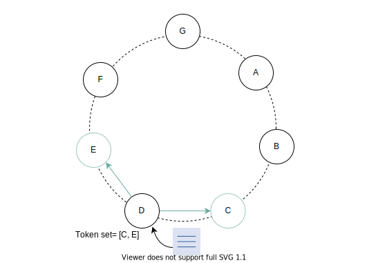

### Обеспечение отказоустойчивости и обнаружения сбоев

Узнайте, как сделать хранилище «ключ-значение» отказоустойчивым и способным обнаруживать сбои.

### Обработка временных сбоев

Как правило, распределенные системы используют подход, основанный на кворуме, для обработки сбоев. Кворум — это минимальное количество
голосов, необходимое для выполнения операции распределенной транзакции. Если сервер, участвующий в консенсусе, не работает, то мы не можем
выполнить требуемую операцию. Это влияет на доступность и долговечность нашей системы.

Мы будем использовать гибкий кворум вместо строгого кворума. Обычно лидер управляет коммуникацией между участниками консенсуса. Участники
отправляют подтверждение после успешного выполнения записи. Получив эти подтверждения, лидер отвечает клиенту. Однако недостатком является
то, что участники легко подвержены сбоям в сети. Если лидер временно недоступен и участники не могут до него добраться, они объявляют
лидера "мертвым". Теперь необходимо переизбрать нового лидера. Такие частые выборы негативно сказываются на производительности, поскольку
система тратит больше времени на выбор лидера, чем на выполнение реальной работы.

При гибком кворуме первые `n` работоспособных узлов из списка предпочтений обрабатывают все операции чтения и записи. `n` работоспособных
узлов не всегда могут быть первыми `n` узлами, найденными при движении по часовой стрелке в кольце согласованного хеширования.

Рассмотрим следующую конфигурацию с `n = 3`. Если узел `A` временно недоступен во время операции записи, запрос отправляется следующему
работоспособному узлу из списка предпочтений, которым в данном случае является узел `D`. Это обеспечивает желаемую доступность и
долговечность. После обработки запроса узел `D` включает подсказку о том, какой узел был предполагаемым получателем (в данном случае, `A`).
Как только узел `A` снова заработает, узел `D` отправляет информацию о запросе узлу `A`, чтобы тот мог обновить свои данные. По завершении
передачи `D` удаляет этот элемент из своего локального хранилища, не влияя на общее количество реплик в системе.

1) Предположим, у нас есть семь узлов в нашем кольце и список предпочтений этих
   узлов

2) Поступает запрос, и узел A обрабатывает его, поскольку он является следующим узлом в кольце. Узел обрабатывается при движении по часовой стрелке

3) Узел A выходит из строя из-за некоторого сбоя

4) Поступает запрос. Узел A должен обработать его, но не может, поэтому мы проверяем следующий узел в списке предпочтений

5) Запрос отправляется узлу D, когда узел A не работает

Этот подход называется **передача с подсказкой (hinted handoff)**. Используя его, мы можем гарантировать выполнение операций чтения и записи
в случае временного сбоя узла.

> **Примечание**: Высокодоступная система хранения должна справляться со сбоями центров обработки данных из-за отключения электроэнергии,
> сбоев охлаждения, сбоев в сети или стихийных бедствий. Для этого мы должны обеспечить репликацию между центрами обработки данных. Таким
> образом, если один центр обработки данных выйдет из строя, мы сможем восстановить данные из другого.

> 
> Каковы ограничения использования передачи с подсказкой?
>

>    
Ответ

>    Минимальный отток участников системы и временные сбои узлов идеально подходят для передачи данных с подсказками. Однако при определенных обстоятельствах реплики с подсказками могут стать недоступными до восстановления на исходном узле-реплике.
>

---

<h2 id="handle-permanent-failures">Обработка постоянных сбоев</h2>

В случае постоянных сбоев узлов мы должны поддерживать синхронизацию наших реплик, чтобы сделать систему более долговечной. Нам необходимо
ускорить обнаружение несоответствий между репликами и уменьшить объем передаваемых данных. Для этого мы будем использовать деревья Меркла.

В **дереве Меркла** значения отдельных ключей хешируются и используются в качестве листьев дерева. В родительских узлах, расположенных выше
по дереву, находятся хеши их дочерних узлов. Каждая ветвь дерева Меркла может быть проверена независимо, без необходимости загружать все
дерево или весь набор данных. При проверке несоответствий между копиями деревья Меркла уменьшают объем данных, которые необходимо
обменивать. Синхронизация не требуется, если, например, хеш-значения корней двух деревьев одинаковы и их листовые узлы также одинаковы. Пока
процесс не дойдет до листьев дерева, хосты могут определять ключи, которые не синхронизированы, когда узлы обмениваются хеш-значениями
дочерних узлов. Дерево Меркла — это механизм для реализации анти-энтропии, то есть для поддержания согласованности всех данных. Это
сокращает передачу данных для синхронизации и количество обращений к дискам в процессе анти-энтропии.

Следующие слайды объясняют, как работают деревья Меркла:

1) Рассчитайте хэши для всех ключей. Хэши будут листовыми узлами
2) Хэши узлов H1 и H2 рассчитываются и сохраняются как их родительский узел
3) Хэши узлов H3 и H4 рассчитываются и сохраняются как их родительский узел
4) Хэши всех остальных узлов рассчитываются и сохраняются как их родительский узел
5) Хэши узлов H1-2 и H3-4 рассчитываются и сохраняются как их родительский узел. То же самое делается для H5-6 и H7-8
6) Мы дублируем нечетный узел
7) Рассчитайте хэш обоих узлов (оригинального и его дубликата) и сохраните его как родительский узел
8) Рассчитайте хэш узлов и сохраните его как родительский узел
9) Рассчитайте хэш последних двух узлов и сохраните его как корневой узел
10) Предположим, значение K2 обновлено. Его хэш будет пересчитан
11) Хэш родительского узла также будет пересчитан и обновлен
12) Хэш родительского узла также будет пересчитан и обновлен
13) Хэш родительского узла также будет пересчитан и обновлен
14) Хэш корневого узла также будет пересчитан и обновлен

<h3 id="anti-entropy-with-merkle-trees">Анти-энтропия с использованием деревьев Меркла</h3>

Каждый узел поддерживает отдельное дерево Меркла для диапазона ключей, которые он хранит для каждого виртуального узла. Узлы могут
определить, верны ли ключи в заданном диапазоне. Между двумя узлами происходит обмен корнем дерева Меркла, соответствующего общим диапазонам
ключей. Мы выполним следующее сравнение:

1. Сравнить хеши корневого узла деревьев Меркла.
2. Если они одинаковы, не продолжать.
3. Рекурсивно обойти левых и правых дочерних узлов. Узлы определяют, есть ли у них какие-либо различия, и выполняют необходимую
   синхронизацию.

Следующие слайды более подробно объясняют, как работают деревья Меркла.

> **Примечание**: Мы предполагаем, что определенные диапазоны являются гипотетическими для целей иллюстрации.

1) Предположим, у нас есть виртуальные узлы A и B в кольце  
   

2) Диапазоны, которые покрывает каждый виртуальный узел, определены  
   

3) Диапазоны, которые покрывает каждый виртуальный узел, определены в виде таблицы  
   

4) Дерево Меркла для узла A  
   

5) Дерево Меркла для узла B  
   

6) Предположим, добавлен новый виртуальный узел N8 для узла A, и диапазоны соответственно обновлены  
   

7) Обновленные диапазоны, которые покрывает каждый виртуальный узел, определены в виде таблицы  
   

8) Обновленное дерево Меркла для узла A  
   

9) Обновленное дерево Меркла для узла B  
   

Преимущество использования деревьев Меркла заключается в том, что каждая ветвь дерева может быть проверена независимо, без необходимости
загрузки узлами всего дерева или полного набора данных. Это уменьшает объем данных, которые необходимо обменивать для синхронизации, и
количество обращений к диску, необходимых в процессе анти-энтропии.

Недостатком является то, что при присоединении или уходе узла из системы хеши дерева пересчитываются, поскольку затрагиваются несколько
диапазонов ключей.

Мы хотим, чтобы наши узлы могли обнаруживать сбои других узлов в кольце, так что давайте посмотрим, как мы можем добавить это в наш
предлагаемый дизайн.

> Обсудите последствия для масштабируемости и отказоустойчивости при использовании согласованного хеширования в распределенных хранилищах
> «ключ-значение».

---

<h2 id="promote-membership-in-the-ring-to-detect-failures">Использование членства в кольце для обнаружения сбоев</h2>

Узлы могут быть в офлайне на короткие периоды, но они также могут уйти в офлайн на неопределенный срок. Мы не должны перебалансировать
назначения разделов или исправлять недоступные реплики, когда выходит из строя один узел, потому что это редко является постоянным уходом.
Поэтому добавление и удаление узлов из кольца следует производить осторожно.

Плановый ввод в эксплуатацию и вывод из эксплуатации узлов приводит к изменениям в членстве. Эти изменения формируют историю. Они постоянно
записываются в хранилище каждого узла и согласовываются между членами кольца с помощью gossip-протокола. **Gossip-протокол** также
поддерживает в конечном итоге согласованное представление о членстве. Когда два узла случайно выбирают друг друга в качестве пиров, оба узла
могут эффективно синхронизировать свои сохраненные истории членства.

Давайте узнаем, как работает gossip-протокол, на следующем примере. Допустим, узел `A` запускается впервые, и он случайным образом добавляет
узлы `B` и `E` в свой набор токенов. Набор токенов содержит виртуальные узлы в пространстве согласованного хеширования и сопоставляет узлы с
их соответствующими наборами токенов. Эта информация хранится локально на дисковом пространстве узла.

Теперь узел `A` обрабатывает запрос, который приводит к изменению, и сообщает об этом узлам `B` и `E`. Другой узел, `D`, имеет в своем
наборе токенов `C` и `E`. Он вносит изменение и сообщает об этом `C` и `E`. Другие узлы выполняют тот же процесс. Таким образом, каждый узел
в конечном итоге узнает информацию о каждом другом узле. Это эффективный способ асинхронного обмена информацией, который не занимает много
пропускной способности.

1) Набор узлов в кольце  
   

2) Узел A обрабатывает запрос. Его набор токенов включает B и E  
   

3) Узел A передает информацию о членстве узлам B и E после нескольких запросов  
   

4) Узел D обрабатывает запрос. Его набор токенов включает C и E  
   

5) Узел D передает информацию о членстве узлам C и E после нескольких запросов  
   

> ### Темы для размышления
> 1. Учитывая наш подход с согласованным хешированием, может ли gossip-протокол дать сбой?
> 

>     
Ответ

> Да, протокол на основе слухов может дать сбой. Например, виртуальный узел N1N1 узла AA хочет быть добавленным в кольцо. Администратор спрашивает N2N2, который также является виртуальным узлом AA. В таком случае оба узла считают себя частью кольца и не будут знать, что они являются одним и тем же сервером. Если будет сделано какое-либо изменение, оно будет продолжать обновлять само себя, что является неправильным. Это называется логическим разделением.
>
> Протокол на основе слухов работает, когда все узлы в кольце соединены в одном графе (то есть имеют одну связную компоненту в графе). Это подразумевает, что существует путь от любого узла к любому другому узлу (возможно, через различные промежуточные узлы). Различные проблемы, такие как высокая текучесть (появление и исчезновение узлов), проблемы с сопоставлением виртуальных узлов физическим узлам и т.д., могут создать ситуацию, аналогичную той, когда реальная сеть разделила некоторые узлы от остальных, и теперь обновления из одного набора не будут достигать другого. Поэтому одного лишь наличия протокола на основе слухов недостаточно для правильного распространения информации; также необходимо поддерживать топологию в хорошем, связанном состоянии.
> 

Децентрализованные протоколы обнаружения сбоев используют gossip-протокол, который позволяет каждому узлу узнавать о добавлении или удалении
других узлов. Методы `join` и `leave` прибывающих или уходящих узлов явно уведомляют другие узлы о постоянных добавлениях и удалениях узлов.
Отдельные узлы обнаруживают временные сбои узлов, когда им не удается связаться с другим узлом. Если узел не может связаться ни с одним из
узлов, присутствующих в его наборе токенов, в течение установленного времени, он сообщает администраторам, что узел "мертв".

---

<h2 id="conclusion">Заключение</h2>

Хранилище «ключ-значение» обеспечивает гибкость и позволяет нам масштабировать приложения с неструктурированными данными. Веб-приложения
могут использовать хранилища «ключ-значение» для хранения информации о сессии пользователя и его предпочтениях. При использовании ключа
пользователя все данные доступны, и хранилища «ключ-значение» идеально подходят для быстрых операций чтения и записи. Хранилища
«ключ-значение» могут использоваться для поддержки рекомендаций и рекламы в реальном времени, поскольку они могут быстро получать доступ и
представлять новые рекомендации.