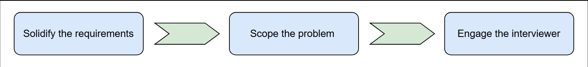
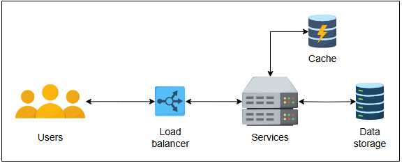
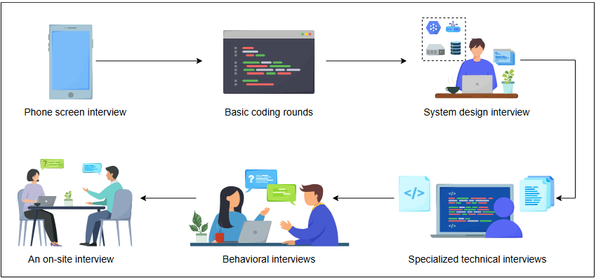

# Подготовка к собеседованию по проектированию систем

Собеседование по **System Design** — это техническая оценка способности кандидата создавать **robust (надёжные)** и **scalable (
масштабируемые)** системы. В отличие от **coding interviews**, где обычно есть одно верное решение, собеседования по **System Design**
предполагают открытое обсуждение и множество возможных решений, которые можно итеративно улучшать.

Для многих инженеров-программистов вопросы на собеседовании по **System Design** остаются загадочной проблемой. Большинство инженеров
никогда не работали с крупномасштабными системами, поэтому объяснение, как построить одну из них, кажется пугающей задачей. Поскольку
вопросы на таких собеседованиях часто являются **open-ended (не имеющими единственно верного ответа)**, бывает сложно понять, как лучше
всего к ним готовиться.

Однако, как человек, участвовавший в сотнях собеседований по **System Design**, я могу заверить вас, что существует правильный подход к этим
вопросам. С правильным настроем и подготовкой вы можете чувствовать себя уверенно и быть готовыми к любому вопросу по **System Design**.

Важно отметить, что вопросы по **System Design** проверяют не только технические знания кандидата, но и его способность подходить к
проблеме, мыслить критически и идти на **trade-offs (компромиссы)**. Поэтому подготовка к такому собеседованию — это не только понимание
технических деталей, но и понимание проблемы, её декомпозиция и поиск наиболее оптимального решения.

### Чем собеседования по проектированию систем отличаются от других?

Как и к любому другому собеседованию, к собеседованиям по **System Design** нужно подходить стратегически. Они отличаются от **coding
interviews**. На этом интервью редко требуется писать код.

Собеседование по **System Design** проходит на гораздо более **high level of abstraction (высоком уровне абстракции)**. Мы определяем
требования и сопоставляем их с **computational components (вычислительными компонентами)** и **high-level communication protocols (
высокоуровневыми протоколами связи)**, которые соединяют эти **subsystems (подсистемы)**.

Окончательный ответ не имеет значения. Важен процесс и тот путь, по которому хороший кандидат ведёт интервьюера.

> **Примечание:** По сравнению с задачами по программированию на собеседованиях, **System Design** больше соответствует задачам, которые мы
> будем выполнять на работе.

### Как подходить к вопросам по проектированию?

Вопросы по проектированию являются неопределёнными, и они намеренно расплывчаты в самом начале. Такая неопределённость отражает реальность
современного бизнеса.

Интервьюеры часто спрашивают о хорошо известной проблеме — например, о проектировании WhatsApp. У настоящего приложения WhatsApp есть
множество функций, и включать их все в требования к нашему клону WhatsApp может быть неразумно по следующим причинам:

* Во-первых, у нас будет ограниченное время на собеседовании.
* Во-вторых, работы с несколькими **core functionalities (основными функциями)** системы должно быть достаточно, чтобы продемонстрировать
  наши навыки решения проблем.

Мы можем сказать интервьюеру, что настоящее приложение WhatsApp делает много других вещей, которые мы не собираемся включать в наш проект.
Если у интервьюера есть возражения, мы можем соответствующим образом изменить наш план действий.

Вот несколько лучших практик, которым следует придерживаться во время собеседования по **System Design**:

* Кандидат должен задавать правильные вопросы, чтобы конкретизировать требования.
* Кандидатам также необходимо определить рамки задачи, чтобы они могли успешно попытаться решить её в ограниченное время собеседования.
  Собеседования по **System Design** обычно длятся от 35 до 40 минут.
* Коммуникация с интервьюером критически важна. Молча работать над проектом — плохая идея. Вместо этого следует взаимодействовать с
  интервьюером, чтобы убедиться, что он понимает ваш ход мыслей.

#### Представьте высокоуровневый дизайн

На **high level** компонентами могут быть **frontend**, **load balancers**, **caches**, **data processing** и так далее. **System Design**
объясняет, как эти компоненты взаимодействуют друг с другом.

**Architectural design** часто представляет компоненты в виде блоков. Стрелки между этими блоками показывают, кто с кем общается и как эти
блоки или компоненты в совокупности работают вместе.

### Возможные вопросы на каждом собеседовании по проектированию систем

Собеседования по **System Design** часто включают вопросы о том, как проект может эволюционировать со временем, когда какой-либо аспект
системы увеличивается на **order of magnitude (порядок величины)** — например, количество пользователей, количество **queries per second (
запросов в секунду)** и так далее. В сообществе системных инженеров принято считать, что когда какой-либо аспект системы увеличивается в
десять или более раз, прежний дизайн может не выдержать и потребовать изменений.

Проектирование и эксплуатация более крупной системы требуют тщательного обдумывания, потому что проекты часто не **linearly scale (линейно
масштабируются)** с ростом нагрузки на систему.

Другой вопрос на собеседовании по **System Design** может касаться того, почему мы не проектируем систему, которая изначально способна
справляться с большей нагрузкой, чем необходимо или прогнозируется.

Основная причина, по которой мы так не делаем, — это затраты, связанные со сложными проектами.

### Трудности проектирования

Со временем всё будет меняться и ломаться по следующим причинам:

* Не существует единственно правильного подхода или решения для задачи проектирования.
* Многое зависит от сделанных нами допущений.

#### Ответственность проектировщика

Как проектировщики, мы должны обеспечивать **fault tolerance (отказоустойчивость)** на уровне проекта, потому что почти все современные
системы используют **off-the-shelf components (готовые компоненты)**, и таких компонентов миллионы. Поэтому что-то всегда будет ломаться, и
мы должны скрывать эту нежелательную реальность от наших клиентов.

### Кто проходит собеседование по проектированию систем?

Традиционно кандидаты уровня от **mid** до **senior** с опытом работы более двух лет проходят как минимум одно собеседование по **System
Design**. Для более старших кандидатов обычным делом являются два или три таких собеседования. В последнее время крупные компании начали
задавать вопросы по **System Design** и некоторым младшим кандидатам. Никогда не рано начинать изучать **System Design**, чтобы расти или
даже ускорить свою карьеру.

### Теория и практика

Большая часть теории **System Design** происходит из области **distributed systems**. Настоятельно рекомендуется освежить знания в этих
концепциях. У Educative есть отличный курс по **distributed systems**, который можно использовать для этого.

**Distributed systems (распределённые системы)** дают нам ориентиры для зрелых принципов разработки программного обеспечения. К ним
относятся:

* **Robustness (надёжность)** (способность поддерживать работу во время кризиса)
* **Scalability (масштабируемость)**
* **Availability (доступность)**
* **Performance (производительность)**
* **Extensibility (расширяемость)**
* **Resiliency (устойчивость к сбоям)** (способность возвращаться к нормальной работе за приемлемый период времени после сбоя)

Такая терминология также служит **lingua franca (общим языком)** между интервьюером и кандидатом.

Например, мы можем сказать, что нам нужно найти **trade-off** между **availability (доступностью)** и **consistency** при сбоях сетевых
компонентов, потому что **CAP theorem** гласит, что мы не можем иметь и то, и другое при **network partitions**. Такой общий язык помогает в
общении и показывает, что мы хорошо разбираемся как в теории, так и в практике.

### На каком этапе процесса найма проходит собеседование по проектированию систем?

В компаниях FAANG+ (Facebook, Apple, Amazon, Netflix, Google, Microsoft и т.д.) процесс найма включает несколько технических и нетехнических
раундов собеседований. Собеседование по **System Design** обычно проходит после **coding interview rounds** и перед **behavioral interviews
**. Типичное место такого собеседования в процессе найма изображено ниже:

