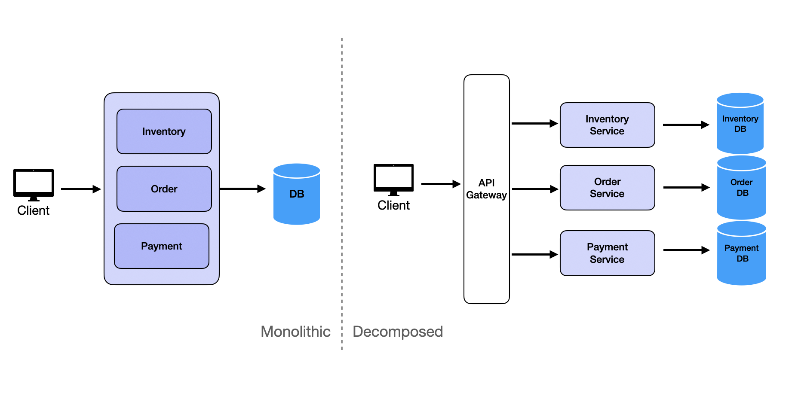
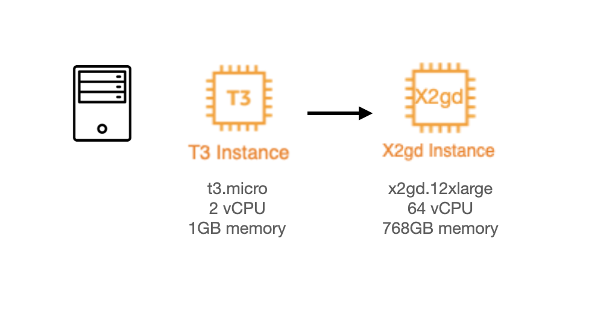
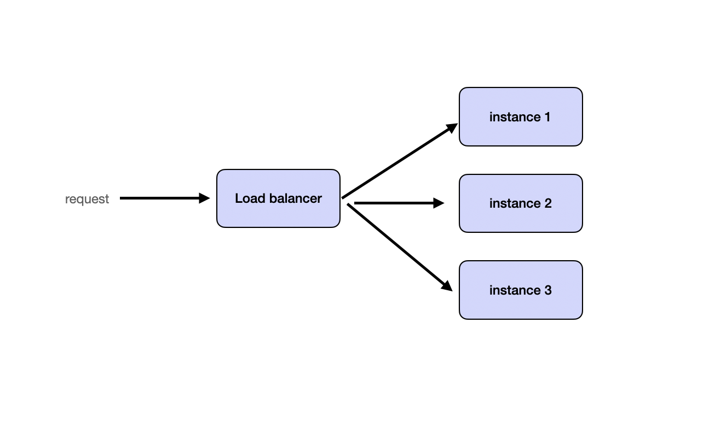
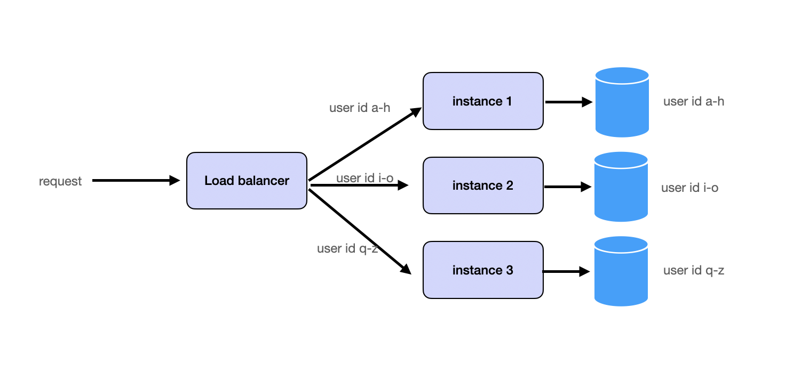
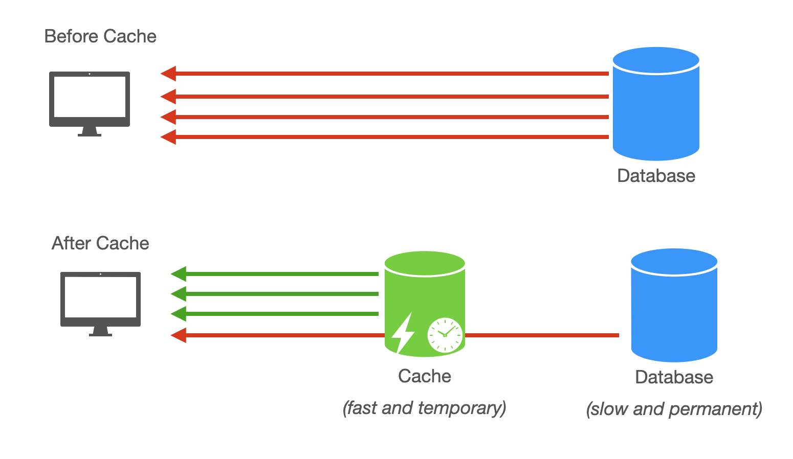
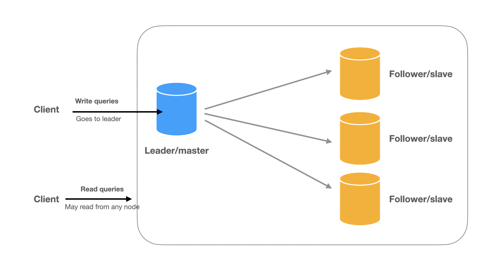
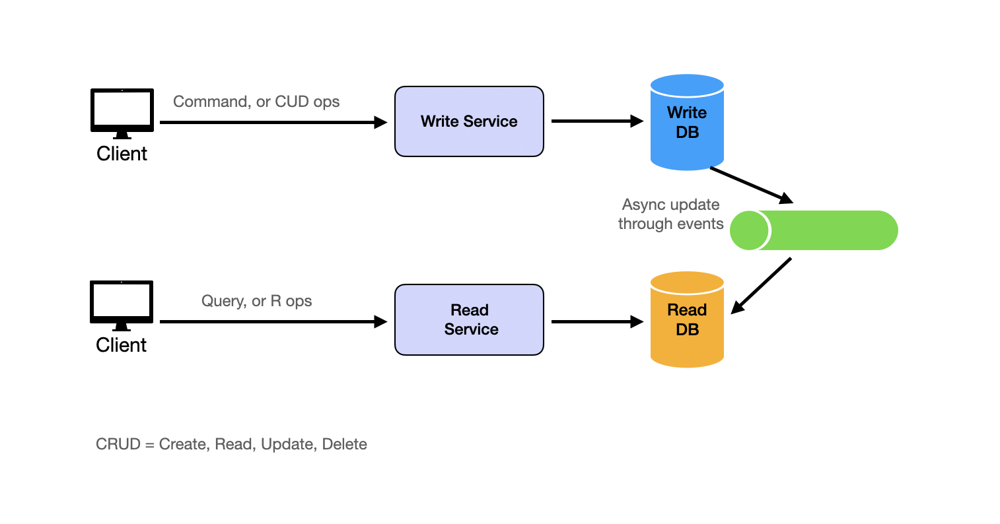

Масштабирование системы является одним из наиболее важных аспектов удовлетворения нефункциональных требований при проектировании систем. В частности, **масштабируемость (Scalability)** часто является главным приоритетом. Ниже мы рассмотрим различные стратегии для достижения масштабируемой архитектуры системы.

## Декомпозиция (Decomposition)

**Декомпозиция (Decomposition)** включает разделение монолита на микросервисы. Ключевой принцип заключается в разделении системы на более мелкие, независимые **сервис** на основе конкретных бизнес-возможностей или требований. Каждый **микросервис** должен фокусироваться на одной ответственности для повышения масштабируемости и удобства поддержки.

## Вертикальное масштабирование (Vertical Scaling)

**Вертикальное масштабирование (Vertical scaling)** представляет собой грубый подход к масштабированию. Концепция проста: **масштабируйтесь вверх (scale up)**, используя более мощные машины. Благодаря достижениям в **облачных вычислениях (cloud computing)** этот подход стал гораздо более осуществимым. В то время как в прошлом организациям приходилось ждать, пока будут построены и отправлены новые машины, сегодня они могут запускать новые экземпляры за считанные секунды.

Современные **облачные провайдеры (cloud providers)** предлагают впечатляющие варианты вертикального масштабирования. Например, AWS предоставляет экземпляры «Amazon EC2 High Memory» с объемом памяти до 24 ТБ, а Google Cloud предлагает экземпляры «Tau T2D», специально оптимизированные для вычислительно-интенсивных рабочих нагрузок.

## Горизонтальное масштабирование (Horizontal Scaling)

**Горизонтальное масштабирование (Horizontal scaling)** фокусируется на **масштабировании наружу (scaling out)** путем запуска **нескольких идентичных экземпляров** **сервисов без состояния (stateless services)**. Stateless природа этих **сервисов** позволяет беспрепятственно распределять запросы между экземплярами с помощью **балансировщиков нагрузки (load balancers)**.

## Разделение (Partitioning)

**Разделение (Partitioning)** включает в себя **разделение запросов и данных на шарды (splitting requests and data into shards)** и их распределение между **сервисами** или **базами данных**. Это может быть достигнуто путем **разделения данных** на основе идентификатора пользователя, географического положения или другого логического ключа. Многие системы реализуют **согласованное хеширование (consistent hashing)** для обеспечения сбалансированного **разделения (partitioning)**.

Мы подробно рассмотрим **разделение (partitioning)** в разделе «**Разделение базы данных (Database Partitioning)**».

## Кэширование (Caching)

**Кэширование (Caching)** служит для повышения производительности чтения запросов путем хранения часто используемых данных в более быстром хранилище памяти, например, в **кэшах в оперативной памяти (in-memory caches)**. Популярные **инструменты**, такие как Redis или Memcached, могут эффективно хранить **горячие данные (hot data)** для снижения нагрузки на базу данных.

Мы подробно рассмотрим **кэширование (caching)** в разделе «**Кэширование (Caching)**».

## Буферизация с очередями сообщений (Buffer with Message Queues)

Сценарии с высокой конкуренцией часто сталкиваются с операциями с интенсивной записью. Частые записи в базу данных могут перегрузить систему из-за узких мест ввода-вывода диска. **Очереди сообщений (Message queues)** могут **буферизовать (buffer)** запросы на запись, изменяя **синхронные операции (synchronous operations)** на **асинхронные (asynchronous ones)**, тем самым ограничивая запросы на запись в базу данных до управляемых уровней и предотвращая сбои системы.

Мы подробно рассмотрим **очереди сообщений (message queues)** в разделе «**Очереди сообщений (Message Queues)**».

## Разделение операций чтения и записи (Separating Read and Write)

То, является ли система **интенсивной для чтения (read-heavy)** или **интенсивной для записи (write-heavy)**, зависит от бизнес-требований. Например, платформа социальных сетей является **интенсивной для чтения**, потому что пользователи читают больше, чем пишут. С другой стороны, система IOT является **интенсивной для записи**, потому что пользователи пишут больше, чем читают. Вот почему мы хотим **разделить операции чтения и записи (separate read and write operations)**, чтобы обрабатывать их по-разному.

**Разделение операций чтения и записи (Read and write separation)** обычно включает две основные стратегии. Во-первых, **репликация (replication)** реализует **архитектуру «лидер-последователь» (leader-follower architecture)**, где записи происходят на **лидере (leader)**, а **последователи (followers)** предоставляют **реплики для чтения (read replicas)**.

Во-вторых, так называемый **шаблон CQRS (Command Query Responsibility Segregation)** развивает **разделение чтения и записи (read-write separation)**, используя совершенно разные модели для чтения и записи данных. В CQRS система разделена на две части:
* **Сторона команд (Command Side) (сторона записи)**: обрабатывает все операции записи (создание, обновление, удаление) с использованием модели данных, оптимизированной для записи.
* **Сторона запросов (Query Side) (сторона чтения)**: обрабатывает все операции чтения с использованием денормализованной модели данных, оптимизированной для чтения.

Изменения со **стороны команд (command side)** **асинхронно распространяются (asynchronously propagated)** на **сторону запросов (query side)**.

Например, система может использовать MySQL в качестве **базы данных-источника истины (source-of-truth database)**, одновременно используя Elasticsearch для полнотекстового поиска или аналитических запросов и асинхронно синхронизируя изменения из MySQL в Elasticsearch с использованием **Change Data Capture (CDC)** из **binlog MySQL**.

## Объединение техник (Combining Techniques)

Эффективное масштабирование обычно требует многогранного подхода, объединяющего несколько техник. Это начинается с **декомпозиции (decomposition)** для разделения монолитных сервисов для независимого масштабирования. Затем **разделение (partitioning)** и **кэширование (caching)** работают вместе для эффективного распределения нагрузки и повышения производительности. **Разделение чтения/записи (Read/write separation)** обеспечивает быстрое чтение и надежную запись с помощью настроек «лидер-реплика». Наконец, корректировки бизнес-логики помогают разрабатывать стратегии, которые смягчают операционные узкие места без ущерба для пользовательского опыта.

## Адаптация к меняющимся бизнес-требованиям (Adapting to Changing Business Requirements)

Адаптация бизнес-требований предлагает практический способ обработки больших нагрузок трафика. Хотя это не строго технический подход, понимание этих стратегий демонстрирует ценный опыт и навыки критического мышления в условиях собеседования.
Рассмотрим сценарий еженедельной распродажи: вместо проведения всех распродаж одновременно для всех пользователей нагрузка может быть распределена путем выделения определенных дней для различных категорий товаров для конкретных регионов. Например, детские товары могут быть представлены в День 1, затем электроника в День 2. Такой подход обеспечивает более предсказуемые схемы трафика и позволяет лучше распределять ресурсы, такие как предварительная загрузка кэша для следующего дня и масштабирование реплик для чтения для конкретных регионов.
Другой пример включает в себя решение проблем согласованности во время важных событий, таких как аукционы eBay. Временно отображая сообщения об успешной ставке на **внешнем интерфейсе (frontend)**, система может обеспечить бесперебойный пользовательский опыт, пока **внутренний интерфейс (backend)** асинхронно устраняет проблемы согласованности. Пользователи в конечном итоге увидят правильный статус своей ставки после окончания аукциона.
Хотя это не технические решения, их упоминание на собеседовании демонстрирует вашу способность продумать проблему и предложить практические решения.