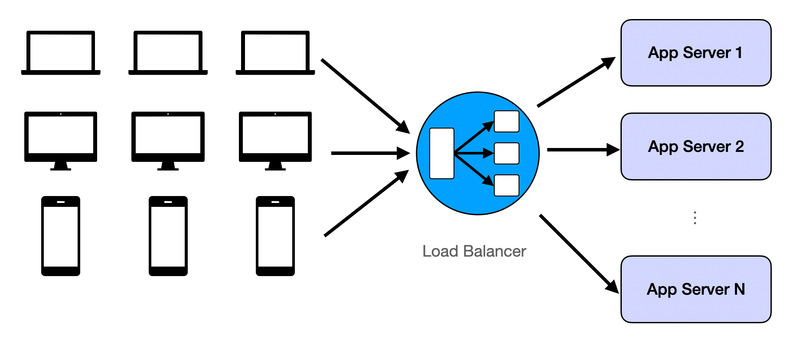
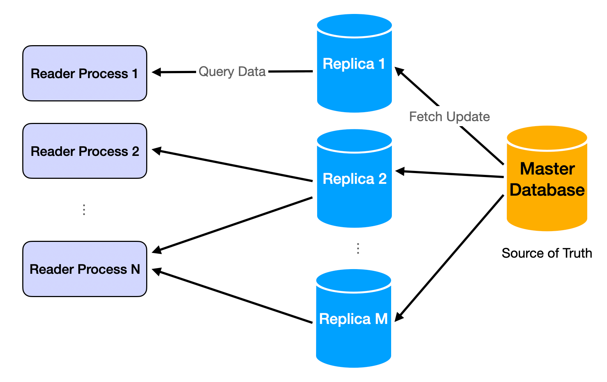
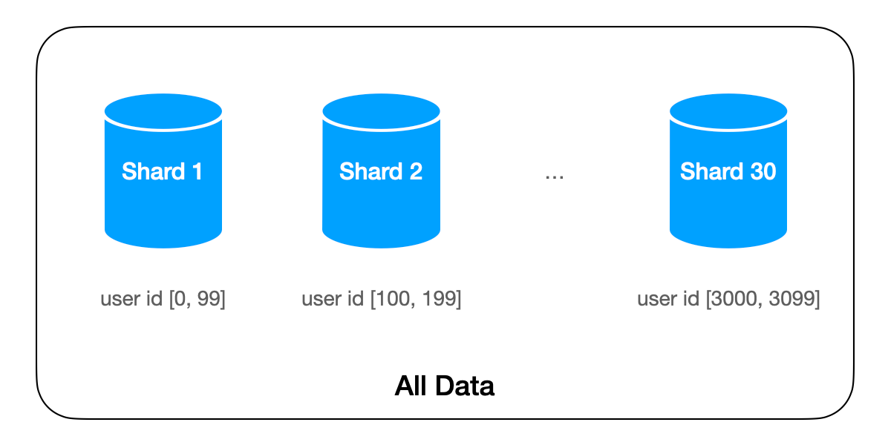
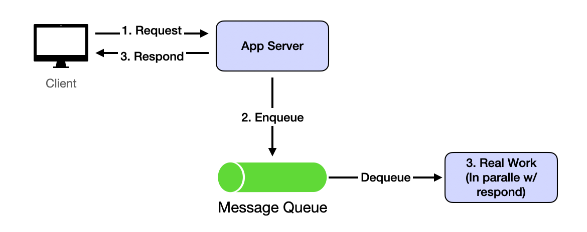
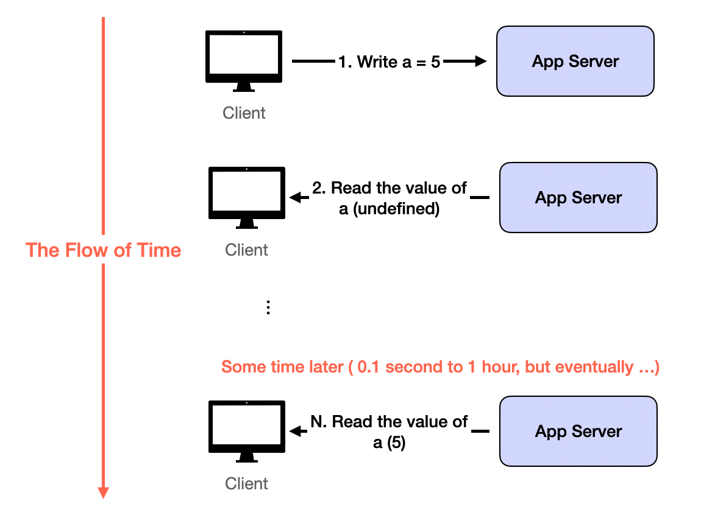

Прежде чем углубляться в повторно используемые строительные блоки проектирования распределенных систем, читатели должны хорошо понимать, каковы общие проблемы. Они возникают из-за обслуживания очень большого количества пользователей путем добавления большего количества машин. Без огромного числа пользователей все проблемы проектирования систем сводятся к проблемам кодирования. Как и решения, собранные из повторно используемых строительных блоков, проблемы имеют несколько повторяющихся шаблонов. Я надеюсь представить четыре проблемы таким образом, чтобы их легко мог понять любой, кто успешно проходит собеседования по кодированию. Надеюсь, что дальнейший, богатый жаргоном контент станет более понятным после того, как мы поймем, какие проблемы он решает.

## Проблема 1: Слишком много одновременных пользователей (Too Many Concurrent Users)

Хотя большая база пользователей создает много проблем, самая распространенная и интуитивно понятная заключается в том, что одна машина/база данных имеет ограничение по RPS (запросам в секунду) / QPS (запросам в секунду). Во всех демонстрационных приложениях с одним сервером, которые вы увидите в учебных пособиях по веб-разработке, производительность сервера быстро ухудшится после превышения предела.

Решение также интуитивно понятно: **повторение (repetition)**. Мы просто повторяем одни и те же ресурсы нашего приложения и случайным образом назначаем пользователей каждой **репликации (replication)**. Когда реплицированные ресурсы представляют собой логику сервера, это называется **балансировкой нагрузки (load balancing)**. Когда реплицированные ресурсы представляют собой данные, это обычно называется **репликами базы данных (database replicas)**. Подробнее об этом позже.

## Проблема 2: Слишком много данных для перемещения (Too Much Data to Move Around)

Двойная проблема слишком большого количества пользователей — это проблема слишком большого количества данных. Данные становятся «большими», когда их невозможно хранить на одной машине. Некоторые распространенные примеры: индекс Google, все твиты, опубликованные в Twitter, все фильмы на Netflix.

Решение называется **шардированием (sharding)**: разделение данных по некоторой логике. Логика шардирования группирует некоторые данные вместе, например, если мы шардируем по `user_id` в Twitter, то все твиты от одного пользователя будут храниться на одной машине.

## Проблема 3: Система должна быть быстрой и отзывчивой (The System Should be Fast and Responsive)

Большинство пользовательских приложений должны быть быстрыми. Время ответа должно быть менее 500 мс. Если оно превышает 1 секунду, пользователь получит плохой опыт.

Чтение обычно происходит быстро после того, как у нас есть **репликация (replication)**. Запросы на чтение обычно реализуются в виде запроса к словарю значений ключей в памяти, а не к протоколам HTTP. Поэтому для многих простых приложений задержка в основном составляет время сетевого обхода (network round time).

Затруднения возникают при записи. Поскольку большинство типичных процессов записи включают множество запросов и обновлений данных, они длятся гораздо дольше 1-секундного лимита. Решением является **асинхронность (asynchrony)**: запрос на запись возвращается немедленно после того, как наш сервер получает свои данные и помещает данные в очередь. Тем временем фактическая обработка продолжается в фоновом режиме. После получения ответа от сервера логика на стороне клиента имеет пространство для маневра для быстрого взаимодействия с пользователем. Например, она может показать некоторый UI перед перенаправлением пользователя для чтения результата. Это обычно занимает 1-2 секунды, и этого достаточно для фоновой обработки фактического запроса на запись.

Это реализуется с помощью **очереди сообщений (message queue)**, такой как Kafka.

## Проблема 4: Несогласованные (устаревшие) состояния (Inconsistent (outdated) States)

Эта проблема является результатом решения Проблемы 1 и Проблемы 2. При репликации данных и асинхронном обновлении данных запросы на чтение могут легко видеть несогласованные данные. **Несогласованность (Inconsistency)** обычно означает устаревшие: пользователь не увидит случайных неверных данных, но старые версии или удаленные данные.

Решение больше на уровне приложения, чем на системном уровне. Поскольку устаревшее чтение, возникшее в результате **репликации (replication)** и асинхронных обновлений, в конечном итоге исчезнет, когда серверы синхронизируются, мы строим пользовательский опыт таким образом, чтобы кратковременное отображение устаревших данных было приемлемым. Это называется **конечной согласованностью (eventual consistency)**.

Большинство приложений хорошо переносят **конечную согласованность (eventual consistency)**. Особенно по сравнению с альтернативами: навсегда потерять данные или быть очень медленным. Исключением являются банковские или платежные приложения. Любая несогласованность недопустима, поэтому приложения должны ждать завершения всей обработки, прежде чем что-либо возвращать пользователям. Вот почему такие приложения кажутся намного медленнее, чем, скажем, Google Search.

## Резюме

В одном предложении, чтобы вместить всех людей в качестве своих DAU, хранить сотни ТБ данных и обеспечивать быстрый пользовательский опыт, распределенные системы веб-масштаба **реплицируют (replicate)** свою логику и данные, **шардируют (shard)** свое проблемное пространство и **асинхронно (asynchronously)** обрабатывают медленные запросы. Результатом является **конечно согласованное (eventual consistent)** приложение, которое может **обслуживать всех пользователей (serve all users)** на **произвольно больших данных (arbitrarily large data)**. Система может постепенно добавлять машины по мере роста базы пользователей. Это основная философия проектирования современных крупномасштабных систем, интенсивно использующих данные. Мы углубимся в детали каждой из них в оставшейся части курса.