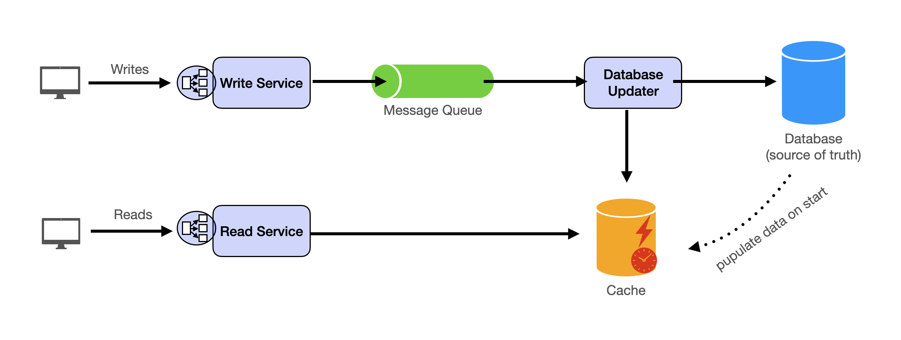

Руководство по изучению

Собеседования по System Design представляют собой уникальную задачу. В отличие от собеседований по алгоритмическому кодированию, которые часто следуют более стандартизированному подходу, отсутствие последовательного отраслевого метода оценки навыков System Design только усугубляет эту сложность, делая процесс загадочным и несколько пугающим.

На собеседованиях по System Design суть проблемы заключается в удовлетворении **нефункциональных требований (non-functional requirements)**, главным образом **масштабируемости (scalability)** и **доступности (availability)**. Эти **нефункциональные требования**, хотя часто рассматриваются как второстепенные, играют решающую роль в определении эффективности и надежности любой системы. Например, **масштабируемость** — это не просто атрибут, который будет добавлен позже, а скорее основной аспект проекта, который значительно влияет на всю архитектуру и производительность системы. Таким образом, для обеспечения эффективной **масштабируемости**, система часто должна быть построена с нуля с особым акцентом на учет расширяющейся нагрузки.

Искусство **System Design** включает в себя управление компромиссами, понимание и применение правильных принципов проектирования, а также навигацию в обширном море технологических решений. Мы разработали систему для решения задач **System Design**:

### Понимание общих целей проектирования, проблем и концептуальных решений

Сначала давайте рассмотрим основные проблемы проектирования веб-масштабных(web-scale), интенсивно использующих данные (data-intensive) приложений:
* Слишком много одновременных пользователей
* Слишком много данных для хранения и доступа
* Приложение должно иметь низкую задержку (latency)
* Состояние должно быть согласованным (consistent)

Мы обсудим эти детали в следующем разделе.

### Освоение строительных блоков («кусочков лего»)

Эта часть курса будет посвящена различным **компонентам**, которые часто используются для построения системы (**строительные блоки**), и **шаблонам проектирования**, которые обеспечивают основу для структурирования этих блоков.

#### Основные строительные блоки

Как минимум, вы должны знать основные **строительные блоки System Design**.
* Масштабирование **stateless services** с **балансировкой нагрузки (load balancing)**
* Масштабирование операций чтения из базы данных с помощью **репликации (replication)** и **кэширования (caching)**
* Масштабирование операций записи в базу данных с помощью **разделения (partitioning)** (также известного как **шардирование (sharding)**)
* Масштабирование **потока данных (data flow)** с помощью **очередей сообщений (message queues)**

#### Шаблон System Design

С помощью этих **строительных блоков** вы сможете применить наш шаблон для решения многих проблем **System Design**. Мы углубимся в детали в разделе «**Шаблон проектирования (Design Template)**». Вот краткий обзор:

#### Дополнительные строительные блоки

Кроме того, вам понадобится понимание таких концепций, как:
* Обработка больших объемов данных (так называемые «**большие данные (big data)**») с помощью **пакетной (batch)** и **потоковой обработки (stream processing)**
    * Особенно полезно для решения задач data-intensive, таких как проектирование аналитического приложения
* Достижение **согласованности (consistency)** между **сервисами** с использованием **распределенных транзакций (distributed transactions)** или **журналирования событий (event sourcing)**
    * Особенно полезно для решения проблем, требующих строгих транзакций, таких как проектирование финансовых приложений
* **Полнотекстовый поиск (Full text search)**: **полнотекстовый индекс (full-text index)**
* Долгосрочное хранение данных: **хранилище данных (data warehousing)**

### Знание, специфичное для проблемы

Помимо этого, существуют специальные знания, которые вам понадобятся для решения определенных проблем. Например, **геохеширование (geohashing)** для проектирования **сервисов** на основе местоположения, таких как Yelp или Uber, **оперативное преобразование (operational transform)** для решения таких проблем, как проектирование Google Doc. Вы можете изучать это в каждом конкретном случае. Собеседования по **System Design** призваны проверить ваши общие навыки проектирования, а не конкретные знания, но хорошо знать это, чтобы вы знали, с чего начать, когда вас попросят спроектировать такую систему.
