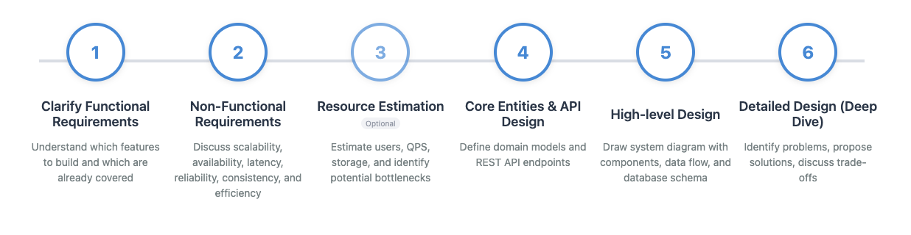

Этот шаблон описывает типичный процесс собеседований для позиций ниже уровня Staff Engineer в средних и крупных компаниях.

Давайте рассмотрим каждый этап подробнее:

## 1. Уточнение функциональных требований (Clarify functional requirements)

Спросите:
* Какие функции уже покрыты существующими сервисами или API?
* Какие функции необходимо разработать?

---

## 2. Обзор нефункциональных требований (non-functional requirements)

Обсудите с интервьюером любые из следующих соответствующих требований:

**Основные 6:**
* **Масштабируемость (Scalability)**: Спроектируйте систему так, чтобы она могла выдерживать заданное количество пользователей.
* **Доступность (Availability)**: Спроектируйте систему так, чтобы она была работоспособна по мере необходимости, используя такие методы, как репликация для предотвращения простоя.
* **Задержка (Latency)**: Определите приемлемую задержку для системы. Это варьируется в зависимости от приложения (например, Google Docs требуется низкая задержка, в то время как Dropbox может обрабатывать более длительные задержки).
* **Надежность (Reliability)**: Убедитесь, что сервис постоянно возвращает правильные и ожидаемые результаты.
* **Согласованность (Consistency)**: Обеспечьте согласованность данных между сервисами, убедитесь, что чтение из разных источников дает тот же результат, и решите, где сохранять данные.
* **Эффективность (Efficiency)**: Минимизируйте избыточные операции и оптимизируйте использование ресурсов.

**Особые:**
* **Конфиденциальность (Privacy)**: Учитывайте соответствие GDPR и другие требования конфиденциальности в зависимости от хранимых и обрабатываемых данных (например, электронная почта, пользовательская информация).

Поместите эти требования в контекст обсуждаемой проблемы.

---

## 3. Оценка ресурсов (необязательно)

Обратите внимание, что этот шаг часто является необязательным, и интервьюер может просто сказать «много пользователей» или «много данных», особенно для вопросов по проектированию продукта, таких как проектирование платформы социальных сетей или приложения для заказа такси. Оценка ресурсов становится важной для вопросов по проектированию инфраструктуры, таких как проектирование ограничителя скорости или системы кэширования.

Спросите:
* Сколько ежедневных пользователей должна поддерживать система (т.е. Daily Active Users, или DAU)?
* Как долго должны храниться данные (т.е. срок хранения данных)?

Оцените:
* QPS (запросы в секунду): 
  - Чтение.
  - Запись.
* Текущие соединения (если применимо), например, для приложений на основе WebSocket, таких как WhatsApp.
* Пропускная способность (в ГБ/с), необходимая для задач потокового видео или хостинга изображений.
* Требования к хранилищу на основе срока хранения данных и размера объектов в байтах с использованием количества строк.
* Выявите потенциальные узкие места в системе, такие как ограничения БД или QPS.

---

## 4. Проектирование основных сущностей и API-интерфейсов

**Основные сущности (Core entities)** — это базовые доменные модели, необходимые для реализации функциональных требований. Например, если система является платформой социальных сетей, основные сущности могут включать пользователей, публикации, комментарии и лайки. Они обычно соответствуют таблицам базы данных. Относительно просто определить основные сущности, как только у нас есть функциональные требования — это **существительные** в требованиях.

**API (API endpoints)** устанавливают контракт между сервисом и конечным пользователем. Обычно в этой части мы хотим указать интерфейс запроса и ответа REST API. Обратите внимание, что нас интересуют только API, связанные с функциональными требованиями, и мы избегаем введения нерелевантных API. Этот шаг также может быть выполнен после шага 5 (высокоуровневое проектирование), если интервьюер сочтет это слишком подробным. Это **глаголы** в требованиях.

Если система требует двунаправленной связи, не забудьте обсудить технологии, которые это облегчают, такие как **WebSockets** или протоколы обмена сообщениями между сервером и клиентом, такие как **Server-Sent Events**.

---

## 5. Высокоуровневое проектирование (High-level Design) (диаграмма проекта)

Нарисуйте высокоуровневую системную диаграмму, которая включает:
* Основные компоненты систем и их взаимодействие друг с другом.
* **Поток данных (Data flow)**: Покажите, как данные перемещаются по системе.
* **Схема трафика (Traffic pattern)**: Если это применимо к проблеме, покажите, как система обрабатывает различные типы трафика (например, push против pull для Twitter).
* **Модель/схема базы данных (Database model/schema)** и какие поля индексировать при необходимости.

Убедитесь, что каждая функция в функциональных требованиях охвачена в проекте. Однако не углубляйтесь в детали слишком рано на этом этапе.

Обратите внимание, что в большинстве случаев, когда мы набрасываем System Design, мы в основном фокусируемся на ключевых компонентах, специфичных для уникальных проблем, которые система стремится решить. Общие элементы, такие как аутентификация, которые являются частью практически всех систем, часто исключаются из этих первоначальных диаграмм.

Также важно иметь в виду, что на начальных этапах System Design не принято углубляться в детали конкретных технологий. Чрезмерное акцентирование на модных словах или популярных технологических стеках может быть серьезной ошибкой, поскольку интервьюеры могут воспринять это как попытку скрыть недостаток понимания фундаментальных концепций.

---

## 6. Детальное проектирование (Deep Dive)

Цель этого раздела — выявить части компонентов в системе, которые могут привести к проблемам (в основном масштабируемости), и обсудить, как их решить, возможно, путем изменения проекта. Этот раздел более открытый и зависит от взаимодействия с интервьюером. **Нефункциональные требования (Non-functional requirements)** играют ключевую роль в принятии проектных решений здесь.

Как только мы выявляем проблему, мы должны предложить, в идеале, несколько решений и обсудить их компромиссы. Компромиссы обычно заключаются в **балансировании масштабируемости (scalability)**, **задержки (latency)** и **согласованности (consistency)**.
