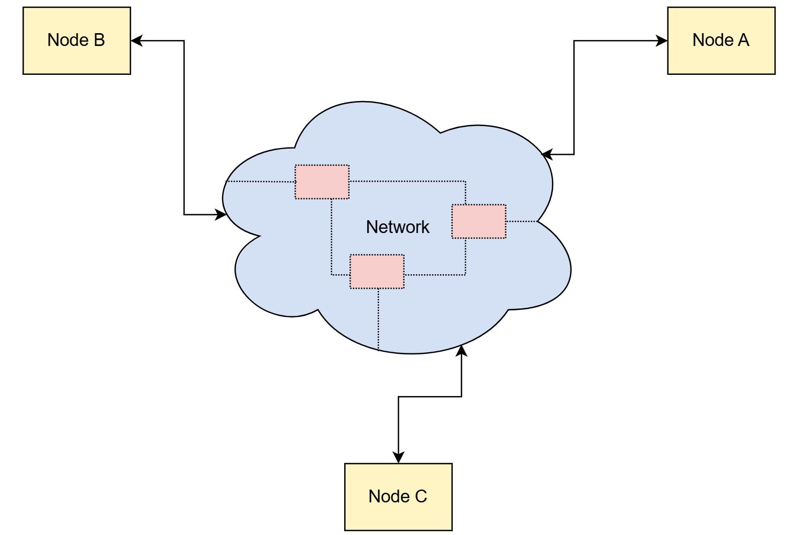
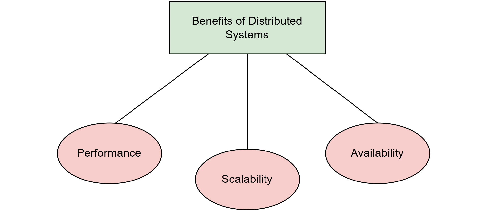

# Что такое распределенная система?
По словам Кулуриса и др. , «**распределенная система** — это система, компоненты которой расположены на разных сетевых компьютерах, которые взаимодействуют и координируют свои действия, передавая сообщения друг другу».
Компоненты этой системы можно рассматривать как программы, работающие на физическом оборудовании, таком как компьютеры. Эти компоненты могут иметь множество форм; например, они могут быть веб-серверами, маршрутизаторами, веб-браузерами и т. д. Чтобы сохранить общее представление, мы предполагаем, что каждая программа работает на отдельной машине. Мы называем каждую из этих машин **узлом**.

На приведенном выше рисунке показано, что сеть состоит либо из прямых соединений между компонентами распределенной системы, либо из большего количества компонентов, которые образуют основу сети (например, если связь осуществляется через Интернет).

> Хотя общее представление узлов полезно для понимания приведенной выше схемы, иногда реальные примеры работы узлов могут быть более полезными... В таких случаях мы подробно объясняем роль каждого узла в системе.

# Части распределенной системы
Существует две категории центральных частей, которые помогают распределенным системам функционировать:

1) Различные части, составляющие распределенную систему: они расположены удаленно и разделены сетью.
2) Сеть, разделяющая различные части распределенной системы: она действует как механизм связи, позволяющий им обмениваться сообщениями.

> Далее в этом курсе мы подробно рассмотрим отдельные части.

# Зачем нам нужна распределенная система

Как показано на рисунке ниже, распределенные системы обладают тремя основными преимуществами.

Давайте объясним каждый из них по отдельности.

## Производительность
По словам Мохана и др., «**Производительность** — это степень, в которой программная система или компонент соответствует поставленным целям по своевременности».

## Проблема с одним компьютером
Физические ограничения его оборудования накладывают определенные ограничения на производительность отдельного компьютера. Более того, после определенного момента повышать производительность отдельного компьютера становится чрезвычайно дорого.

## Решение
Мы можем достичь той же производительности с двумя или более компьютерами с низкими характеристиками, что и с одним компьютером высокого класса. Таким образом, распределенные системы позволяют нам достичь лучшей производительности при меньших затратах.

> Обратите внимание, что более высокая производительность может означать разные вещи в зависимости от контекста, например, меньшую задержку на запрос, более высокую пропускную способность и т. д.

## Масштабируемость
По словам Бонди и др., «Масштабируемость — это способность системы, сети или процесса справляться с растущим объемом работы или ее потенциал к расширению для удовлетворения этого роста».

# Проблема с одним компьютером
Хранение и обработка данных отвечают за большую часть ценности, которую программные системы привносят в реальный мир. По мере роста клиентской базы системы ей необходимо обрабатывать больше трафика и хранить больше данных. Однако система, состоящая из одного компьютера, может масштабироваться только до определенной точки, как объяснялось ранее.

## Решение
Если мы построим распределенную систему, мы сможем разделить и хранить данные на нескольких компьютерах, а также распределить работу по обработке.

> **Вертикальное масштабирование** относится к подходу масштабирования системы путем добавления ресурсов (памяти, ЦП, диска и т. д.) к одному узлу. В то же время **горизонтальное масштабирование** относится к подходу масштабирования путем добавления большего количества узлов в систему.

В результате мы можем масштабировать наши системы до размеров, которые мы не могли себе представить с помощью одной компьютерной системы.

## Доступность
В контексте программных систем **доступность** — это вероятность того, что система будет работать так, как требуется, когда требуется, во время выполнения миссии.

## Проблема с одним компьютером
В настоящее время большинство онлайн-сервисов должны работать постоянно (также известно как «обслуживание 24/7»), что является огромной проблемой. Когда сервис заявляет, что у него доступность пять-девять, он обычно работает 99,999% времени. Это означает, что он может быть недоступен максимум 5 минут в год, чтобы удовлетворить эту гарантию.

Если мы рассмотрим, насколько ненадежным может быть оборудование, мы легко поймем, насколько это масштабное начинание. Конечно, было бы невыполнимо предоставить такую ​​гарантию с одним компьютером.

## Решение
**Избыточность** — один из широко используемых механизмов для достижения более высокой доступности. Она подразумевает хранение данных на нескольких избыточных компьютерах. Таким образом, когда один компьютер выходит из строя, мы можем эффективно переключиться на другой. Таким образом, мы предотвратим возникновение этого сбоя у наших клиентов.

Учитывая, что данные теперь хранятся на нескольких компьютерах, мы получаем распределенную систему!

> Если мы используем распределенную систему, мы получаем все вышеперечисленные преимущества. Однако, как мы увидим позже, между ними и несколькими другими свойствами есть напряжение. Поэтому в большинстве случаев нам приходится идти на компромисс. Для этого мы должны понимать основные ограничения и запреты распределенных систем. Первая часть этого курса поможет нам в этом.