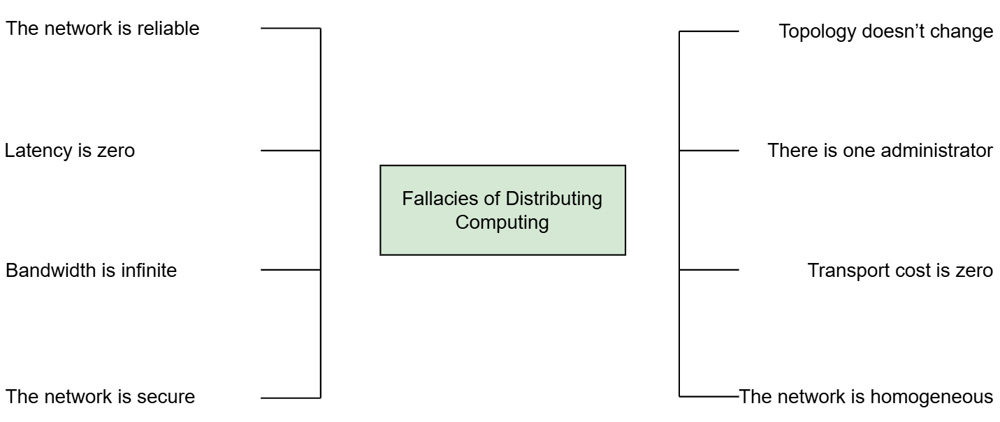

# Заблуждения распределенных вычислений
Давайте посмотрим, какие ложные предположения делают разработчики при разработке программного обеспечения для распределенных систем.

# Разница в разработке программного обеспечения для распределенных систем
Распределенные системы подвержены гораздо большему количеству ограничений, чем программные системы, работающие на одном компьютере. В результате разработка программного обеспечения для распределенных систем также сильно отличается. Однако те, кто является новичком в распределенных системах, делают предположения, основанные на их опыте разработки программного обеспечения для систем, работающих на одном компьютере. Конечно, это создает множество проблем в дальнейшем в системах, которые они создают.

Чтобы устранить эту путаницу и помочь людям создавать лучшие системы, Л. Питер Дойч и другие в Sun Microsystems создали коллекцию этих ложных предположений. Это заблуждения распределенных вычислений .

# Заблуждения
Существует восемь таких заблуждений распределенных вычислений. На следующем рисунке они перечислены.

По мере прохождения курса вы глубже поймете, почему эти утверждения ошибочны.

Однако мы дадим вам краткий обзор, быстро пробежавшись по ним и объяснив, в чем их недостатки.

# Сеть надежна
Разработчики абстракций, которые они изучают из различных технологий и протоколов, часто усиливают это распространенное заблуждение. Как мы увидим в следующей главе, сетевые протоколы, такие как TCP, могут заставить нас поверить, что сеть надежна и никогда не выходит из строя. Однако это всего лишь иллюзия со значительными последствиями. Кроме того, мы строим сетевые соединения поверх оборудования, которое также в какой-то момент выйдет из строя. Следовательно, мы должны проектировать наши системы соответствующим образом.

# Задержка равна нулю
Библиотеки, которые пытаются моделировать удаленные вызовы процедур как локальные вызовы, такие как gRPC или Thrift , навязывают это предположение. Мы всегда должны помнить, что существует большая разница (от миллисекунд до наносекунд) в задержке между вызовом удаленной системы и вызовом доступа к локальной памяти. Это становится еще хуже, когда мы рассматриваем вызовы между центрами обработки данных на разных континентах. Таким образом, это еще один момент, который следует иметь в виду при принятии решения о том, как геораспределить нашу систему.

# Пропускная способность бесконечна
Это заблуждение в наши дни слабее. Это связано с тем, что пропускная способность, которую мы можем достичь, значительно улучшилась за последние несколько десятилетий. Например, теперь мы можем строить высокоскоростные соединения в наших собственных центрах обработки данных. Однако это не означает, что мы можем использовать ее всю, если наш трафик должен пересекать Интернет. Это важно учитывать, когда мы принимаем решения о топологии нашей распределенной системы и когда запросы проходят через Интернет.

# Сеть безопасна
Это заблуждение показывает, что более широкая сеть, используемая двумя узлами для связи, не обязательно находится под их контролем. Таким образом, мы должны считать ее небезопасной.

Часть курса посвящена безопасности, где объясняются различные методы, которые можно использовать для безопасного использования незащищенной сети.

# Топология не меняется
Сеть также состоит из множества различных частей, которыми разные организации могут управлять с помощью разного оборудования. Более того, сбои в некоторых частях этой сети могут потребовать от нас изменения ее топологии, чтобы она оставалась работоспособной. Это также подчеркивает два других заблуждения, а именно, что есть один администратор и сеть однородна

# Стоимость транспортировки равна нулю
Передача данных между двумя точками влечет за собой финансовые затраты. Мы должны учитывать это при построении распределенной системы.

# Глобальное заблуждение о часах
Есть одно заблуждение, которое не входит в вышеприведенный набор, но все еще часто вызывает путаницу среди людей, плохо знакомых с распределенными системами. Если следовать тому же стилю, что и выше, то можно сформулировать это заблуждение следующим образом:

«Распределенные системы имеют глобальные часы, которые мы можем использовать для определения времени возникновения событий».

Это предположение довольно обманчиво, поскольку оно несколько интуитивно понятно и справедливо даже в нераспределенных системах. Например, приложение, работающее на одном компьютере, может использовать локальные часы компьютера, чтобы решить, когда происходят события и в каком порядке. Однако это неверно в распределенной системе, где каждый узел в системе имеет свои собственные локальные часы, которые работают с уникальной скоростью.

Хотя существуют способы синхронизации часов, некоторые из них очень дороги и не устраняют эти различия полностью. Физические законы также ограничивают это ограничение. Примером этого является API TrueTime , созданный Google, который явно выставляет неопределенность часов как первоклассного гражданина.

> Однако, как мы увидим в следующих уроках, посвященных причинам и следствиям, существуют и другие способы рассуждать о времени с использованием логических часов.