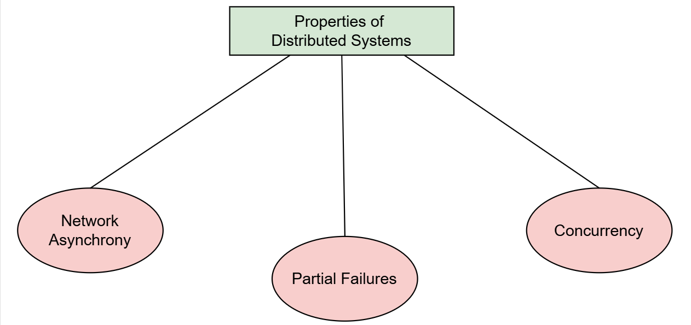
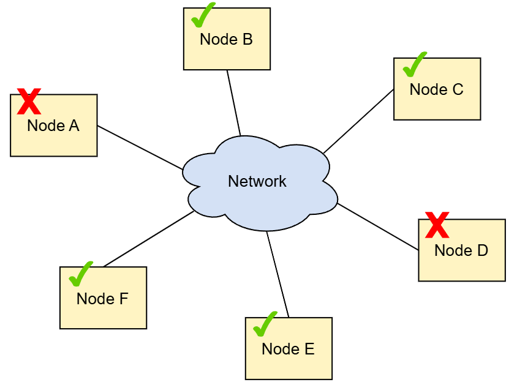

# Почему распределенные системы сложно проектировать
В целом, распределенные системы сложно проектировать, строить и рассуждать о них. Это увеличивает риск ошибки.

Стоит задаться вопросом: почему распределенные системы так сложно проектировать? Ответ на этот вопрос поможет нам устранить наши слепые пятна и даст указания по некоторым аспектам, на которые следует обратить внимание.

# Свойства, которые делают распределенные системы сложными
На следующем рисунке показаны основные свойства, которые усложняют понимание распределенных систем.

Давайте рассмотрим каждый объект недвижимости.

# Асинхронность сети
Асинхронность сети — это свойство сетей связи, которые не могут предоставить надежные гарантии относительно доставки событий, например, максимального количества времени, необходимого сообщению для доставки. Это может привести к множеству нелогичных поведений, которые отсутствуют в нераспределенных системах. Это контрастирует с операциями с памятью, которые предоставляют гораздо более строгие гарантии . Например, сообщения могут доставляться очень долго в распределенной системе. Они могут даже доставляться не по порядку или вообще не доставляться.

# Частичные отказы
Частичные отказы — это случаи, когда только некоторые компоненты распределенной системы выходят из строя. Такое поведение может контрастировать с определенными видами приложений, которые развертывает один сервер. Эти приложения работают в предположении, что либо все работает нормально, либо произошел сбой сервера. Это вносит значительную сложность, когда требуется атомарность между компонентами в распределенной системе. Таким образом, мы должны гарантировать, что мы либо применяем операцию ко всем узлам системы, либо ни к одному из них.

> Глава о достижении атомарности анализирует эту проблему.

# Параллелизм
Параллелизм — это выполнение нескольких вычислений одновременно и, возможно, над одним и тем же фрагментом данных. Эти вычисления перемежаются друг с другом. Это вносит дополнительную сложность, поскольку эти вычисления могут мешать друг другу и создавать неожиданное поведение. Это, опять же, контрастирует с упрощенными приложениями без параллелизма, где программа выполняется в порядке, определенном последовательностью команд в исходном коде.

> В главе, посвященной изоляции , объясняются различные типы проблемного поведения, возникающие в результате параллелизма.

Сетевая асинхронность, частичные сбои и параллелизм являются основными факторами, влияющими на сложность в области распределенных систем. Поэтому мы должны помнить о них, когда создаем распределенные системы в реальной жизни. Это поможет нам предвидеть пограничные случаи и обрабатывать их соответствующим образом.