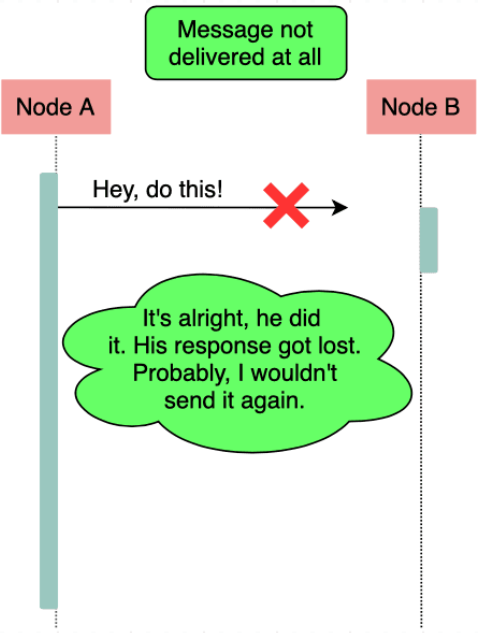
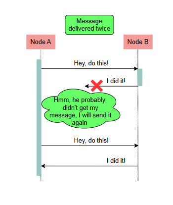

# История семантики "ровно один раз"

Познакомимся с историей семантики "ровно один раз".

## Многократная доставка сообщений

Различные узлы распределённой системы взаимодействуют друг с другом путём обмена сообщениями.

Поскольку сеть ненадёжна, эти сообщения могут теряться. Конечно, чтобы справиться с этим, узлы могут повторять попытки в надежде, что сеть в какой-то момент восстановится и сообщение будет доставлено.

Однако это означает, что узлы могут доставлять сообщения несколько раз, потому что отправитель не знает, что происходит на самом деле.

На следующей иллюстрации показано, что происходит, когда узел вообще не доставляет сообщение.

На следующей иллюстрации показано сообщение, которое узел доставляет дважды.

## Последствия дублирования сообщений

Такая дублирующая доставка сообщения может привести к катастрофическим побочным эффектам.

### Пример последствий

Представьте, что произойдёт, если сообщение должно сигнализировать о переводе денег между двумя банковскими счетами в рамках покупки. Банк может дважды списать деньги с клиента за один продукт.

## Избежание многократной доставки сообщений

Чтобы справиться со сценариями, подобными описанному выше, мы можем использовать несколько подходов, чтобы гарантировать, что узлы обрабатывают сообщение только один раз, даже если оно доставляется многократно. Рассмотрим эти подходы.

### Подход с идемпотентными операциями

Идемпотентная операция — это операция, которую можно применять многократно без изменения результата после первого применения.

#### Пример идемпотентной операции

Примером идемпотентной операции является добавление значения в множество. Даже если мы применим эту операцию несколько раз, последующие операции после первой не будут иметь эффекта, так как значение уже добавлено в множество. Конечно, здесь мы предполагаем, что другие операции не могут удалять значения из множества. В противном случае повторная операция может добавить значение, которое было удалено.

#### Пример неидемпотентной операции

Примером неидемпотентной операции является увеличение счётчика на единицу, где операция будет иметь дополнительные побочные эффекты при каждом её применении.

Используя идемпотентные операции, мы можем гарантировать, что даже если узел доставляет сообщение несколько раз и повторяет операцию, результат останется тем же.

Однако идемпотентные операции часто накладывают строгие ограничения на систему. Поэтому во многих случаях мы не можем построить систему так, чтобы все операции были идемпотентными по своей природе. В таких случаях мы можем использовать другой подход: дедупликацию.

### Подход с дедупликацией

В подходе с дедупликацией каждому сообщению присваивается уникальный идентификатор, и каждое повторно отправленное сообщение содержит тот же идентификатор, что и оригинальное. Таким образом, получатель может запомнить множество идентификаторов, которые он уже получил и обработал. Это позволяет избежать выполнения операций, которые уже были выполнены.

Важно отметить, что для этого необходимо контролировать обе стороны системы: отправителя и получателя. Это связано с тем, что генерация идентификаторов происходит на стороне отправителя, а процесс дедупликации — на стороне получателя.

### Пример

Представьте сценарий, в котором приложение отправляет электронные письма в рамках операции. Отправка письма не является идемпотентной операцией. Если протокол электронной почты не поддерживает дедупликацию на стороне получателя, мы не можем быть уверены, что каждое письмо будет отображено получателю ровно один раз.

## Разница между доставкой и обработкой

Когда мы говорим о семантике "ровно один раз", полезно различать понятия доставки и обработки.

В контексте вышеизложенного давайте считать доставку прибытием сообщения на узел назначения на аппаратном уровне.

Обработку же будем считать обработкой этого сообщения на уровне программного приложения узла.

В большинстве случаев нас больше волнует, сколько раз узел обрабатывает сообщение, а не сколько раз он его доставляет. Например, в приведённом ранее примере с письмом нас в основном интересовало, отобразит ли приложение одно и то же письмо дважды, а не то, получит ли оно его дважды.

Как показали предыдущие примеры, в распределённой системе невозможно обеспечить доставку "ровно один раз". Однако иногда всё же возможно обеспечить обработку "ровно один раз".

В итоге важно понимать разницу между этими двумя понятиями и уточнять, о чём именно мы говорим, когда обсуждаем семантику "ровно один раз".

## Другие семантики доставки

В заключение отметим, что легко реализовать семантики доставки "не более одного раза" и "хотя бы один раз".

Мы можем достичь доставки "не более одного раза", отправляя каждое сообщение только один раз, независимо от того, что происходит. В то же время доставку "хотя бы один раз" можно обеспечить, отправляя сообщение непрерывно, пока не будет получено подтверждение от получателя