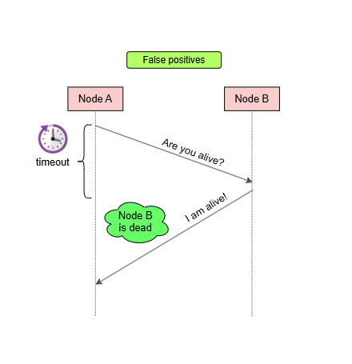
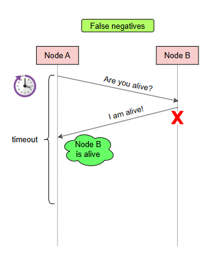

# Сбои в мире распределённых систем

## Введение
В распределённых системах сбои неизбежны, и их обнаружение представляет собой сложную задачу. Это связано с характеристиками распределённых систем, описанными в уроке «Трудности проектирования распределённых систем», одной из которых является асинхронность сети. В этом документе мы рассмотрим, почему происходят сбои, как их обнаруживать и какие компромиссы возникают при этом.

## Причина сбоев
Асинхронная природа сети в распределённых системах затрудняет различие между узлом, который вышел из строя, и узлом, который просто медленно отвечает на запросы. Из-за отсутствия строгих гарантий по времени доставки сообщений невозможно однозначно определить состояние узла.

## Механизм обнаружения сбоев
Основной механизм обнаружения сбоев в распределённых системах — **тайм-ауты**. Поскольку асинхронная сеть может бесконечно задерживать сообщения, тайм-ауты устанавливают искусственное ограничение на время ожидания. Если узел не отвечает в течение заданного времени, его считают вышедшим из строя. Это позволяет системе продолжать работу, не блокируясь в ожидании ответа от узлов, которые, возможно, уже не функционируют.

Однако тайм-ауты не являются абсолютным решением и создают определённые компромиссы.

### Компромисс при малом значении тайм-аута
Если установить малое значение тайм-аута:
- Система будет тратить меньше времени на ожидание узлов, которые действительно вышли из строя.
- Однако система может ошибочно объявить «мёртвыми» узлы, которые просто работают медленнее, чем ожидалось. Такие случаи называются **ложноположительными** (false positive), если считать «мёртвый» узел положительным классом, а «живой» — отрицательным.

### Компромисс при большом значении тайм-аута
Если установить большое значение тайм-аута:
- Система будет более терпима к медленным узлам, снижая вероятность ложноположительных срабатываний.
- Однако система будет медленнее определять узлы, которые действительно вышли из строя, что может привести к потере времени на ожидание.

## Детектор сбоев
**Детектор сбоев** — это компонент узла, используемый для определения других узлов, которые перестали функционировать. Этот компонент критически важен для алгоритмов, которые должны продолжать работать при наличии сбоев. Исследования детекторов сбоев занимают важное место в области распределённых систем.

### Свойства, классифицирующие детекторы сбоев
Детекторы сбоев классифицируются по двум основным свойствам, отражающим упомянутые компромиссы:

- **Полнота** (Completeness): процент узлов, вышедших из строя, которые детектор успешно идентифицирует за определённый период.
- **Точность** (Accuracy): количество ошибок, которые допускает детектор за определённый период (например, ложноположительные срабатывания).

### Идеальный детектор сбоев
**Идеальный детектор сбоев** обладает максимальной полнотой и точностью: он безошибочно определяет все неисправные узлы и никогда не считает узел вышедшим из строя, пока тот действительно не перестал работать. Однако в полностью асинхронных системах построить такой детектор невозможно из-за фундаментальных ограничений.

Тем не менее, даже несовершенные детекторы сбоев могут быть полезны для решения сложных задач, таких как достижение консенсуса в распределённых системах.

## Заключение
Сбои в распределённых системах — это сложная проблема, связанная с асинхронной природой сетей. Тайм-ауты являются основным механизмом обнаружения сбоев, но их использование требует балансировки между скоростью реакции на сбои и риском ложных срабатываний. Детекторы сбоев играют ключевую роль в обеспечении устойчивости систем, и их эффективность определяется полнотой и точностью. Понимание этих аспектов помогает проектировать более надёжные распределённые системы.