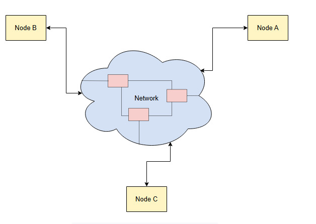
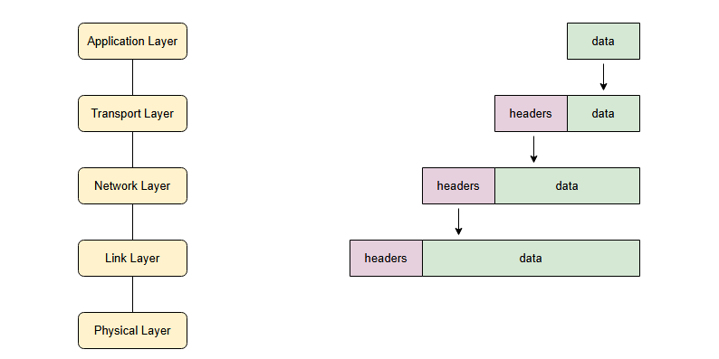

# **Введение**

Введение в сетевые концепции для распределенных систем.

В предыдущем уроке мы узнали о конечных узлах распределенной системы, где **сеть**, соединяющая их, рассматривается как черный ящик.

> В этой главе мы рассмотрим различные компоненты этой *сети*, которая обеспечивает связь между узлами, образующими распределенную систему.

Приложения обычно полагаются на набор четко определенных протоколов, которые позволяют этим приложениям выполнять свои функции на высоком уровне, без необходимости иметь дело с низкоуровневыми деталями. Это означает, что во многих случаях люди могут создавать приложения, не зная, как работают эти нижние уровни.

Однако эти знания позволяют нам создавать **масштабируемые**, **эффективные** и **отказоустойчивые** распределенные системы, а также более эффективно устранять возникающие проблемы.

Эта глава содержит краткий обзор основных технологий и протоколов, используемых для соединения нескольких вычислительных узлов.

## **Вспомним заблуждения, относящиеся к сетям**

Если мы вернемся к заблуждениям распределенных вычислений, мы заметим, что многие из них актуальны для этой главы:

*   Сеть надежна.
*   Задержка равна нулю.
*   Пропускная способность бесконечна.
*   Топология не меняется.
*   Стоимость передачи равна нулю.
*   Сеть однородна.

> Мы призываем читателя помнить об этих заблуждениях, проходя уроки этой главы.

## **Сетевые протоколы**

В настоящее время используется так много различных сетевых протоколов и технологий, что осветить их все в одном курсе было бы поистине геркулесовой задачей. В результате этот курс будет сосредоточен только на **стеке интернет-протоколов**, который является наиболее широко используемым протоколом в наши дни.

Однако проблемы, решаемые этими протоколами, являются общими, и они опираются на фундаментальные принципы, которые проявляются и в других моделях, таких как модель **OSI**.

### **Стек интернет-протоколов**

Стек интернет-протоколов следует многоуровневой архитектуре, где общая функциональность разделена на отдельные уровни, содержащие набор различных протоколов. Каждый уровень предоставляет сервис вышестоящему уровню и использует сервисы, предоставляемые нижестоящим уровнем.

Начиная сверху, существует пять уровней, а именно:

*   Прикладной уровень
*   Транспортный уровень
*   Сетевой уровень
*   Канальный уровень
*   Физический уровень

Когда данные поступают с вышестоящего уровня, каждый уровень оборачивает эти данные вместе с необходимыми метаданными для соответствующего протокола, как показано на иллюстрации ниже. Эти метаданные обычно называют ***заголовками***, а фактические данные — ***полезной нагрузкой***.

Когда данные передаются с нижних уровней на верхние, происходит обратный процесс. В этом случае *полезная нагрузка* извлекается и передается вышестоящему уровню. Эти процессы также известны как ***инкапсуляция*** и ***декапсуляция*** соответственно.

> **Примечание:** В этой главе мы рассмотрим каждый из этих уровней и их протоколы, чтобы понять проблемы, которые каждый уровень пытается решить, и как они решаются. Мы будем следовать подходу «снизу вверх», начиная с уровней в нижней части стека и продвигаясь вверх шаг за шагом.
