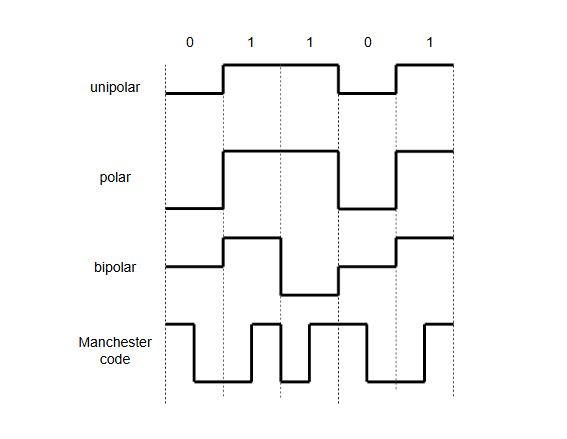

# **Физический уровень**

**Физический уровень** отвечает за передачу данных в виде необработанных битов по физическому каналу между двумя соединенными узлами.

> Примечание: Данные передаются через среду, которая может принимать различные формы, как мы увидим далее.

## **Сервисы, предоставляемые физическим уровнем**

Теперь мы рассмотрим некоторые сервисы, которые предоставляет физический уровень:

### **Линейное кодирование**

Это процесс кодирования цифровых данных в виде битов в паттерн напряжения, тока или фотонов, который может быть передан по физической среде.

Некоторые примеры линейного кодирования: униполярное, полярное, биполярное и манчестерское кодирование, как мы видим на следующей иллюстрации.

*   При **униполярном линейном кодировании** двоичная 1 кодируется как положительное напряжение, а двоичный 0 — как нулевое напряжение.
*   При **полярном линейном кодировании** двоичная 1 кодируется как положительное напряжение, а двоичный 0 — как отрицательное напряжение.
*   При **биполярном линейном кодировании** двоичный 0 кодируется как нулевое напряжение, а двоичная 1 — попеременно как положительное или отрицательное напряжение.
*   При **манчестерском линейном кодировании** двоичный 0 кодируется как переход от низкого напряжения к высокому, а двоичная 1 — как переход от высокого напряжения к низкому.

Каждый вид кодирования имеет свои плюсы и минусы. В результате, пригодность того или иного паттерна кодирования зависит от других факторов, таких как среда передачи.

### **Модуляция/демодуляция**

Это процесс смешивания сигнала, соответствующего цифровым данным, которые мы хотим передать, известного как ***сигнал данных*** или ***информационный сигнал***, с отдельным периодическим сигналом, известным как ***несущий сигнал***. Это делается для преобразования сигнала в форму, более подходящую для передачи.

Например, частота несущего сигнала зависит от передаваемых данных. Несколько сигналов данных могут быть отправлены по одному каналу, если мы используем несколько несущих на немного разных частотах. Это также имеет практические преимущества. Антенны должны быть примерно в одну десятую длины волны сигнала, поэтому экономично использовать более высокие частоты.

Три основных типа модуляции:

*   Амплитудная модуляция
*   Частотная модуляция
*   Фазовая модуляция

### **Контроль несущей и обнаружение коллизий**

Это процесс, который используется для определения, передает ли другое устройство данные по среде, и если другое устройство передавало данные одновременно, что привело к коллизии и потенциальной потере/повреждению передаваемых данных.

### **Автосогласование**

Это процесс, используемый для того, чтобы две или более стороны сетевого соединения договорились об одинаковом наборе параметров, используемых для связи, таких как скорость и режим передачи, например *симплексный* или *дуплексный*.

На практике устройства объявляют о своих возможностях, а затем выбирается самый производительный режим передачи, поддерживаемый обеими сторонами.

## **Среда передачи**

Существует множество различных физических сред, которые можно разделить на две основные категории:

*   Направляющие среды
*   Ненаправляющие среды

### **Направляющие среды**

**Направляющие среды** используют физический путь или проводник для передачи сигнала в определенном направлении. Поэтому их также называют **проводной связью**.

Некоторые примеры проводных сред:

#### **Витая пара**

Витая пара — это тип проводки, в которой два проводника одной цепи скручены вместе для улучшения электромагнитной совместимости за счет уменьшения электромагнитного излучения от пары и внешних электромагнитных помех от других источников. Эти кабели обычно изготавливаются из медных проводов.

#### **Коаксиальный кабель**

Коаксиальный кабель — это тип электрического кабеля, который состоит из внутреннего проводника, окруженного концентрическим проводящим экраном. Проводник и проводящий экран разделены диэлектриком (изоляционным материалом).

#### **Оптоволоконный кабель**

Оптоволоконный кабель содержит одно или несколько оптических волокон, которые используются для передачи света. Обычно эти волокна индивидуально покрыты пластиковыми слоями и заключены в защитную трубку, подходящую для среды, в которой будет проложен кабель.

### **Ненаправляющие среды**

Ненаправляющие среды транслируют сигнал по воздуху и не направляют его. Поэтому их также называют **беспроводной связью**.

Некоторые примеры беспроводных сред — радиоволны, микроволны и инфракрасный свет. Все это различные формы электромагнитного излучения с разными частотами.

## **Технологии, предоставляющие сервисы физического уровня**

Множество различных технологий предоставляют сервисы физического уровня, такие как DSL, ISDN, Bluetooth и USB.

> Примечание: Ethernet и Wi-Fi являются основными составляющими Интернета, поэтому сейчас мы сосредоточимся на них.

### **Ethernet**

Ethernet является частью стандарта IEEE 802.3, который определяет как спецификации физического уровня, так и связанные протоколы канального уровня, которые мы рассмотрим позже. Он может передаваться по различным физическим средам, включая коаксиальный кабель, медный провод и оптическое волокно. В результате он существует во многих различных формах.

Некоторые примеры Ethernet: 10BASE-2, 10BASE-T и 10BASE-F, где первый компонент указывает скорость стандарта (например, 10 Мбит/с), а последняя часть — среду (например, коаксиальный кабель, витая пара или оптоволоконный кабель).

### **Wi-Fi**

Wi-Fi является частью стандарта IEEE 802.11, который определяет спецификации физического уровня и связанные протоколы канального уровня, используемые для беспроводной связи.

## **Предоставление сервисов физического уровня компьютеру**

Сервисы физического уровня предоставляются компьютеру через **сетевую карту** (network interface card). Это аппаратный компонент, который подключает компьютер к другим компьютерам по проводной или беспроводной среде.

*Сетевая карта* обычно связана с адресом, называемым **MAC-адресом**, который используется для уникальной идентификации устройства в непосредственной сети устройств.
