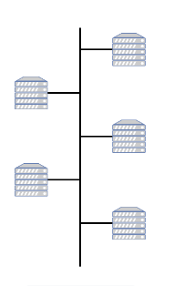
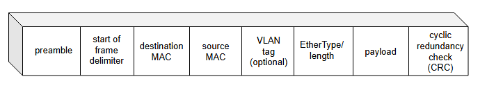
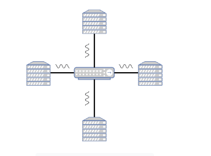
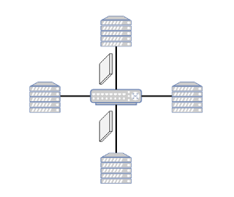
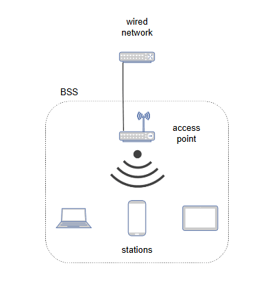
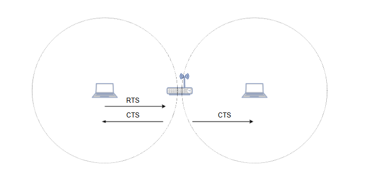

# **Протоколы канального уровня**

Узнайте о протоколах канального уровня.

Как уже упоминалось ранее, Ethernet и Wi-Fi — это протоколы, которые широко используются для подключения устройств в проводных или беспроводных средах. Поэтому здесь мы представим краткий обзор их основных принципов работы.

## **Ethernet**

Ethernet прошел через различные фазы и развивался со временем. Это означало, что вносились изменения в спецификации как на аппаратном уровне, так и в связанные протоколы.

Изначально Ethernet предназначался для подключения нескольких компьютеров по общему коаксиальному кабелю, который выступал в качестве широковещательной среды передачи. Эта топология также известна как **шинная топология**, как показано на следующей иллюстрации.

Это означало, что любые данные, переданные одним узлом, будут получены всеми остальными узлами, подключенными к этому конкретному кабелю.

Сетевая карта отвечала за чтение метаданных каждого пакета и передачу процессору только тех пакетов, которые были ему адресованы. Для выполнения этого процесса каждая сетевая карта имеет один или несколько уникальных адресов, известных как **MAC-адреса (адреса управления доступом к среде)**. Это 48-битные числа, которые выделяются ассоциацией IEEE.

Каждый кадр Ethernet содержит MAC-адрес источника и назначения, причем последний используется сетевой картой для идентификации предназначенных ей кадров. Существуют также специальные адреса, которые позволяют отправлять кадр нескольким сетевым картам одновременно. Одним из таких примеров является **широковещательный адрес**, который состоит только из битов, установленных в единицу (также представляется как FF:FF:FF:FF:FF:FF), и принимается всеми узлами. Кадр также содержит другие поля, как показано на иллюстрации ниже.

*   **Преамбула** — это статическое значение, которое используется для синхронизации тактовых генераторов отправителя и получателя, чтобы последующие данные были правильно интерпретированы получателем.
*   Поле **EtherType** содержит идентификатор, который указывает, какому протоколу сетевого уровня должны быть переданы данные.
*   Поле **полезной нагрузки** несет данные протокола сетевого уровня.
*   **CRC** используется для обнаружения битовых ошибок.

Поскольку среда является общей, если две станции пытаются передавать данные одновременно, может произойти коллизия, что может привести к повреждению передаваемых данных. Поэтому в ранних версиях Ethernet использовался вариант CSMA, известный как **CSMA/CD**, для восстановления после таких коллизий и успешной передачи данных.

Для эффективной работы протокола CSMA/CD указаны конкретные ограничения на длину сегмента кабеля. Это позволяет удерживать задержку распространения коллизии и деградацию сигнала на допустимых уровнях.

Позже *шинная топология* была заменена ***топологией «звезда»***, в которой несколько узлов подключались к устройству, называемому повторителем или концентратором, с помощью витой пары из медного провода, как показано на иллюстрации ниже.

### **Концентратор (Hub)**

Концентратор — это устройство физического уровня, которое работает с отдельными битами, а не с кадрами. Когда бит поступает с одного интерфейса, концентратор воссоздает бит, усиливает его сигнал и передает бит на другие интерфейсы. В результате Ethernet с топологией «звезда» на основе концентратора остается общей широковещательной средой, что означает, что CSMA/CD все еще используется.

> **Примечание**: Использование топологии «звезда» имеет преимущества по сравнению с шинной топологией. Например, топология «звезда» облегчает установку в зданиях, которые уже используют кабельные планы топологии «звезда» для телефонии, и обеспечивает лучшую отказоустойчивость, поскольку позволяет легко отключать неисправные узлы и предотвращать их влияние на другие устройства в сети.

Следующая и самая последняя эволюция привела к замене концентраторов в центре топологии «звезда» устройствами, называемыми коммутаторами, которые работают на канальном уровне. Это показано на следующей иллюстрации.

ра

### **Коммутатор (Switch)**

**Коммутатор** получает кадры канального уровня и пересылает их на конкретные исходящие каналы, на которые они адресованы. Для этого коммутатор поддерживает таблицу коммутации, которая сопоставляет MAC-адреса с соответствующими интерфейсами, ведущими к ним. Это делается автоматически, без необходимости ручной настройки или дополнительных протоколов.

Таблица коммутации изначально пуста, и коммутатор добавляет в нее записи, проверяя MAC-адреса источников входящих кадров и связывая их с интерфейсом, с которого они поступили.

> **Примечание:** Каждый раз, когда коммутатор получает входящий кадр, он ищет в таблице запись, содержащую адрес назначения. Последние достижения означают, что коммутаторы могут выполнять пересылку на основе более сложной логики, используя больше информации, чем просто MAC-адрес назначения. Одним из таких примеров является **протокол OpenFlow**. Однако здесь мы намеренно сосредоточились на самом простом и первоначальном использовании.

Для каждого кадра коммутатор находит интерфейс, соответствующий адресу назначения. Если такой записи нет, кадр пересылается на все остальные интерфейсы, то есть на все, кроме того, с которого он был получен. Это называется **флудингом** (flooding) и является причиной, по которой коммутаторы называют самообучающимися или устройствами plug-and-play.

В случаях, когда узлы напрямую подключены к коммутаторам в полнодуплексном режиме, возможность коллизии отсутствует, что означает отсутствие необходимости в протоколе управления доступом к среде, таком как CSMA/CD, и пропускная способность канала используется более эффективно.

> **Примечание:** Использование коммутатора вместо концентратора также может привести к общему сокращению трафика. Уменьшение широковещательного трафика, в свою очередь, может привести к повышению производительности сети.

## **Wi-Fi**

Wi-Fi использует два основных режима работы:

*   Режим Ad-hoc
*   Инфраструктурный режим

### **Режим Ad-hoc**

В **режиме ad-hoc** каждый узел передает данные напрямую другим узлам.

### **Инфраструктурный режим**

В **инфраструктурном режиме** связь обычно проходит через центральную точку доступа (AP), которая соединяет беспроводные устройства (станции) с проводной сетью. Инфраструктурный режим используется более широко и в большинстве повседневных сценариев, поэтому мы сосредоточимся на нем.

В этом режиме существует **базовый набор служб (BSS)**, который представляет собой группу станций, подключенных к одной и той же точке доступа. Каждая точка доступа связана с идентификатором, известным как **идентификатор набора служб (SSID)**, который настраивается администратором.

> **Примечание:** Каждая беспроводная станция должна быть ассоциирована с точкой доступа, прежде чем она сможет отправлять или получать данные от остальной части сети.

## **Ассоциация**

Ассоциация выполняется следующим образом: точки доступа периодически передают специальные сообщения, называемые **маячковыми кадрами (beacon frames)**, которые содержат SSID и MAC-адрес точки доступа. Беспроводная станция прослушивает эти сообщения и выбирает одно из них для ассоциации или представляет их пользователю. Пользователь выбирает сообщение через пользовательский интерфейс. Этот процесс прослушивания среды на предмет маячковых кадров известен как ***пассивное сканирование***.

Беспроводное устройство также может выполнять ***активное сканирование***, транслируя пробный кадр (probe frame), который получают все точки доступа в радиусе действия беспроводного устройства. Точки доступа отвечают на *запрос-пробник* *ответом-пробником*. Устройство отправляет *запрос на ассоциацию* точке доступа, а точка доступа отвечает *ответом на ассоциацию* для установления связи с AP.

После завершения ассоциации устройство начинает отправлять и получать кадры данных в сеть и из нее.

Учитывая, что множество беспроводных устройств могут использовать одну и ту же среду, для координации передач необходим **протокол множественного доступа**. По этой причине 802.11 использует CSMA с предотвращением коллизий (CSMA/CA).

***Обнаружение коллизий*** заменяется ***предотвращением коллизий***, поскольку на адаптере 802.11 принимаемый сигнал, как правило, слаб по сравнению с силой передаваемого сигнала. Поэтому создание аппаратного обеспечения, способного обнаруживать коллизии, является дорогостоящим.

По сравнению с проводными каналами, беспроводные каналы страдают от большего затухания сигнала и помех, что увеличивает вероятность повреждения передаваемых данных. По этой причине используется **протокол подтверждения**, при котором получатель отвечает на сообщение с данными **сообщением-подтверждением**, чтобы сообщить отправителю, что сообщение было получено без повреждений. Если сообщение не получено без повреждений или если сообщение-подтверждение потеряно, отправитель попытается отправить сообщение снова.

Станции вводят дополнительные задержки, когда обнаруживают, что канал занят, чтобы убедиться, что другой узел не пытается отправить кадр в то же время. Это и есть часть, отвечающая за *предотвращение коллизий*, и она введена потому, что в этом протоколе узлы не прекращают передачу при возникновении коллизии (то есть, нет *обнаружения коллизий*).

## **Проблема скрытого терминала**

Беспроводные каналы также подвержены проблеме, известной как **проблема скрытого терминала**. Бывают случаи, когда две станции не могут обнаружить передачи друг друга, потому что они находятся слишком далеко друг от друга, но при этом обе находятся в радиусе действия точки доступа. Это показано на следующей иллюстрации.

Протокол Wi-Fi содержит опциональный режим, в котором станция может передать специальное сообщение точке доступа, чтобы получить доступ к передаче, известное как **Запрос на отправку (RTS)**. Если ни одно другое устройство не передает данные, точка доступа отвечает сообщением, известным как **Готовность к приему (CTS)**. CTS получают все устройства, ассоциированные с точкой доступа, что резервирует среду для соответствующей станции.

## **Типы кадров**

В общем, существует три типа кадров, а именно:

*   **Кадры данных:** Используются для передачи полезной нагрузки данных между узлами.
*   **Управляющие кадры:** Используются для облегчения обмена кадрами данных. Кадры CTS/RTS и кадры подтверждения являются примерами управляющих кадров.
*   **Управленческие кадры:** Используются для поддержания или прекращения связи. Маячковые кадры или запросы-пробники являются примерами управленческих кадров.

Структура кадра имеет много общего с Ethernet.

Полезная нагрузка содержит полезную нагрузку инкапсулированного протокола более высокого уровня и CRC, который защищает от ошибок передачи.

Кадр содержит четыре MAC-адреса, как видно на следующей иллюстрации.

*   Адрес 1 — это непосредственный получатель
*   Адрес 2 — это непосредственный передатчик
*   Адрес 3 — это косвенный получатель/передатчик

Эти адреса соответствуют точке доступа, исходной станции и станции назначения соответственно для кадров, отправляемых станцией в точку доступа для доставки другой станции. В качестве альтернативы, они соответствуют станции назначения, точке доступа и исходной станции соответственно для кадров, отправляемых точкой доступа конечной станции назначения. Кадр также содержит порядковые номера для целей дедупликации, поле длительности, используемое для резервирования канала, и поле управления кадром, которое содержит различные подполя, такие как версия протокола, тип кадра (например, данные, управляющий или управленческий) и так далее.
