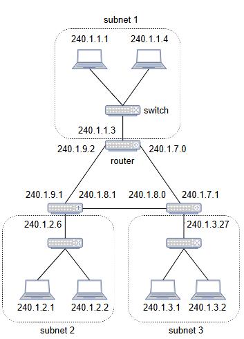
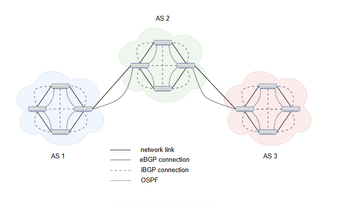

# **Сетевой уровень**

Узнайте о сетевом уровне, протоколах, которым он следует, и ограничениях, с которыми он сталкивается.

В то время как ***канальный уровень*** отвечает за передачу пакетов между напрямую связанными узлами, ***сетевой уровень*** передает пакеты между узлами, которые не связаны напрямую и могут принадлежать разным сетям.

## **Функциональные возможности, обеспечивающие сервис сетевого уровня**

Функциональные возможности, которые помогают сетевому уровню передавать пакеты между узлами, которые не связаны напрямую и могут принадлежать разным сетям, можно разделить на две основные области: **плоскость управления** и **плоскость данных**.

### **Плоскость управления**

**Плоскость управления** — это часть сетевого уровня, которая собирает всю необходимую метаинформацию, которая требуется для маршрутизации пакетов данных между узлами.

### **Плоскость данных**

**Плоскость данных** — это часть сетевого уровня, которая маршрутизирует пакеты данных между узлами, используя информацию, предоставленную плоскостью управления.

## **Протоколы**

> **Примечание:** Существует множество различных протоколов, которые используются на сетевом уровне, но рассмотреть их все в этом уроке непрактично. Поэтому в этом курсе мы сосредоточимся на самых центральных из них.

Каждый сетевой интерфейс имеет MAC-адрес, который используется для адресации кадров на канальном уровне. Однако этот адрес назначается статически и не является иерархическим, что делает его неподходящим для маршрутизации пакетов в сети. В результате на сетевом уровне вводится вторая форма адреса, называемая **IP-адресом (адресом Интернет-протокола)**.

### **Интернет-протокол (IP)**

IP-адреса назначаются статически, либо администратором, либо динамически сетью.

IP-адреса также являются иерархическими, что означает, что каждый адрес является частью сети, которая может содержать несколько адресов, и где сеть также может быть частью более крупной сети.

Протокол IP со временем эволюционировал, чтобы удовлетворять потребности пользователей, и структура IP-адресов менялась вместе с ним. В результате изменений появились:

*   IP-адрес v4, который является 32-битным числом.
*   IP-адрес v6, который является 128-битным числом.

> **Примечание:** Внедрение IP v6 — это продолжающийся процесс. Поэтому мы будем приводить примеры с использованием IP v4. Для краткости мы будем называть его просто IP.

#### **Структура**

IP-адреса представляются в точечно-десятичной нотации, состоящей из четырех десятичных чисел, которые представляют 8 бит и находятся в диапазоне 0-255, разделенных точкой.

Пример IP-адреса: 172.16.254.1.

IP-адрес структурно состоит из двух частей:

*   Первая часть содержит старшие биты, которые являются общими для всех адресов в сети, и известна как **сетевой префикс**.
*   Вторая часть IP-адреса представляет идентификатор узла в сети.

Сети соединены друг с другом через специальные устройства, называемые маршрутизаторами, которые способны правильно маршрутизировать пакеты между сетями, чтобы они успешно достигали своего назначения.

На следующей иллюстрации показан пример трех разных подсетей, соединенных друг с другом через три маршрутизатора.

> **Примечание:** Центральным протоколом на сетевом уровне является **протокол IP**.

Задача IP — доставлять пакеты, называемые **датаграммами**, от одного узла к другому. Он доставляет датаграммы, которые потенциально могут находиться в другой сети. Эти датаграммы инкапсулируются в кадры канального уровня (например, кадры Ethernet), чтобы быть отправленными по каналу связи. Они также состоят из набора заголовков и полезной нагрузки, которая соответствует пакету следующего уровня в сетевом стеке. Здесь основными интересующими нас заголовками являются IP-адреса источника и назначения, протокол вышестоящего уровня и версия используемого протокола IP.

## **Протокол разрешения адресов (ARP)**

> **Примечание:** Мы рассмотрим некоторые протоколы сетевого уровня более подробно, чтобы понять, как пакет доставляется между различными сетями.

Узлы, как правило, адресуются глобально в Интернете по их IP-адресам. Однако, чтобы пакет в конечном итоге достиг узла, его соседний узел должен знать его MAC-адрес, чтобы иметь возможность создать пакет канального уровня, адресованный ему. Это сопоставление IP-адреса с MAC-адресом выполняется **протоколом ARP**.

> **Примечание:** Вопрос о том, является ли ARP протоколом канального или сетевого уровня, является спорным. Некоторые утверждают, что это протокол *сетевого-канального уровня*, потому что его пакеты инкапсулируются в кадр *протокола канального уровня*. Другие, наоборот, утверждают, что это протокол канального уровня, потому что он не маршрутизируется и обменивается только в пределах одной сети.

> В контексте этой главы протокол ARP был представлен как часть сетевого уровня, потому что мы считаем, что его легче понять при подходе «снизу вверх».

Для того чтобы узел определил MAC-адрес узла с конкретным IP-адресом, он может отправить ARP-запрос всем узлам в локальной сети (используя широковещательный MAC-адрес в качестве адреса назначения), включив в запрос IP-адрес. ARP-сообщение будет инкапсулировано в кадр канального уровня. В случае Ethernet, например, это будет означать, что полезной нагрузкой кадра будет ARP-сообщение, а тип будет соответствовать типу ARP (0x0806).

> **Примечание:** Для краткости мы не будем вдаваться в детали структуры ARP-сообщения.

Каждый из узлов, получивших ARP-запрос, проверит, совпадает ли IP-адрес с их собственным, и если это так, они ответят ARP-ответом, который будет содержать их MAC-адрес. Узлы также хранят эти сопоставления в локальной ARP-таблице, которая действует как кэш, чтобы избежать повторных запросов на одну и ту же информацию.

Мы ответили на вопрос о том, как сетевой уровень доставляет пакеты внутри одной сети, но остается вопрос, как он доставляет пакеты между несколькими сетями.

### **Доставка пакетов между несколькими сетями**

Это достигается с помощью маршрутизаторов. Маршрутизаторы поддерживают специальные таблицы маршрутизации, которые содержат информацию о том, как можно достичь определенных IP-адресов. В частности, таблица маршрутизации содержит записи со следующими полями:

*   **Сеть назначения и маска сети:** Вместе эти поля образуют идентификатор сети.
*   **Шлюз:** Шлюз — это следующий узел, на который должен быть отправлен пакет, чтобы он достиг своего конечного пункта назначения. Этим конечным пунктом назначения может быть конкретный IP-адрес маршрутизатора, если сеть доступна через какой-либо маршрутизатор. Он также может иметь значение 0.0.0.0, если сеть доступна локально, что означает наличие прямого канала к IP-адресу назначения, и пакет можно отправить ему напрямую.
*   **Интерфейс:** Это поле соответствует сетевому интерфейсу, через который можно достичь шлюза.

### **Таблица маршрутизации**

Таблицы маршрутизации также поддерживаются обычными узлами для той же цели. Каждый раз, когда узлу необходимо отправить пакет сетевого уровня, он выполняет поиск в своей таблице маршрутизации по IP-адресу назначения пакета, чтобы определить, куда этот пакет должен быть направлен, чтобы достичь этого IP-адреса. Затем пакет отправляется через соответствующий интерфейс на соответствующий шлюз.

Теперь мы можем вернуться к нашему предыдущему примеру и посмотреть, как будут выглядеть эти таблицы маршрутизации и как пакеты будут перемещаться между сетями. Например, таблица маршрутизации для узла с IP-адресом 240.1.1.1 может выглядеть следующим образом:

| Назначение | Маска сети | Шлюз | Интерфейс |
| :--- | :--- | :--- | :--- |
| 0.0.0.0 | 0.0.0.0 | 240.1.1.3 | if1 |
| 240.1.1.0 | 255.255.255.0 | 0.0.0.0 | if1 |

Следующий вопрос, который может у нас возникнуть на данном этапе: как эта таблица маршрутизации заполняется изначально?

#### **Заполнение таблицы маршрутизации**

Таблицы маршрутизации заполняются, когда маршрутизаторы обмениваются информацией о IP-адресах, достижимых через них. Затем маршрутизаторы используют эту информацию для формирования карты сети в виде таблицы маршрутизации. Конечно, это намеренно упрощенное описание процесса заполнения.

### **Автономная система (АС)**

На практике несколько узлов из одной или нескольких сетей могут быть сгруппированы в **автономную систему (АС)**, которая содержит группу маршрутизаторов, находящихся под единым административным контролем.

#### **Протокол маршрутизации внутри автономной системы**

Маршрутизаторы в пределах одной АС используют один и тот же алгоритм маршрутизации для обмена информацией друг о друге. В результате алгоритм маршрутизации, работающий в автономной системе, называется **протоколом маршрутизации внутри автономной системы**. Примером такого протокола является **протокол OSPF (Open Shortest Path First)**.

> **Примечание:** Уровень, к которому принадлежит OSPF, также является предметом споров. Он инкапсулируется в IP, но его относят к канальному уровню, потому что пакеты OSPF передаются только по одному каналу и не проходят через маршрутизаторы, чтобы преодолеть более одного хопа.

#### **Протокол маршрутизации между автономными системами**

Автономной системе необходимо обмениваться некоторой информацией с другими автономными системами, чтобы иметь возможность маршрутизировать к ним пакеты. Это задача протокола маршрутизации между автономными системами. Примером такого протокола является **протокол BGP (Border Gateway Protocol)**, который состоит из внешнего **BGP (eBGP)** и внутреннего **BGP (iBGP)**.

*eBGP* работает между двумя маршрутизаторами в разных автономных системах для обмена информацией о соседях, а *iBGP* работает между двумя маршрутизаторами в одной и той же автономной системе для распространения этой информации внутри автономной системы.

> **Примечание:** Фактически, BGP используется большинством интернет-провайдеров (ISP) для установления маршрутизации между собой.

## **Ограничения сетевого уровня**

Прежде чем мы перейдем к следующему уровню, было бы полезно сначала поразмыслить над ограничениями сетевого уровня.

*   Сетевой уровень не предоставляет никаких гарантий, что сообщения, отправленные с одного узла, в конечном итоге будут доставлены на узел назначения. Обмен сообщениями не удается либо когда маршрутизатор выходит из строя, либо когда маршрутизатор вынужден отбросить пакет из-за перегрузки сети.

> Маршрутизаторы хранят полученные пакеты в памяти до тех пор, пока не передадут их в сеть. Если пакеты поступают с большей скоростью, чем они могут быть переданы, маршрутизатор может быть вынужден отбросить некоторые пакеты, чтобы избежать исчерпания памяти. **Алгоритм организации очереди**, используемый маршрутизатором, определяет, как пакеты буферизуются в памяти и/или отбрасываются. Некоторые примеры алгоритмов организации очереди включают: **«первым пришел — первым вышел» (FIFO), приоритетную очередь** и **взвешенную справедливую очередь.**

*   Сетевой уровень также не предоставляет гарантий порядка. Если узел А отправляет два сообщения последовательно на один и тот же узел, это не означает, что другой узел получит их в том же порядке. Пакеты могут следовать разными путями через сеть, или некоторые маршрутизаторы в сети не обязательно сохраняют порядок пакетов. В результате сетевой уровень не обеспечивает ни надежной, ни упорядоченной доставки.
*   Сетевой уровень также не может предоставить строгих гарантий пропускной способности или времени, поскольку у приложений нет способа зарезервировать ресурсы сети на определенный период времени. Вместо этого они используют любую доступную пропускную способность на момент передачи данных. Это важно помнить при построении распределенной системы, потому что мы должны убедиться, что не делаем неверных предположений.

> Это сводится к тому, что протокол IP является ***протоколом с коммутацией пакетов***. Существуют и другие ***протоколы с коммутацией каналов***, которые могут предоставлять строгие гарантии пропускной способности, но у них, конечно, есть свои недостатки.
