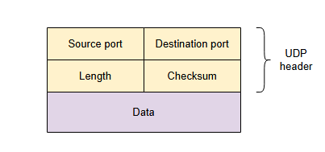
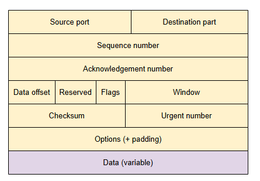

# **Транспортный уровень**

Узнайте о сервисах, предоставляемых транспортным уровнем.

Сетевой уровень обеспечивает ***связь между узлами***, в то время как транспортный уровень предоставляет сервис ***связи между приложениями***.

Сервис связи между приложениями полезен, потому что на одном узле может быть запущено множество различных приложений, которые хотят общаться с одним из приложений, запущенных на другом узле.

## **Обеспечение сервиса транспортного уровня**

Связь между приложениями достигается с помощью концепции **портов**, где каждый узел может иметь множество различных приложений, запущенных и прослушивающих разные порты для получения данных из сети.

Некоторые протоколы на транспортном уровне также могут предоставлять дополнительные сервисы поверх этого основного. Мы кратко рассмотрим **протокол управления передачей (TCP)** и **протокол пользовательских датаграмм (UDP)**, два наиболее часто используемых и известных протокола *транспортного уровня*.

### **Протокол пользовательских датаграмм (UDP)**

UDP — это простой протокол, который приложения могут использовать для отправки сообщений друг другу. Эти сообщения называются датаграммами.

Подобно протоколу IP, это **протокол без установления соединения**, что означает, что приложение на одном хосте может отправить сообщение приложению на другом хосте без предварительной установки канала связи. Все, что ему нужно сделать, — это указать IP-адрес узла назначения и порт, который прослушивает соответствующее приложение.

#### **Структура датаграммы**

Датаграмма состоит из **полезной нагрузки**, которая соответствует сообщению приложения, и **заголовка**, который содержит поля для портов источника и назначения, длину датаграммы и необязательную контрольную сумму.

### **Протокол управления передачей (TCP)**

TCP — это более сложный протокол, который может предоставлять больше сервисов. TCP является **протоколом с установлением соединения**, что означает, что соединение между клиентом и сервером должно быть установлено до того, как могут быть отправлены данные приложения. Это достигается с помощью **трехстороннего рукопожатия**.

#### **Трехстороннее рукопожатие**

**Трехстороннее рукопожатие** используется для установления соединения и согласования нескольких его параметров.

Например, важным параметром, который выбирается на этом этапе, является **размер буферов в памяти**, которые будут использоваться для временного хранения полученных данных до их доставки приложению.

Этот процесс начинается, когда клиент отправляет запрос на установку соединения (SYN), продолжается, когда сервер отвечает подтверждением соединения вместе с запросом на установку соединения в обратном направлении (ACK & SYN), и заканчивается, когда клиент отвечает подтверждением (ACK). После завершения этого процесса между двумя сторонами устанавливается соединение, которое можно использовать для обмена данными.

#### **Передача данных**

Данные отправляются от одного узла к другому в виде потока байтов. В результате приложению необходимо указывать начало и конец сообщения приложения в этом потоке с помощью **разделителей** или специальных заголовков, которые определяют размер сообщения.

#### **Преимущества**

У TCP есть свои преимущества.

**Доставка в правильном порядке**

TCP обеспечивает надежную **доставку в правильном порядке**. Это означает, что любые данные, отправленные отправителем, гарантированно будут доставлены получателю **в конечном итоге** и в том порядке, в котором они были отправлены. Это достигается за счет использования сложного протокола подтверждения.

*Достижение доставки в правильном порядке:* Отправитель помечает отправляемые данные порядковым номером, который соответствует количеству байтов в полезной нагрузке. Получатель отправляет обратно подтверждения, указывая порядковый номер, до которого он успешно получил данные. В результате отправитель может повторно отправить данные, которые не были подтверждены в течение определенного времени. Получатель также может доставлять данные приложению в том порядке, в котором они были отправлены, используя эти порядковые номера.

**Управление потоком и управление перегрузкой**

TCP также обеспечивает управление потоком и управление перегрузкой, что означает, что скорость, с которой данные передаются отправителем, тщательно регулируется, чтобы избежать перегрузки получателя или всей сети.

**Управление потоком** достигается, когда получатель включает в подтверждения информацию о том, сколько места доступно в его буфере приема, чтобы отправитель мог снизить скорость передачи, когда буфер начинает заполняться.

**Управление перегрузкой** достигается путем регулировки количества находящихся в пути и неподтвержденных пакетов на стороне отправителя в соответствии с предполагаемой потерей пакетов.

**Потерю пакетов**, как правило, трудно точно определить на двух концах соединения, поэтому узлы используют эвристики для получения приближенной оценки. Например, отправитель предполагает, что пакет потерян, если он не был подтвержден в течение определенного временного окна.

> **Примечание**: Мы намеренно избегали подробностей этого протокола подтверждения, потому что он содержит множество оптимизаций и различных вариаций, которые сами по себе являются отдельной большой темой. В результате, если посмотреть на структуру *TCP-пакета*, она сложнее, чем у *UDP-пакетов*. Заголовок содержит много дополнительных полей для вышеупомянутых функций, таких как порядковый номер, номер подтверждения, размер окна и так далее.

## **Преимущества UDP перед TCP**

После предыдущего анализа можно подумать, что TCP превосходит UDP, поскольку предоставляет больше сервисов прикладному уровню. Конечно, это не так, потому что все эти гарантии сопряжены с определенными компромиссами.

*   Тот факт, что TCP требует установления соединения до начала обмена данными, делает его более "тяжеловесным" и медленным по сравнению с UDP.
*   То же самое относится к сервисам надежной доставки и доставки в правильном порядке, которые могут вносить значительные накладные расходы на память и сетевой трафик из-за необходимости поддерживать состояние соединения, буферы сообщений и выполнять повторные передачи для данных, которые считаются потерянными.
*   Данные в TCP отправляются и принимаются как поток байтов без каких-либо индикаторов границ, что означает, что прикладному уровню необходимо добавлять индикаторы границ вместе с необходимым парсингом и буферизацией. Напротив, данные в UDP отправляются и принимаются как сообщения с явными границами.
*   UDP также обеспечивает лучший контроль над тем, когда сообщение будет передано в сеть, по сравнению с TCP, который должен соблюдать несколько параметров, контролирующих, когда данные, отправленные из приложения, должны быть переданы в сеть. Например, алгоритм Нейгла работает, объединяя несколько небольших исходящих пакетов и отправляя их все сразу, чтобы более эффективно использовать сеть, что означает, что данные, отправленные из приложения, могут быть переданы не сразу.

## **Выбор протокола**

Полезно понимать плюсы и минусы каждого протокола, чтобы принять правильное решение при создании приложения на их основе. Ниже приведены некоторые примеры приложений и того, как они могут извлечь выгоду из характеристик каждого протокола:

*   Приложение для видео и аудио в реальном времени (например, видеоконференция) может выиграть от использования UDP, поскольку оно может допускать случайные потери пакетов и не получает большой выгоды от пакетов, которые приходят со значительной задержкой.
*   Приложение, которому требуется быстрый обмен относительно небольшим запросом с последующим единственным ответом, может выиграть от использования UDP, потому что оно не требует предварительного установления соединения, что делает это взаимодействие очень быстрым.

> DNS является примером такого приложения, и мы изучим его в следующем уроке.

*   Приложение, в котором получателю необходимо получить все данные от отправителя и в правильном порядке, может извлечь выгоду из надежной и упорядоченной доставки TCP. Примерами таких приложений являются передача электронной почты (SMTP), передача файлов (FTP) или передача веб-контента (HTTP).
