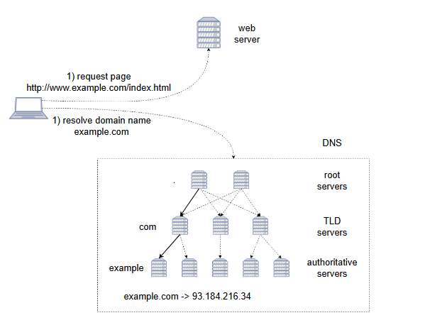
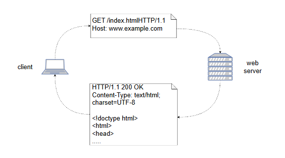

# **Прикладной уровень**

Узнайте о назначении прикладного уровня и двух основных протоколах, которым он следует.

**Прикладной уровень** полагается на транспортный уровень для передачи данных и отвечает за определение синтаксиса и семантики этих данных, а также протокола обмена между двумя сторонами.

Вероятно, это самый насыщенный уровень с огромным количеством протоколов. В этом уроке мы рассмотрим два протокола, которые составляют основу всемирной паутины, а именно: **протокол системы доменных имен (DNS)** и **протокол передачи гипертекста (HTTP)**.

## **Система доменных имен (DNS)**

DNS — это система, используемая для сопоставления понятных человеку имен, называемых **доменными именами**, с **IP-адресами**. Это полезно, потому что доменные имена легче запоминать и использовать людям, и они также могут быть независимы от фактической сетевой топологии приложения, что делает их лучшей схемой адресации для приложений, в отличие от IP-адресов.

### **Пользователи DNS**

Пользователей системы DNS можно разделить на две большие категории.

**Клиенты**, которые хотят разрешить доменное имя в IP-адрес для отправки пакета данных, и **серверы**, которые хранят и предоставляют эту информацию клиентам.

DNS определяет протокол, который задает структуры данных, которые могут поддерживать серверы, и то, как клиенты могут запрашивать необходимые им данные. Например, одним из типов записей является так называемая запись A, которая содержит IP-адрес для соответствующего доменного имени.

Чтобы клиент мог найти IP-адрес для определенного доменного имени, ему необходимо отправить DNS-запрос на DNS-сервер, содержащий необходимую информацию, такую как доменное имя, которое нужно разрешить, и запрашиваемый тип записи (A).

DNS-серверы образуют иерархию с тремя основными уровнями:

*   Корневые серверы
*   Серверы доменов верхнего уровня
*   Авторитетные серверы

Клиенту необходимо знать *IP-адреса* **корневых серверов**, которые публикуются Корпорацией по присвоению имен и номеров в Интернете (ICANN) как официальный «файл корневой зоны».

В обычных условиях DNS использует UDP в качестве транспортного протокола, и разрешение доменного имени состоит из одного UDP-запроса от клиента, за которым следует один UDP-ответ от сервера.

## **Протокол передачи гипертекста (HTTP)**

HTTP — это протокол прикладного уровня для распределенных, совместных, гипермедийных информационных систем. Другими словами, его можно использовать для распространения различных фрагментов информации по всему Интернету, где каждый фрагмент информации может ссылаться на другой.

HTTP также функционирует как **протокол «запрос-ответ»** между клиентами и серверами. Например, клиентом может быть браузер, запрашивающий веб-страницу, а сервером — компьютер, на котором эта веб-страница размещена.

HTTP использует **TCP** в качестве базового протокола транспортного уровня и использует собственные заголовки для указания размера сообщения.

> **Примечание:** Существует много версий протокола HTTP, и HTTP/3 использует UDP вместо TCP в основном из соображений производительности. Однако, говоря здесь о HTTP, мы для простоты имеем в виду первую версию HTTP.

### **Структура HTTP-запроса и ответа**

На следующей иллюстрации показана структура HTTP-запроса и соответствующего ответа.

#### **Сообщение-запрос**

Сообщение-запрос состоит из следующих частей, разделенных `<CR><LF>` (символ возврата каретки, за которым следует символ перевода строки):

*   Строка запроса, содержащая метод запроса (например, GET) и местоположение запрашиваемого ресурса (например, /index.html)
*   Несколько полей заголовков (например, Host)
*   Пустая строка
*   Необязательное тело сообщения, заполняемое в случае, если данные необходимо отправить на сервер (например, при запросе на обновление данных, а не на их получение)

#### **Сообщение-ответ**

Сообщение-ответ состоит из следующих частей (также разделенных `<CR><LF>`):

*   Строка состояния, включающая код состояния и сообщение, указывающее причину успеха или неудачи (например, 200 OK)
*   Несколько полей заголовков (например, Content-Type)
*   Пустая строка
*   Необязательное тело сообщения, которое заполняется, когда серверу необходимо отправить данные, связанные с ресурсом, в составе ответа
