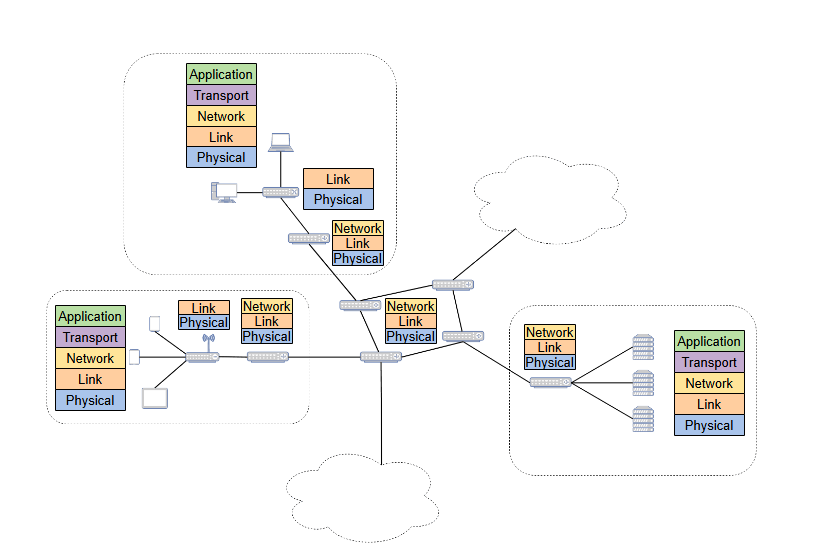

# **Сделаем шаг назад**

Взглянем на общую картину сетей в распределенных системах.

Теперь, когда мы более внимательно изучили каждый уровень, нам следует сделать шаг назад и взглянуть на общую картину.

На этом этапе мы понимаем, какая сложность лежит в основе, казалось бы, простого запроса от вашего веб-браузера к Google и сколько движущихся частей задействовано в этой передаче. Конечно, то же самое относится и к большинству современных **распределенных систем**, поскольку они работают поверх той же или подобной сетевой инфраструктуры.

Следующая иллюстрация показывает пример большой сети, такой как **Интернет**, и уровни, задействованные на каждом этапе.

> **Примечание:** Устройства, показанные на иллюстрации выше, — это **конечные хосты**, **коммутаторы** и **маршрутизаторы**. Коммутаторы — это те, рядом с которыми показаны только два уровня. У маршрутизаторов три уровня, а у конечных хостов — пять.

Когда мы видим, что у узла отсутствуют некоторые уровни, это означает, что узел не зависит от этого уровня. Например:

*   Коммутаторы будут пересылать Ethernet-кадры, не проверяя инкапсулированный в них сетевой пакет.
*   Маршрутизаторы будут маршрутизировать IP-пакеты, не проверяя инкапсулированные в них TCP- или UDP-пакеты.

Мы надеемся, что теперь стало ясно, что каждый из этих уровней предоставляет полезную абстракцию, которую мы можем использовать для создания наших приложений.

Однако все же полезно понимать основные механизмы, которые используют уровни для создания приложений.

Знание сервисов, предоставляемых каждым протоколом, полезно, когда мы оцениваем различные протоколы для использования в нашем приложении.

Знание механизмов, которые они используют «под капотом», полезно для понимания стоимости этих сервисов и для устранения проблем, когда они возникают.

Конечно, эта глава лишь поверхностно затронула тему, чтобы дать нам общее представление об основных задействованных частях и ролях, которые они играют в этом процессе.

> **Примечание:** Для заинтересованных читателей, которые хотят глубже понять различные механизмы и техники, используемые этими протоколами, есть много хороших **книг** для изучения. Они также могут пройти наш курс «Grokking Computer Networking for Software Engineers», чтобы узнать больше по этой теме.

