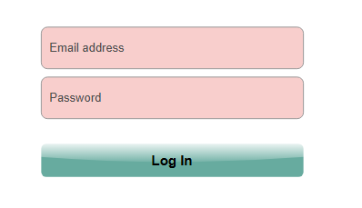
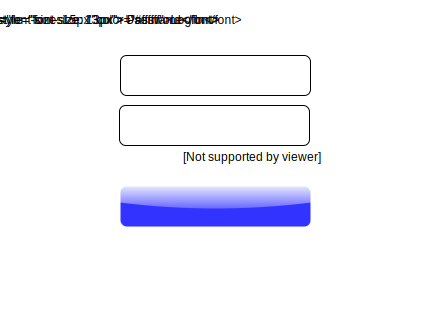
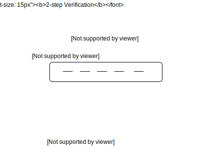
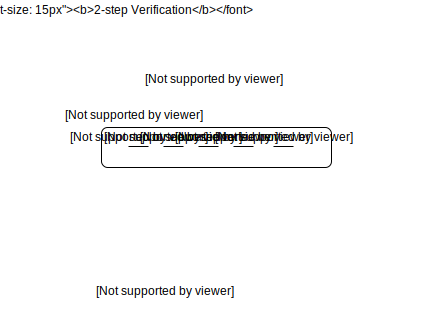
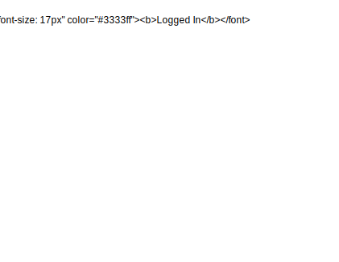
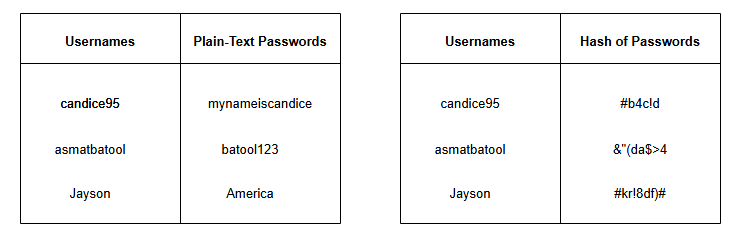

# Аутентификация

Давайте разберемся, что такое аутентификация и какие существуют подходы для ее выполнения.

**Аутентификация** — это процесс проверки, является ли кто-то или что-то тем, кем или чем он/оно себя заявляет.

Когда мы создаем системы, проблема аутентификации возникает в двух основных контекстах:

*   Когда пользователь пытается аутентифицироваться в вычислительной системе (**пользователь-система**).
*   Когда одна система пытается аутентифицироваться в другой системе (**система-система**).

## Аутентификация пользователя в системе

Когда мы говорим об аутентификации пользователя в системе, существует три основные категории подходов, с помощью которых может быть выполнена аутентификация, известные как **факторы аутентификации**. Мы обсудим эти факторы в следующем разделе:

### Факторы знания
Факторы знания соответствуют тому, что знает аутентифицируемый субъект. Например, это может быть **пароль** или **ответ на секретный вопрос**.

### Факторы владения
Факторы владения соответствуют тому, чем владеет аутентифицируемый субъект. Например, это может быть **ID-карта** или **аппаратное устройство аутентификации**.

### Факторы неотъемлемости
Факторы неотъемлемости соответствуют тому, чем является или что делает аутентифицируемый субъект. Например, это может быть биометрический идентификатор, такой как **отпечаток пальца** или **ДНК**.

## Достижение наивысшей степени безопасности

Для достижения наивысшей степени безопасности система в идеале должна использовать несколько факторов аутентификации — метод, известный как **многофакторная аутентификация**.

### Пример
**Двухфакторная аутентификация (2FA)** является примером многофакторной аутентификации. Сегодня многие приложения используют двухфакторную аутентификацию (2FA).

При двухфакторной аутентификации (2FA) пользователю необходимо сначала ввести пароль, а затем он получает одноразовый код на личное устройство, который он должен предоставить системе. Таким образом, даже если пароль пользователя будет скомпрометирован, злоумышленник не сможет получить доступ к системе от имени пользователя, не получив также доступ к его личному устройству.

1) Пользователь сначала вводит пароль вместе с именем пользователя
   

2) На персональное устройство (телефон) пользователя отправляется одноразовый пароль
   

3) Пользователь получает одноразовый пароль на персональном устройстве (телефоне).
   

4) Пользователь вводит одноразовый пароль, полученный на персональном устройстве.
   

5) Теперь пользователь вошел в систему.
   

## Практики, которым следует придерживаться при аутентификации на основе пароля

Существует несколько хороших практик при аутентификации на основе пароля.

### Избегайте хранения пароля в открытом виде
Система должна избегать хранения пароля в открытом тексте, чтобы он не был легко доступен системным администраторам и не мог быть слит в случае компрометации базы данных.

Один из способов смягчить эту проблему — вычислить хеш пароля и хранить вместо него это значение. Однако даже в этом случае злоумышленник может вычислить исходное значение пароля, предварительно создав таблицу хешей для множества возможных значений, а затем проверив все утекшие хеши по этой таблице. Этот процесс известен как **атака по радужным таблицам**.

Чтобы сделать атаку по радужным таблицам вычислительно сложнее, можно использовать **соль**.

Соль — это случайный набор данных, генерируемый для каждого пароля и добавляемый к нему перед вычислением хеш-значения. Она может храниться рядом с хешем пароля, чтобы та же операция могла быть повторена при попытке аутентификации существующего пользователя.

Соль усложняет выполнение атак по радужным таблицам, потому что злоумышленнику придется вычислять все возможные комбинации соли со всеми возможными паролями. Это нельзя сделать заранее, а только после обнаружения некоторых солей, например, в результате утечки данных. Это лишь некоторые из многих хороших практик, которым можно следовать для более безопасного хранения паролей.

## Аутентификация системы в системе

При аутентификации системы в системе в основном используются факторы знания и владения.

Например, система *А* может создать учетную запись с учетными данными для отдельной системы *Б*. Эти учетные данные могут быть внедрены во время выполнения в систему *Б*, которая предоставит их системе *А* для аутентификации перед вызовом каких-либо операций. В качестве альтернативы система *А* может регистрировать открытые ключи для других систем, которые могут использовать соответствующие закрытые ключи для аутентификации (например, в SSH).
