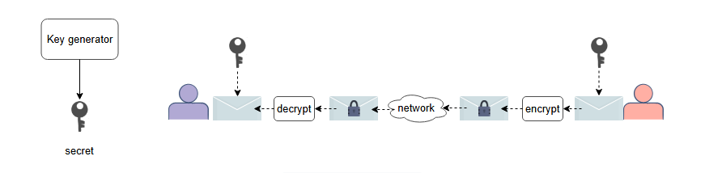
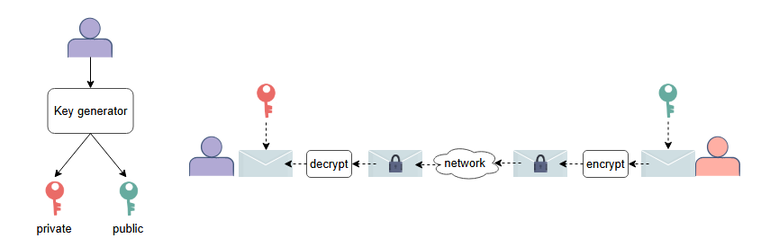

# Конфиденциальность

Узнайте о конфиденциальности и методах ее обеспечения.

**Конфиденциальность** — это процесс защиты информации от доступа неавторизованных сторон.

## Обеспечение конфиденциальности

Основным методом обеспечения конфиденциальности является **шифрование**.

### Шифрование

Шифрование — это процесс преобразования исходного представления некоторой информации, известного как **открытый текст**, в альтернативную
форму, известную как **шифротекст**. Шифротекст может быть преобразован обратно в исходный открытый текст только определенными
авторизованными сторонами, и никакие другие стороны не должны быть в состоянии сделать какие-либо выводы об открытом тексте, глядя на
соответствующий шифротекст.

По техническим причинам шифрование обычно достигается за счет использования **псевдослучайного** ключа шифрования, а расшифровка — с помощью
соответствующего ключа расшифровки.

Существует две основные схемы шифрования: симметричная и асимметричная.

#### Симметричное шифрование

Симметричное шифрование — это простейший вид шифрования, в котором используется один и тот же ключ как для шифрования, так и для
расшифровки, как показано на следующей иллюстрации:

#### Асимметричное шифрование

*Асимметричное шифрование* использует два разных ключа: ключ шифрования и ключ расшифровки, как показано на следующей иллюстрации:

* Ключ шифрования — это **открытый** (публичный) ключ, которым делятся со всеми, кому необходимо отправлять зашифрованные сообщения
  субъекту.
* Ключ расшифровки — это **закрытый** (приватный) ключ, и он используется только этим субъектом для расшифровки входящих сообщений.

#### Сравнение симметричного и асимметричного шифрования

*Симметричное шифрование*, как правило, быстрее *асимметричного*, но оно страдает от **проблемы начальной загрузки (bootstrapping problem)**, поскольку необходимо найти безопасный способ обмена симметричным ключом в первую очередь.

В результате многие протоколы сначала используют асимметричное шифрование для обмена симметричным ключом, который затем используется для
симметричного шифрования в оставшейся части сеанса связи.

### Сценарии использования шифрования

Существует два основных сценария использования шифрования, известные как **шифрование при передаче** и **шифрование хранимых данных**.

#### Шифрование при передаче

Шифрование при передаче используется для шифрования данных, передаваемых по сети, что защищает эти данные от раскрытия посредникам во время
передачи.

#### Шифрование хранимых данных

Шифрование хранимых данных (encryption at rest) используется для шифрования данных, хранящихся на компьютерах и устройствах хранения, что
защищает эти данные в случае сбоя других мер безопасности и получения злоумышленниками доступа к системам, где хранятся данные.
