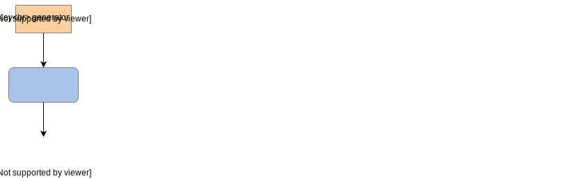
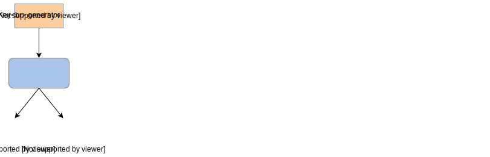

# Целостность

Давайте разберем, что такое целостность и как мы можем ее обеспечить.

**Целостность** — это процесс сохранения точности и полноты данных на протяжении всего их жизненного цикла, чтобы они не могли быть изменены несанкционированным или незаметным образом. Это изменение может произойти злонамеренно (например, посредником в сети) или случайно (например, из-за сбоя программного или аппаратного обеспечения).

## Обеспечение целостности

> **Примечание:** В предыдущей главе мы обсуждали некоторые методы защиты от случайных изменений, такие как **контрольные суммы** и **циклические избыточные проверки**, поэтому здесь мы сосредоточимся на злонамеренных изменениях, которые более актуальны в контексте безопасности.

### Хеш-значение

Простой подход к защите *целостности* данных заключается в вычислении хеш-значения для фрагмента данных и отправке как данных, так и хеша, как показано на следующей иллюстрации:

1) Система, в которой есть отправитель, получатель и сеть связи.
   

2) У отправителя есть некоторые данные в виде открытого текста
   

3) Отправитель вычисляет хэш данных с помощью хэш-функции.
   

4) Отправитель помещает данные и соответствующий хэш в сообщение и отправляет сообщение по сети
   

5) Сообщение будет отправлено получателю.
   

6) Получатель получает сообщение
   

7) Получает и вычисляет хэш данных в сообщении, используя хэш-функцию
   

8) Получатель сравнивает хэш данных, который он вычислил локально, с сохраненным хэшем в сообщении
   

9) Получатель сохраняет сообщение, поскольку значения хэша совпадают, поскольку данные не были изменены каким-либо вредоносным объектом в сети.
   

Любой злоумышленник может изменить данные, но мы можем обнаружить некоторые атаки, если злоумышленник не сможет подобрать правильную хеш-функцию, как показано на следующей иллюстрации.

1) Система, в которой есть отправитель, получатель и сеть связи
   

2) У отправителя есть некоторые данные в виде открытого текста
   

3) Отправитель вычисляет хэш данных, используя хэш-функцию
   

4) Отправитель помещает данные и соответствующий хэш в сообщение и отправляет сообщение по сети
   

5) В сеть проникает вредоносный объект.
   

6) Вредоносный объект обновляет данные в сообщении, которое пересылается получателю
   

7) Получатель получает сообщение
   

8) Получает и вычисляет хэш данных в сообщении, используя хэш-функцию
   

9) Получатель сравнивает хэш данных, который он вычислил локально, с сохраненным хэшем в сообщении
   

10) Получатель отклоняет сообщение из-за несоответствия значений хэша, поскольку данные были изменены вредоносным объектом в сети.
    

Однако этот подход имеет очевидную проблему:
*   Предположим, если мы отправляем хеш вместе с данными, любой злоумышленник, который может изменить данные, сможет выяснить используемую хеш-функцию и соответствующим образом скорректировать хеш. В результате мы не сможем обнаружить измененные данные.

Следовательно, нам обычно нужна комбинация *целостности* и *аутентификации*, то есть уверенность в том, что хеш соответствует данным и что хеш был вычислен отправителем, а не кем-то другим.

Мы можем достичь этого с помощью техник, аналогичных описанным ранее. Ниже приведены некоторые методы, обеспечивающие как *целостность*, так и *аутентификацию*.

## Методы, обеспечивающие как целостность, так и аутентификацию

Мы рассмотрим два метода для обеспечения целостности и аутентификации.

### Коды аутентификации сообщений (MAC)

**Коды аутентификации сообщений** используют **общий секретный ключ** для генерации тега для сообщения, который затем может быть проверен по данным с использованием этого общего ключа. Это показано на следующей иллюстрации.

1) Отправитель запрашивает у генератора ключей секретный ключ
   

2) В системе связи есть отправитель, получатель и сеть связи
   

3) У отправителя есть сообщение, и он хочет отправить это сообщение получателю
   

4) На стороне отправителя сначала отправляется сообщение для создания тега для этого сообщения
   

5) Отправитель генерирует тег для сообщения, используя общий секретный ключ, затем помеченное сообщение отправляется по сети
   

6) На стороне получателя тег сначала проверяется
   

7) Получатель сверяет метку с сообщением, используя общий секретный ключ, удаляет метку и сохраняет сообщение
   

Этот метод страдает от тех же проблем, что и симметричное шифрование (требуется безопасный обмен ключом).

### Цифровая подпись

Цифровые подписи используют **асимметричную криптографию**, где алгоритм генерирует открытый и закрытый ключ.

Закрытый ключ известен только отправителю сообщения, который может использовать его для подписи сообщения, создавая цифровую подпись.

Получатели затем могут использовать общий открытый ключ, чтобы убедиться, что цифровая подпись действительна и была сгенерирована отправителем.

Это показано на следующей иллюстрации.

1) Отправитель запрашивает генератор ключей для генерации закрытого и открытого ключей
   

2) В системе связи есть отправитель, получатель и сеть связи
   

3) У отправителя есть сообщение, и он хочет отправить его получателю.
   

4) Со стороны отправителя сообщение сначала отправляется на подпись
   

5) Отправитель использует закрытый ключ для создания цифровой подписи для сообщения, после чего подписанное сообщение отправляется по сети.
   

6) На стороне получателя цифровая подпись подтверждена
   

7) Получатель проверяет цифровую подпись с помощью открытого ключа, удаляет подпись и сохраняет сообщение, если подпись действительна
   

Подобно асимметричному шифрованию, цифровые подписи могут использоваться для защиты *целостности* и *подлинности* данных, передаваемых по сети или хранящихся в системе.

