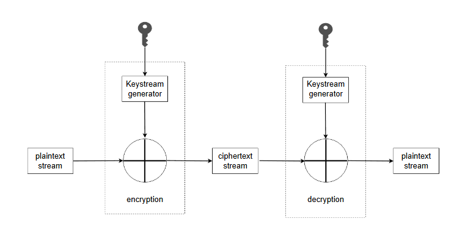
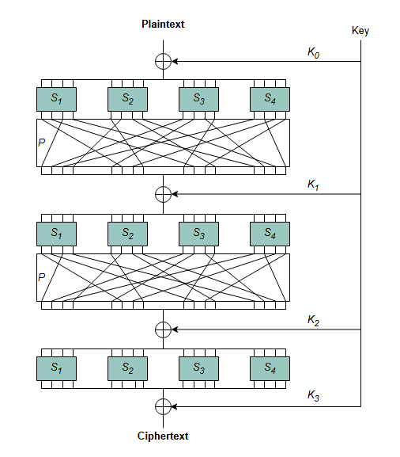
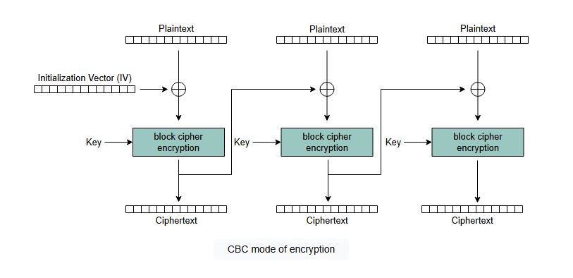

# Основы криптографии

Давайте изучим основную идею криптографии и рассмотрим некоторые базовые механизмы, лежащие в основе техник, упомянутых в предыдущих уроках.

---
> **Криптография** — это очень обширная область. Поэтому в этом разделе мы изучим только основы криптографии.

## Криптография
Одной из центральных частей криптографии является **шифр**.

### Шифр
**Шифр** — это алгоритм для преобразования фрагмента данных, называемого открытым текстом, в другой фрагмент данных, называемый шифротекстом, который выглядит как случайные данные и не раскрывает никакой информации об исходных данных.

Также можно определить *шифр* как пару эффективных алгоритмов (E, D), где:
*   `E: K × M → C` — это функция шифрования, принимающая на вход открытый текст (M) и ключ (K) и выдающая на выходе шифротекст (C).
*   `D: K × C → M` — это функция расшифровки, принимающая на вход *шифротекст* (C) и ключ (K) и выдающая на выходе исходный *открытый текст* (M).

#### Пример
**Одноразовый блокнот** (шифр Вернама) — простейший пример **надежного шифра**, который просто использует операцию `XOR` (исключающее ИЛИ):
*   `E(k, m) = k XOR m`
*   `D(k, c) = k XOR c`

`XOR` используется в этом случае, потому что обладает очень интересным свойством:
*   Если Y — случайная переменная с неизвестным распределением в `{0,1}^N`, а X — независимая переменная с равномерным распределением в `{0,1}^N`, то `Z = X XOR Y` является переменной с равномерным распределением в `{0,1}^N`.

Это означает, что использование `XOR` с равномерно распределенной переменной X устранит скрытые закономерности в переменной Y.

Это делает одноразовый блокнот *надежным шифром* в соответствии с очень строгим определением безопасности, известным как **семантическая стойкость**.

> *Примечание*: При семантической стойкости шифротекст не раскрывает никакой информации об открытом тексте. Однако на практике это непросто, поскольку ключ должен иметь тот же размер, что и шифруемое сообщение. В целом доказано, что абсолютная (совершенная) секретность требует, чтобы размер ключа был равен или превышал размер сообщения, что делает абсолютно надежные алгоритмы довольно непрактичными. По этой причине в зависимости от случая могут использоваться разные определения безопасности.

### Категории шифров
Существует две основные категории шифров: потоковые и блочные.

#### Потоковый шифр
**Потоковый шифр** — это шифр, который преобразует *открытый текст* в шифротекст, шифруя по одному знаку (например, биту) открытого текста за раз с соответствующим знаком псевдослучайного потока ключей (гаммы), который генерируется на основе случайного ключа, как показано на следующей иллюстрации.

Этот шифр полезен, когда полный размер *открытого текста* неизвестен заранее.

*Потоковые шифры* семантически стойкие, поэтому *семантическая стойкость* является одним из альтернативных определений для *потоковых шифров*.

При использовании потокового шифра необходимо быть осторожным, чтобы не использовать один и тот же ключ более одного раза для сохранения его безопасности.

#### Блочные шифры
В отличие от *потоковых* шифров, *блочные* шифры работают с группами битов фиксированной длины, называемыми **блоками**.

Большинство блочных шифров классифицируются как **итеративные блочные шифры**, что означает, что они преобразуют блоки открытого текста фиксированного размера в блоки шифротекста идентичного размера путем многократного применения обратимого преобразования, известного как **раундовая функция**.

На следующей иллюстрации показан пример итеративного блочного шифра, известного как **сеть подстановок-перестановок (SP-сеть)**, который выполняет несколько чередующихся раундов подстановок (**S-блоки**) и перестановок (**P-блоки**). Чтобы быть надежными, эти операции должны обладать определенными свойствами, например, S-блоки не должны иметь линейных зависимостей. Ключ для каждого раунда выводится из исходного ключа шифрования.

> **Примечание**: Сам по себе *блочный шифр* позволяет шифровать только один блок данных *открытого текста*.

Для шифрования нескольких блоков (всего открытого текста) каждый блочный шифр может использоваться различными способами, называемыми **режимами работы**.

Примером режима работы блочного шифра является **режим сцепления блоков шифротекста (CBC)**, в котором случайный вектор инициализации (IV) складывается по `XOR` с первым блоком *открытого текста* перед шифрованием. Затем полученный блок *шифротекста* используется как новый вектор инициализации для следующего блока открытого текста, как показано на следующей иллюстрации:

> Упомянутые шифры обеспечивают *конфиденциальность*, но не обязательно *целостность*, поскольку злоумышленник (man-in-the-middle) потенциально может изменить *шифротекст* таким образом, что он будет расшифрован в действительный открытый текст.

## Код аутентификации сообщения (MAC)
Код аутентификации сообщения (MAC) — это механизм, который может обеспечить *целостность*, но не *конфиденциальность*.

Он состоит из трех основных функций:
*   Функция генерации ключа
*   Функция подписи, которая может сгенерировать тег для открытого текста
*   Функция проверки, которая может проверить, действителен ли тег для определенного *открытого текста*.

MAC могут быть построены на основе других криптографических примитивов, таких как алгоритмы блочного шифрования или криптографические хеш-функции.

### Обеспечение конфиденциальности и целостности
Когда мы комбинируем шифр и код аутентификации сообщения, это может обеспечить аутентифицированное шифрование — форму шифрования, которая одновременно обеспечивает *конфиденциальность* и *целостность*.

Из этих техник только одна комбинация была доказана как безопасная: та, в которой открытый текст сначала шифруется, а затем на основе полученного шифротекста создается MAC. Эта техника также известна как **encrypt-then-MAC** (зашифровать, затем аутентифицировать).
