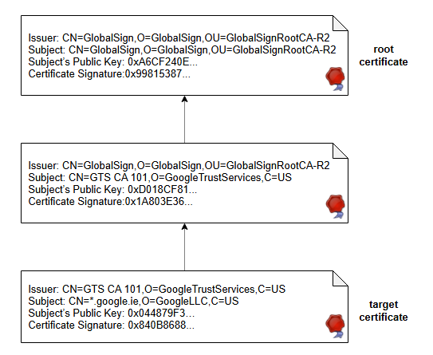

# Инфраструктура открытых ключей (PKI)

Давайте подробно рассмотрим инфраструктуру открытых ключей.

При использовании криптографии с открытым ключом возникает одна распространённая проблема: как клиент может убедиться, что сервер является тем, за кого себя выдаёт?

Теоретически, злоумышленник может сгенерировать вторую пару ключей и предоставить нам свой открытый ключ, который мы будем использовать для шифрования и отправки данных. Даже если данные зашифрованы, они всё равно могут быть отправлены не той стороне, которая затем сможет расшифровать их своим закрытым ключом. Чтобы убедиться, что клиент общается с ожидаемым сервером, мы можем использовать **сертификаты**.

## Сертификаты
Сертификаты — это цифровые документы, которые привязывают открытый ключ к конкретному субъекту. Они используются клиентами для целей аутентификации.

Эти сертификаты могут иметь разные форматы, но X.509 — это распространённый стандарт, определяющий один из форматов для таких протоколов, как TLS.

### Сертификат X.509
Сертификат X.509 содержит открытый ключ и идентификационные данные субъекта, которому принадлежит этот ключ. Эти данные представлены так называемым **отличительным именем (distinguished name)**, которое однозначно идентифицирует субъект и состоит из различных атрибутов, таких как общее имя (common name), название организации, местоположение и т.д.

> **Примечание:** Значения для каждого из этих полей могут различаться в зависимости от варианта использования.

Когда мы используем TLS-сертификаты для веб-сайтов, поле общего имени (common name) заполняется доменным именем сайта, таким образом, сертификат привязывает открытый ключ к конкретному доменному имени.

## Выдача сертификатов
Сертификаты выдаются специальными организациями, называемыми **центрами сертификации**, которые подписывают эти сертификаты, чтобы подтвердить принадлежность открытого ключа соответствующему субъекту.

> **Примечание:** Перед подписанием сертификатов центр сертификации сначала проверяет личность стороны, подающей запрос.

Центры сертификации могут выдать веб-сертификат, попросив сторону доказать, что она контролирует соответствующий домен, например, путем загрузки определенного контента на веб-сайт, обслуживаемый этим доменом.

## Цепочка сертификатов
Центры сертификации также создают сертификаты для своих собственных открытых ключей, но эти сертификаты подписываются их собственными закрытыми ключами и известны как самоподписанные сертификаты. В результате они выступают в качестве доверенных третьих сторон, которым доверяют как владелец, так и пользователи сертификата. Иногда это может усложняться тем, что одни центры сертификации выдают сертификаты для открытых ключей других центров сертификации, которые те, в свою очередь, могут использовать для выпуска других сертификатов. В этом случае эти сертификаты могут образовывать цепочку сертификатов, как показано на следующей иллюстрации:

Сертификат в конце цепи известен как **конечный сертификат** (или целевой), а сертификат на вершине цепи известен как **корневой сертификат**.

**Цепочка сертификатов** используется для того, чтобы убедиться, что открытый ключ и другие метаданные, содержащиеся в *конечном сертификате*, действительно принадлежат его субъекту. Это верно только в том случае, если цепочка сертификатов действительна.

## Правила действительности цепочки сертификатов
Действительная цепочка сертификатов должна соответствовать следующим правилам:
*   Издатель (issuer) каждого сертификата (кроме корневого) должен соответствовать субъекту (subject) следующего сертификата в цепочке.
*   Каждый из этих сертификатов (кроме корневого) должен быть подписан закрытым ключом, соответствующим следующему сертификату в цепочке, т.е. подпись сертификата должна успешно проверяться с использованием открытого ключа из следующего сертификата.
*   Приложение должно доверять корневому сертификату. Поэтому он также известен как **якорь доверия (trust anchor)**. Для этой цели приложениям обычно предоставляется список доверенных корневых сертификатов. Это делается с помощью различных механизмов, например, веб-браузеры поставляются с предопределенным набором предустановленных корневых сертификатов, поэтому TLS-сертификаты, выданные крупными центрами сертификации, будут работать мгновенно.

> Список доверенных корневых сертификатов курируется и включает только заслуживающие доверия организации. Например, в некоторых случаях центры сертификации не смогли обеспечить безопасную работу, и в результате они были удалены из этих списков.

## Механизмы отзыва сертификатов
Центры сертификации внедрили различные механизмы для отзыва сертификатов, когда закрытый ключ связанного субъекта скомпрометирован. Некоторые из этих механизмов:
*   **Списки отзыва сертификатов (CRLs)**
*   **Протокол статуса сертификата в реальном времени (OCSP)**

Вся эта система управления созданием, хранением и распространением цифровых сертификатов известна как **инфраструктура открытых ключей (PKI)**.
