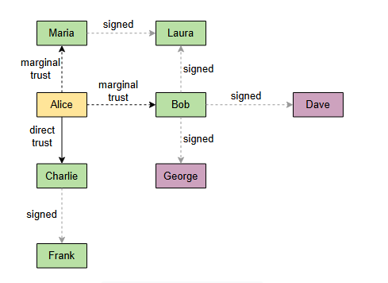

# Сеть доверия (PGP)

Давайте рассмотрим, как сеть доверия решает проблему инфраструктуры открытых ключей.

При использовании **инфраструктуры открытых ключей**, необходимо доверять как минимум корневым центрам сертификации, что означает, что вся система в той или иной степени централизована. Альтернативный подход, призванный решить ту же проблему более децентрализованным способом, — это **сеть доверия**.

В сети доверия нет центров сертификации, которым безоговорочно доверяют все. Вместо этого различные стороны подписывают открытые ключи друг друга, тем самым подтверждая связь открытого ключа с лицом или организацией, указанными в соответствующем сертификате. Это делается на **встрече для подписи ключей (key signing party)**.

## Встреча для подписи ключей
**Встреча для подписи ключей (key-signing party)** — это мероприятие, на котором люди представляют свои открытые ключи другим людям вместе с удостоверениями личности (например, паспортами), а те, в свою очередь, ставят цифровую подпись под их открытым ключом. Каждая сторона также может присвоить определенную степень доверия другим сторонам, что затем можно использовать для создания более сложной схемы доверия, как показано на следующей иллюстрации:

Элис может полностью доверять Чарли, но лишь частично — Бобу. Это означает, что открытые ключи из сертификатов, подписанных Чарли, будут автоматически считаться доверенными.

Однако, чтобы доверять открытым ключам, подписанным Бобом, эти ключи также должны быть подписаны другими сторонами с частичным доверием. Эта схема гибка, и пользователи могут соответствующим образом настраивать эти пороги. Таким образом, все стороны образуют сеть доверия.

> **Примечание:** OpenPGP — это стандарт, построенный на концепции сети доверия.
