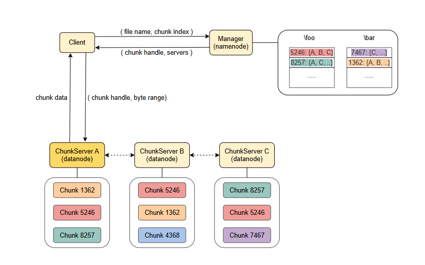

Конечно, вот преобразованный в Markdown и переведенный на русский язык текст.

# Распределенная файловая система Hadoop и файловая система Google

Узнайте, что такое GFS и HDFS. Изучите требования и архитектуру GFS.

-----

**Google File System (GFS)** — это проприетарная распределенная файловая система, разработанная Google. Она также послужила источником вдохновения для **Hadoop Distributed File System (HDFS)**, распределенной файловой системы, разработанной в рамках [проекта Apache](https://www.apache.org).

> **Примечание:** Основные принципы проектирования этих двух систем схожи, с некоторыми небольшими различиями.

**Основные** требования к распределенным файловым системам следующие:

## Отказоустойчивость

Система должна продолжать функционировать несмотря на любые сбои узлов.

## Масштабируемость

Система должна иметь возможность масштабироваться до огромных объемов хранимой информации.

## Оптимизация для пакетных операций

Система должна быть оптимизирована для сценариев использования, включающих пакетные операции, например, для приложений, выполняющих обработку и анализ огромных наборов данных. Это подразумевает, что *пропускная способность* важнее, чем *задержка*, и предполагается, что большинство файлов будут изменяться путем добавления данных, а не перезаписи существующих.

-----

## Архитектура GFS

Следующая иллюстрация дает общий обзор архитектуры GFS:

*В системе существует три типа узлов: **Менеджер**, который хранит глобальный каталог файлов, **клиент**, который запрашивает операции с файлами, и **серверы фрагментов (chunkservers)**, которые хранят файлы.*

> **Примечание:** В оригинальной исследовательской работе, описывающей GFS, авторы используют термин "master", но мы будем использовать термины "менеджер GFS", "узел-менеджер" или просто "менеджер" для обозначения того же самого.

Кластер GFS состоит из одного **узла-менеджера** и нескольких **узлов-серверов фрагментов**.

* Узлы-серверы фрагментов хранят и предоставляют данные файлов.
* Узел-менеджер поддерживает метаданные файловой системы, информируя клиентов о том, какие серверы фрагментов хранят определенную часть файла, и выполняет необходимые административные задачи, такие как сборка мусора для "осиротевших" фрагментов или миграция данных при сбоях.

> **Примечание:** Архитектура HDFS схожа, но узел-менеджер называется **Namenode**, а узлы-серверы фрагментов — **Datanodes**.

-----

### Секционирование и репликация

Каждый файл делится на фрагменты (chunks) фиксированного размера, которые идентифицируются с помощью неизменяемого и глобально уникального 64-битного идентификатора фрагмента, присваиваемого менеджером при его создании.

Серверы фрагментов хранят их на локальных дисках в виде обычных файлов. Система использует как секционирование, так и репликацию:

* Файлы **секционируются** (разделяются) между различными серверами фрагментов.
* Каждый фрагмент **реплицируется** на нескольких серверах фрагментов.

Первое улучшает *производительность*, а второе — *доступность* и *надежность данных*.

> **Примечание:** Узел-менеджер не участвует в передаче данных файлов, чтобы обеспечить хорошую производительность и масштабируемость.

### Топология сети
Система учитывает топологию сети центра обработки данных, которая обычно состоит из нескольких стоек с серверами. Это имеет ряд последствий: например, пропускная способность входящей и исходящей стойки может быть меньше суммарной пропускной способности всех машин в ней, а отказ одного общего ресурса в стойке (сетевого коммутатора или цепи питания) может фактически вывести из строя все машины в стойке.

### Балансировка пропускной способности диска и сети
Когда GFS создаёт новый фрагмент и размещает его изначально пустые реплики, менеджер старается использовать серверы фрагментов с использованием дискового пространства ниже среднего. Он также старается использовать серверы фрагментов с небольшим количеством недавно созданных фрагментов, поскольку это позволяет надёжно прогнозировать предстоящий интенсивный трафик записи. Таким образом, менеджер пытается сбалансировать использование дискового пространства и пропускной способности сети в кластере.

### Размещение реплик
При выборе места размещения реплик менеджер также следует настраиваемой политике размещения реплик фрагментов. По умолчанию он пытается разместить две реплики на двух разных узлах, расположенных в одной стойке, а третью — на узле, расположенном в отдельной стойке. Этот процесс представляет собой компромисс между высокой пропускной способностью сети и надёжностью данных .