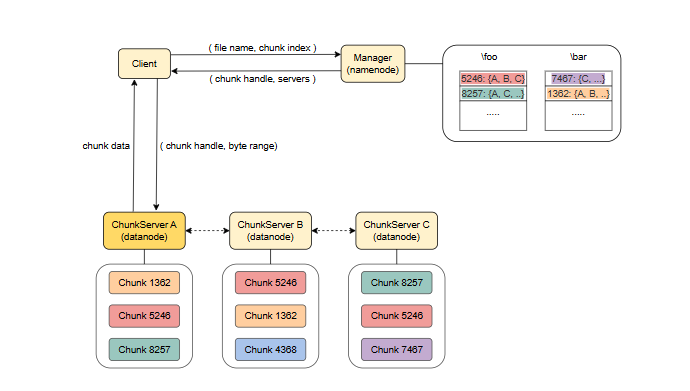
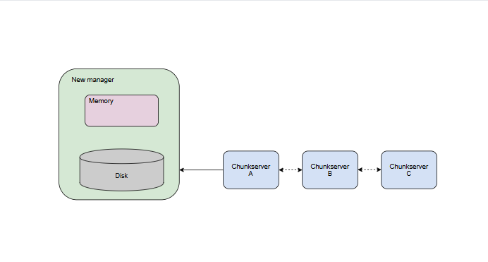

# Создание и чтение файлов

Давайте разберемся, как клиенты могут создавать файлы и читать данные из файлов в распределенной файловой системе.

Клиенты могут создавать и читать файлы из распределенной файловой системы, используя клиентскую библиотеку GFS, связанную с приложением, которая абстрагирует некоторые детали реализации.

Например, приложения могут работать с байтовыми смещениями файлов. Клиентская библиотека преобразует эти смещения в соответствующий индекс чанка и связывается с менеджером, чтобы получить дескриптор чанка для указанного индекса и местоположение соответствующих серверов чанков. Наконец, она обращается к соответствующему серверу чанков (скорее всего, к ближайшему) для получения данных.

## Операция создания

Узел менеджера хранит метаданные о файловой системе. В результате операция создания файла требует обращения только к узлу менеджера, который создает файл локально.

Узел менеджера использует блокировки при создании новых файлов для безопасной обработки параллельных запросов. Более конкретно, блокировка на чтение приобретается для имени каталога, а блокировка на запись — для имени файла.

## Операция чтения

Следующая иллюстрация показывает рабочий процесс для операции чтения:

1. Клиент хочет прочитать данные на серверах чанков, поэтому сначала он связывается с менеджером, чтобы получить дескриптор чанка для указанного индекса и местоположение соответствующих серверов чанков.
2. Менеджер отвечает идентификатором сервера чанков (где можно найти требуемый чанк) и дескриптором чанка.
3. Клиент подключается к соответствующему серверу чанков (скорее всего, к ближайшему), чтобы получить данные.
4. Клиент получает данные чанка от сервера чанков.

### Обязанности клиентов

Клиенты кэшируют метаданные о местоположении чанков локально, поэтому им нужно обращаться к менеджеру только для новых чанков или когда кэш устарел.

Во время миграции чанков из-за сбоев клиенты органически запрашивают свежие данные у менеджера, когда понимают, что старые серверы чанков больше не могут обслуживать данные для указанного чанка.

> Примечание: С другой стороны, клиенты не кэшируют сами данные чанков, поскольку ожидается, что они будут потоково обрабатывать огромные файлы, и их рабочие наборы слишком велики, чтобы извлечь выгоду из кэширования.

### Обязанности менеджера

Менеджер хранит:
- пространства имен файлов и чанков
- отображение файлов на чанки
- местоположения чанков

Все метаданные хранятся в памяти менеджера. Пространства имен и отображения также сохраняются постоянно путем записи изменяющих операций (например, создание файла, переименование и т. д.) в журнал операций, который хранится на локальном диске менеджера и реплицируется на удаленных машинах.

Иллюстрация процесса:
1. Система с узлом менеджера и тремя серверами чанков.
2. Менеджер хранит метаданные в своей памяти.
3. Менеджер создает снимок метаданных и записывает журнал изменений на локальный диск.
4. Менеджер реплицирует снимок метаданных и журнал изменений на другие серверы.
5. Менеджер выходит из строя.
6. Новый менеджер десериализует метаданные и журналы изменений из серверов чанков, чтобы восстановить систему в рабочее состояние.

Узел менеджера также создает контрольные точки своего состояния в памяти на диск, когда журнал значительно увеличивается. В результате в случае сбоя менеджера образ файловой системы может быть восстановлен путем загрузки последней контрольной точки в память и воспроизведения журнала операций с этого момента.