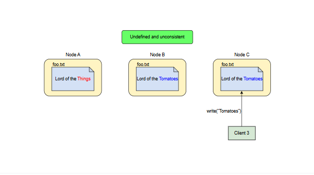

# Модель согласованности GFS

Узнайте о модели согласованности GFS для операций записи.

GFS предоставляет пользовательскую модель согласованности для операций записи.

Состояние области файла после изменения зависит от типа изменения, его успешности и наличия параллельных изменений.

> **Примечание:** Область файла считается **согласованной**, если все клиенты всегда видят одни и те же данные, независимо от реплики, с которой они читают.

## Область внутри файла

Область считается определенной после изменения данных файла, если она согласована и клиенты видят все, что было записано изменением.

Область может быть:
- **Определенной и согласованной:** Когда изменение завершается успешно без вмешательства параллельных записей, затронутая область определяется. Все клиенты всегда видят то, что было записано изменением.
- **Неопределенной, но согласованной:** Параллельные успешные изменения оставляют область неопределенной, но согласованной. Все клиенты видят одни и те же данные, но они могут не отражать то, что было записано любым отдельным изменением. Обычно это смешанные фрагменты из нескольких изменений.
- **Несогласованной и неопределенной:** Неудачное изменение делает область несогласованной. Разные клиенты могут видеть разные данные в разное время.

## Дополнительная операция изменения в GFS

Помимо обычных записей, GFS также предоставляет дополнительную операцию изменения, называемую **добавлением записей**.

### Добавление записей

Добавление записей приводит к тому, что данные добавляются атомарно хотя бы один раз, даже при наличии параллельных изменений, но со смещением, выбранным GFS, которое возвращается клиенту.

Клиенты должны повторять неудачные попытки добавления записей, и GFS гарантирует, что каждая реплика будет содержать данные операции как атомарную единицу хотя бы один раз с тем же смещением.

Однако GFS может вставлять заполнители или дубликаты записей между ними. В результате успешные добавления записей создают определенные области, перемежающиеся с несогласованными областями.

## Краткое описание модели согласованности GFS

## Как приложения адаптируются к модели согласованности GFS

Приложения могут адаптироваться к этой ослабленной модели согласованности GFS, применяя несколько простых техник на уровне приложения:
- Использование добавлений вместо перезаписей
- Создание контрольных точек
- Запись самопроверяющихся и самоидентифицирующихся записей

Добавление гораздо эффективнее и устойчивее к сбоям приложений, чем случайные записи.

Каждая запись, подготовленная писателем, может содержать дополнительную информацию, такую как контрольные суммы, чтобы можно было проверить ее достоверность. Читатель может затем идентифицировать и отбросить лишние заполнители и фрагменты записей с помощью этих контрольных сумм.

> **Примечание:** Если случайные дубликаты недопустимы (например, если они могут вызвать неидемпотентные операции), читатель может отфильтровать их с помощью уникальных идентификаторов записей, выбранных и сохраненных писателем.

## Операция изменения в HDFS

HDFS выбирает несколько иной путь для упрощения семантики операций изменения:
- HDFS поддерживает только одного писателя за раз.
- Она поддерживает только операции добавления (а не перезаписи).
- Она также не предоставляет операцию добавления записей, поскольку нет параллельных записей.
- Она обрабатывает частичные сбои в конвейере репликации немного иначе, полностью удаляя неудачные узлы из набора реплик, чтобы обеспечить одинаковое содержимое файла во всех репликах.

## GFS и HDFS вкратце

И GFS, и HDFS предоставляют приложениям информацию о том, где хранится область файла. Это позволяет приложениям планировать задачи обработки для выполнения на узлах, которые хранят связанные данные, минимизируя перегрузку сети и повышая общую пропускную способность системы. Этот принцип также известен как **перенос вычислений к данным**.

> Теперь, когда вы изучили важные концепции Google File System (GFS) и Hadoop Distributed File System (HDFS), проверьте свои знания, взаимодействуя с AI Mentor ниже. Вы ответите на пять вопросов, посвященных работе GFS и HDFS. Чтобы начать, поздоровайтесь с Edward в виджете ниже, и он проведет вас дальше.