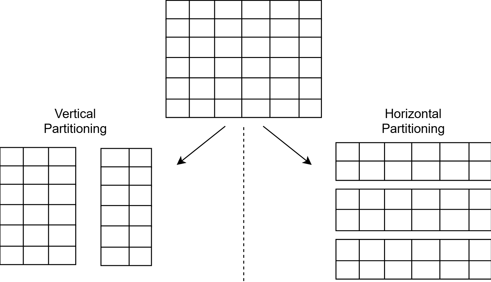
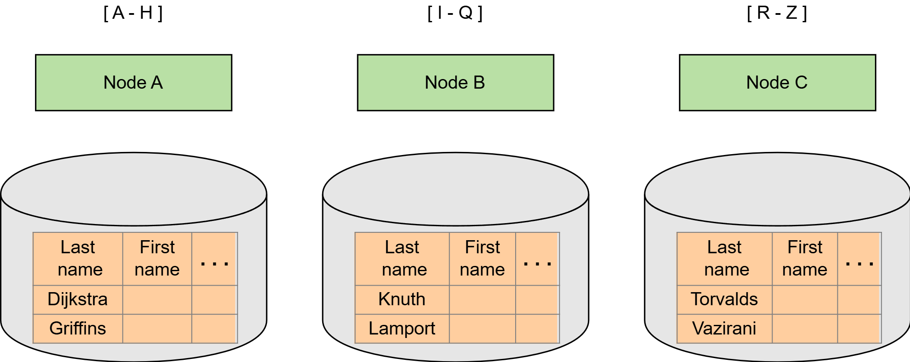

# Разделение данных

Узнайте, как мы можем сделать нашу систему масштабируемой с помощью разделения данных.

Одним из основных преимуществ распределённых систем является масштабируемость.

## Масштабируемость

Масштабируемость позволяет хранить и обрабатывать наборы данных, значительно превышающие возможности одной машины.

## Увеличение ресурсов

### Механизм достижения масштабируемости

Одним из основных механизмов достижения масштабируемости является разделение данных.

## Разделение данных

Разделение данных — это процесс разделения набора данных на несколько меньших наборов данных, с последующим распределением ответственности за их хранение и обработку между различными узлами распределённой системы. Это позволяет добавлять новые узлы в систему и увеличивать объём обрабатываемых данных.

Существует два варианта разделения данных:

- Вертикальное разделение
- Горизонтальное разделение (или шардирование)

Термины «вертикальное» и «горизонтальное» происходят из эпохи реляционных баз данных, которые ввели понятие табличного представления данных.

В этом представлении данные состоят из строк и столбцов, где каждая строка — это отдельная запись в наборе данных, а каждый столбец — это различный атрибут для каждой записи.

### Вертикальное разделение против горизонтального разделения

#### Вертикальное разделение

Вертикальное разделение предполагает разделение таблицы на несколько таблиц с меньшим количеством столбцов и использование дополнительных таблиц для хранения столбцов, которые связывают строки между таблицами. Это обычно называется операцией соединения (join). Затем эти различные таблицы можно хранить на разных узлах.

Нормализация — один из способов выполнения вертикального разделения. Однако общее вертикальное разделение выходит за рамки этого: оно разделяет столбцы, даже если они уже нормализованы.

#### Горизонтальное разделение

Горизонтальное разделение предполагает разделение таблицы на несколько меньших таблиц, где каждая таблица содержит процент строк исходной таблицы. Затем эти подтаблицы можно хранить на разных узлах.

Этот процесс можно выполнять с использованием различных стратегий.

Простой подход — это разделение по алфавиту. Например, мы можем горизонтально разделить таблицу, содержащую данные учеников школы, по их фамилиям.

### Ограничения разделения данных

В системе с вертикальным разделением запросы, требующие объединения данных из разных таблиц (например, операции соединения), становятся менее эффективными. Это связано с тем, что такие запросы могут потребовать доступа к данным с нескольких узлов.

В системе с горизонтальным разделением обычно можно избежать обращения к данным с нескольких узлов, поскольку все данные для каждой строки находятся на одном узле. Однако доступ к данным с нескольких узлов всё же может потребоваться для запросов, которые ищут диапазон строк, принадлежащих разным узлам.

Ещё одно важное последствие горизонтального разделения — это потенциальная потеря транзакционной семантики.

Когда данные хранятся на одной машине, мы можем легко выполнять несколько операций атомар