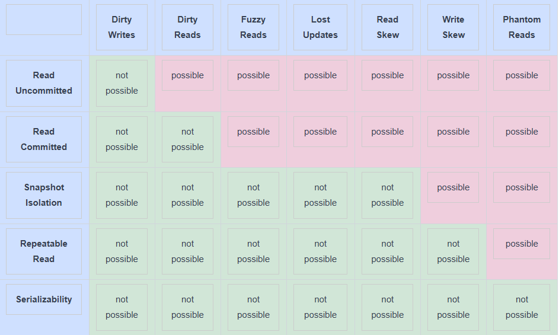

# Предотвращение аномалий в уровнях изоляции
На этом уроке мы определим, какой уровень изоляции предотвращает какие аномалии.

# Уровень изоляции, который предотвращает все аномалии
Существует один уровень изоляции, который предотвращает все эти аномалии: сериализуемый .

Как и модели согласованности, представленные в уроке «Модели согласованности» , этот уровень обеспечивает более формальную спецификацию того, что возможно, например, какие истории выполнения возможны. Более конкретно, он гарантирует, что результат выполнения параллельных транзакций будет таким же, как и результат некоторого последовательного выполнения тех же транзакций. Это означает, что мы можем анализировать только последовательные выполнения на предмет дефектов. Если все возможные последовательные выполнения безопасны, то любое параллельное выполнение системой на уровне сериализуемости также будет безопасным.

Однако сериализуемость влечет за собой снижение производительности, поскольку она намеренно снижает параллелизм для обеспечения безопасности.

# Другие уровни изоляции
Уровни изоляции, отличные от сериализуемых, менее строги и обеспечивают лучшую производительность за счет повышения параллелизма за счет снижения безопасности.

Эти модели допускают некоторые из аномалий, которые мы описали ранее. Следующая иллюстрация содержит таблицу с самыми базовыми уровнями изоляции, а также аномалиями, которые они предотвращают.

Уровни изоляции и предотвращенные аномалии

Эти уровни изоляции возникли из ранних реляционных систем баз данных, которые не были распределенными. Тем не менее, они применимы и в распределенных хранилищах данных.

> Примечание: Основываясь на определении Snapshot Isolation, можно представить, как фантомные чтения возможны на этом уровне изоляции. Это связано с практической реализацией snapshot изоляции с использованием multi-version concurrency control (MVCC) , обсуждаемой в уроке Achieving Snapshot Isolation .