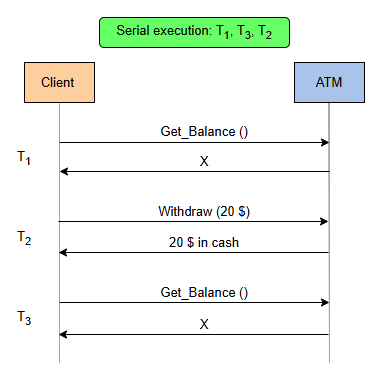

# Последовательность и изоляция

Давайте рассмотрим различия и сходства между моделями согласованности и уровнями изоляции.

Следующая иллюстрация поможет нам запомнить модели согласованности и уровни изоляции.

# Сходства между моделями согласованности и моделями изоляции
Интересно отметить, что уровни изоляции не сильно отличаются от моделей согласованности .

Уровни изоляции и модели согласованности являются важнейшими конструкциями, которые позволяют нам выразить:

1) Какие казни возможны?
2) Какие казни невозможны
В обоих случаях некоторые модели более строгие и допускают меньшее количество казней, тем самым обеспечивая повышенную безопасность за счет снижения производительности и доступности .

Например, линеаризуемость допускает подмножество выполнений, допускаемых причинно-следственной согласованностью , в то время как сериализуемость допускает подмножество выполнений, допускаемых изоляцией моментального снимка .

> Мы также можем выразить эту строгость отношений, сказав, что одна модель подразумевает другую модель.

Тот факт, что система обеспечивает линеаризуемость, автоматически подразумевает, что эта же система обеспечивает и причинно-следственную последовательность .

> Обратите внимание, что некоторые модели нельзя сравнивать напрямую, то есть ни одна из них не является более строгой, чем другая.

# Различия между моделями согласованности и уровнями изоляции
Модели согласованности и уровни изоляции имеют некоторые различия в характеристиках разрешенного и запрещенного поведения.

1) Модели согласованности применяются к операциям с одним объектом (например, чтение/запись в один регистр), в то время как уровни изоляции применяются к операциям с несколькими объектами (например, чтение и запись из/в несколько строк таблицы в рамках транзакции).
> Рассматривая самые строгие модели в этих двух группах, линеаризуемость и сериализуемость , можно заметить еще одно важное различие.

2) Линеаризуемость обеспечивает гарантии реального времени, а сериализуемость — нет.
Линеаризуемость гарантирует, что результаты операции имели место в некоторый момент между моментом, когда клиент вызвал операцию, и моментом, когда результат операции был возвращен клиенту.

Сериализуемость гарантирует только то, что эффекты множественных транзакций будут такими же, как если бы они выполнялись в последовательном порядке. Она не дает никаких гарантий того, будет ли этот последовательный порядок совместим с порядком в реальном времени.

# Почему важны гарантии в реальном времени
На следующем рисунке показано, почему гарантии в реальном времени важны с точки зрения приложения.

Представьте себе банкомат, который может поддерживать две транзакции:

1) GET_BALANCE()
2) WITHDRAW(amount)
Первая транзакция выполняет одну операцию по считыванию баланса счета.

Вторая операция считывает остаток на счете, уменьшает его на указанную сумму, а затем возвращает клиенту указанную сумму наличными.

Предположим также, что эта система сериализуема.

Теперь давайте рассмотрим следующий сценарий:

Клиент с начальным балансом xсчитывает свой баланс, а затем решает снять 20 долларов, выполнив WITHDRAW(20)транзакцию.

После завершения транзакции и возврата денег клиент выполняет GET_BALANCE()операцию по проверке своего нового баланса. Однако автомат по-прежнему возвращает xтекущий баланс вместо x-20.

> Обратите внимание, что это выполнение является сериализуемым (с последовательным порядком транзакций T1, T3 и T2), и конечный результат такой, как если бы машина GET_BALANCE()сначала выполнила транзакции, а затем WITHDRAW(20)транзакцию в полностью последовательном порядке.

Этот пример показывает, что в некоторых случаях сериализуемость сама по себе недостаточна.

# Строгая сериализуемость
Строгая сериализуемость — это модель, представляющая собой комбинацию линеаризуемости и сериализуемости .

Эта модель гарантирует, что результат нескольких транзакций эквивалентен результату их последовательного выполнения, а также совместима с упорядочением этих транзакций в реальном времени.

В результате транзакции, по-видимому, выполняются последовательно, и последствия каждой из них проявляются в какой-то момент между их инициированием и завершением.

Как мы узнали ранее, строгая сериализуемость часто является более полезной гарантией, чем простая сериализуемость.

Однако в централизованных системах предоставление строгой сериализуемости является простым и столь же эффективным, как предоставление только гарантий сериализуемости. В результате такие системы, как реляционные базы данных, иногда рекламируют гарантии сериализуемости , в то время как на самом деле они предоставляют строгую сериализуемость .

Это не обязательно справедливо в случае распределенной базы данных, где обеспечение строгой сериализуемости может оказаться более затратным, поскольку требует дополнительной координации.

Важно понимать разницу между этими двумя гарантиями, чтобы определить, какая из них необходима в зависимости от области применения.