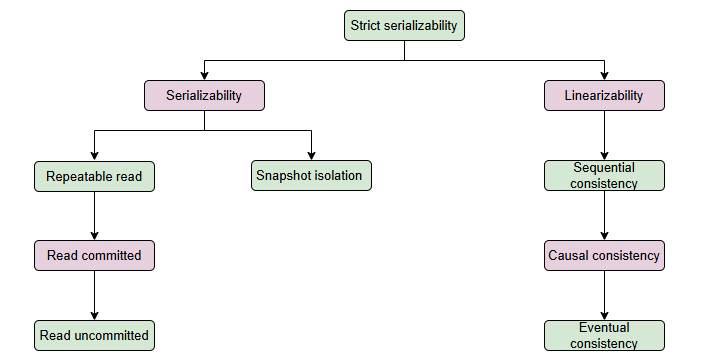

# Иерархия моделей
Давайте рассмотрим иерархию моделей согласованности и уровней изоляции на основе строгости и гарантий, которые они предоставляют.

Модели можно организовать в иерархическое дерево в соответствии с их строгостью и предоставляемыми гарантиями.

# Иерархическое дерево
На следующем рисунке показано такое дерево, содержащее некоторые модели.

