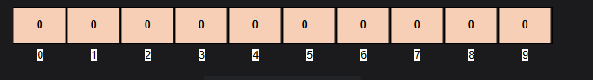
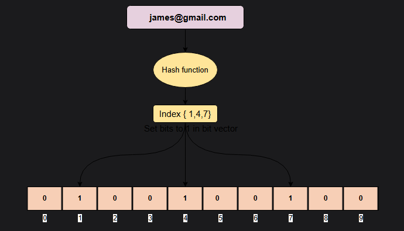
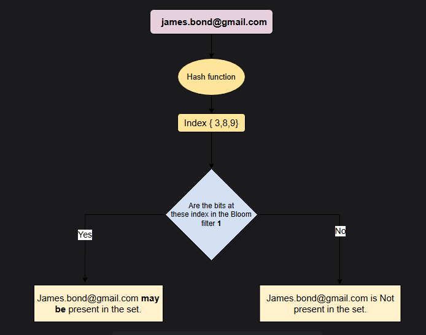

## Что такое фильтр Блума?

*   Это вероятностная структура данных, предназначенная для ответа на вопрос о принадлежности к множеству: *Присутствует ли этот элемент в наборе?*
*   Он очень эффективен по использованию пространства и не хранит сами элементы.
*   Он может очень быстро определить, что элемент не существует в наборе, или что он, возможно, существует в наборе.
*   Однако он не может сказать, *точно ли присутствует* элемент в наборе.

## Как работает фильтр Блума?

Пустой фильтр Блума — это битовый вектор, в котором все биты установлены в ноль. На изображении ниже каждая ячейка представляет собой бит. Число под битом — это его индекс в 10-битном векторе.

*Пустой фильтр Блума*

### Добавление элемента в фильтр Блума

Чтобы добавить элемент, его необходимо хешировать с помощью нескольких хеш-функций. Биты устанавливаются по индексам, полученным от хешей, в битовом векторе.

Например, предположим, нам нужно добавить элемент `james@gmail.com`, используя три эффективные хеш-функции:

H1(`james@gmail.com`) = 12021

H2(`james@gmail.com`) = 23324

H3(`james@gmail.com`) = 23237

Мы можем взять остаток от деления на 10 для всех этих значений, чтобы получить индекс в пределах нашего битового вектора:

12021 % 10 = 1

23324 % 10 = 4

23237 % 10 = 7

*Добавление элемента в фильтр Блума*

### Проверка принадлежности элемента

Для элемента, чью принадлежность необходимо проверить, он также хешируется с помощью тех же хеш-функций. Если все биты по этим индексам уже установлены, элемент может существовать в наборе.

Если хотя бы один бит не установлен, элемент *определенно не* находится в наборе.

*Проверка принадлежности элемента в фильтре Блума*

### Почему фильтры Блума дают ложноположительные результаты

Предположим, мы добавили в фильтр Блума два следующих элемента:

*   *Monkey* с результатом хеширования *H(«Monkey») = {1,2,5}*
*   *Lion* с результатом хеширования *H(«Lion») = {7,4,3}*

Теперь, если мы хотим проверить, существует ли *Tiger* в наборе, мы можем хешировать его с помощью тех же хеш-функций.

*H(«Tiger») = {2,7,3}*

Мы не добавляли «Tiger» в фильтр Блума, но все биты по индексам {2,7,3} уже были установлены предыдущими двумя элементами; таким образом, фильтр Блума утверждает, что «Tiger» присутствует в наборе. Это ложноположительный результат.

## Применения фильтра Блума

Фильтр Блума — это эффективная по использованию пространства структура данных, но он не хранит сами элементы, поскольку является просто битовым вектором. У него много применений, например:

*   Medium использует фильтры Блума в своем модуле рекомендаций, чтобы не показывать посты, которые пользователь уже видел.
*   Cassandra использует фильтры Блума для оптимизации поиска данных в SSTable на диске.
*   CDN используют фильтры Блума, чтобы избежать кэширования элементов, которые редко запрашиваются.