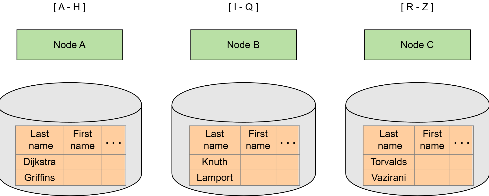
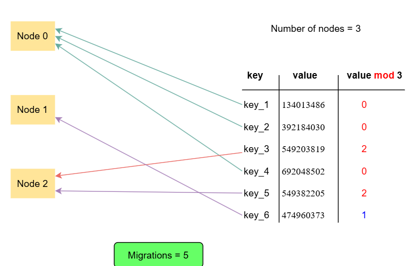
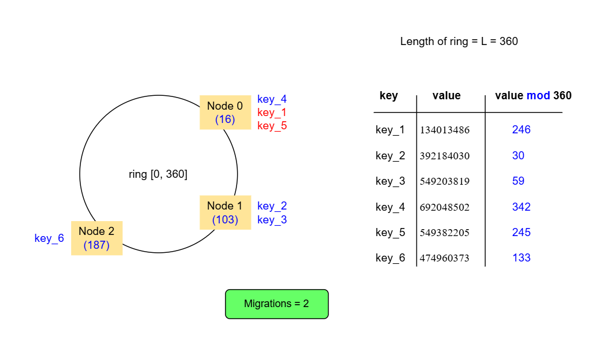

# Алгоритмы горизонтального разделения

Рассмотрим алгоритмы, используемые для горизонтального разделения данных.

Существует множество различных алгоритмов для выполнения горизонтального разделения. Мы изучим некоторые из них и обсудим их преимущества и недостатки.

## Разделение по диапазонам

Разделение по диапазонам — это метод, при котором набор данных разделяется на диапазоны в зависимости от значения определённого атрибута. Каждый диапазон затем сохраняется на отдельном узле. Пример с разделением по алфавиту, описанный в предыдущем уроке, является примером разделения по диапазонам.

Система должна хранить и поддерживать список всех этих диапазонов и карту, указывающую, какой узел хранит конкретный диапазон. Таким образом, при получении запроса на конкретное значение (или диапазон значений) система обращается к этой карте узлов, чтобы определить, на какой узел (или узлы) следует перенаправить запрос.

### Преимущества разделения по диапазонам

Некоторые преимущества разделения по диапазонам включают:

- Простота и лёгкость реализации.
- Возможность выполнения запросов по диапазонам с использованием ключа разделения.
- Хорошая производительность для запросов по диапазонам, использующих ключ разделения, когда запрашиваемый диапазон небольшой и находится на одном узле.
- Упрощение и повышение эффективности настройки диапазонов (перераспределения). Один диапазон может быть увеличен или уменьшен, что требует обмена данными только между двумя узлами.

### Недостатки разделения по диапазонам

Некоторые недостатки разделения по диапазонам включают:

- Невозможность выполнения запросов по диапазонам с использованием ключей, отличных от ключа разделения.
- Низкая производительность для запросов по диапазонам, использующих ключ разделения, когда запрашиваемый диапазон большой и находится на нескольких узлах.
- Неравномерное распределение трафика или данных, что приводит к перегрузке некоторых узлов. Например, при разделении по алфавиту некоторые буквы алфавита могут чаще встречаться в качестве начальных букв фамилий, что означает, что некоторые узлы будут хранить больше данных и обрабатывать больше запросов, чем другие.

Некоторые системы, использующие метод разделения по диапазонам, — это Google BigTable и Apache HBase.

## Хэш-разделение

Хэш-разделение — это метод, при котором к определённому атрибуту каждой строки применяется хэш-функция. В результате получается число, которое определяет, в какой раздел — и, следовательно, на какой узел — попадает эта строка.

Для простоты предположим, что у нас есть один раздел на узел, как в предыдущем примере, и хэш-функция, возвращающая целое число. Если в нашей системе есть n узлов, и мы хотим определить, на каком узле находится запись ученика с фамилией s, мы вычислим это по формуле `hash(s) mod n`.

Этот процесс отображения происходит как при записи новой записи, так и при получении запроса на поиск записи для конкретного значения этого атрибута.

### Преимущества хэш-разделения

Некоторые преимущества хэш-разделения включают:

- Возможность вычисления отображения разделов во время выполнения без необходимости хранения и поддержки карты отображения. Это выгодно как с точки зрения потребностей в хранении данных, так и с точки зрения производительности, поскольку не требуется дополнительных запросов для поиска отображения.
- Более высокая вероятность того, что хэш-функция равномерно распределит данные по узлам системы, предотвращая перегрузку некоторых узлов.

### Недостатки хэш-разделения

Некоторые недостатки хэш-разделения включают:

- Невозможность выполнения запросов по диапазонам даже для атрибута, используемого в качестве ключа разделения, без хранения дополнительных данных или запроса ко всем узлам.
- Добавление или удаление узлов из системы вызывает перераспределение, что приводит к значительному перемещению данных по всем узлам системы.

## Консистентное хэширование

Консистентное хэширование — это метод разделения, очень похожий на хэш-разделение, но решающий проблему повышенного перемещения данных, вызванного хэш-разделением.

Принцип работы следующий: каждому узлу в системе случайным образом назначается целое число в диапазоне [0, L]. Этот диапазон называется кольцом (например, [0, 360]). Затем система использует запись с атрибутом s в качестве ключа разделения, чтобы найти узел, следующий за точкой `hash(s) mod L` на кольце.

В результате, когда новый узел добавляется в кольцо, он получает данные только от следующего узла в кольце. Остальные узлы не должны обмениваться дополнительными данными. Аналогично, когда узел покидает кольцо, его данные передаются следующему узлу в кольце.

### Преимущества консистентного хэширования

Консистентное хэширование имеет одно основное преимущество по сравнению с хэш-разделением:

- Уменьшение перемещения данных при добавлении или удалении узлов в системе.

### Недостатки консистентного хэширования

Некоторые недостатки консистентного хэширования включают:

- Потенциальная неравномерность распределения данных из-за случайного назначения узлов в кольце.
- Возможность более несбалансированного распределения данных при добавлении или удалении узлов. Например, набор данных узла не распределяется равномерно по системе при его удалении, а вместо этого передаётся одному узлу.

Эти проблемы можно смягчить с помощью концепции «виртуальных узлов», где каждому физическому узлу назначается несколько мест в кольце. Эти места известны как виртуальные узлы.

Для дальнейшего обсуждения этой концепции вы можете ознакомиться с документом Dynamo. Ещё одна широко используемая система, использующая консистентное хэширование, — это Apache Cassandra.