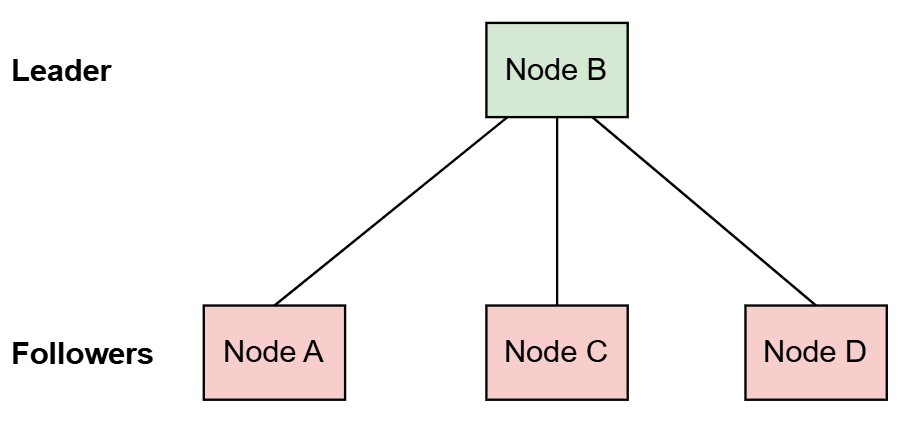
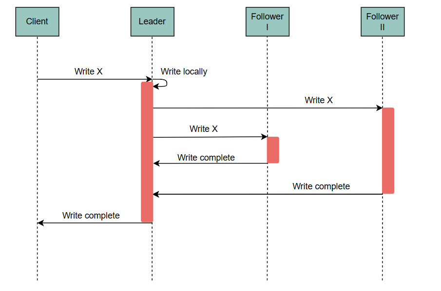
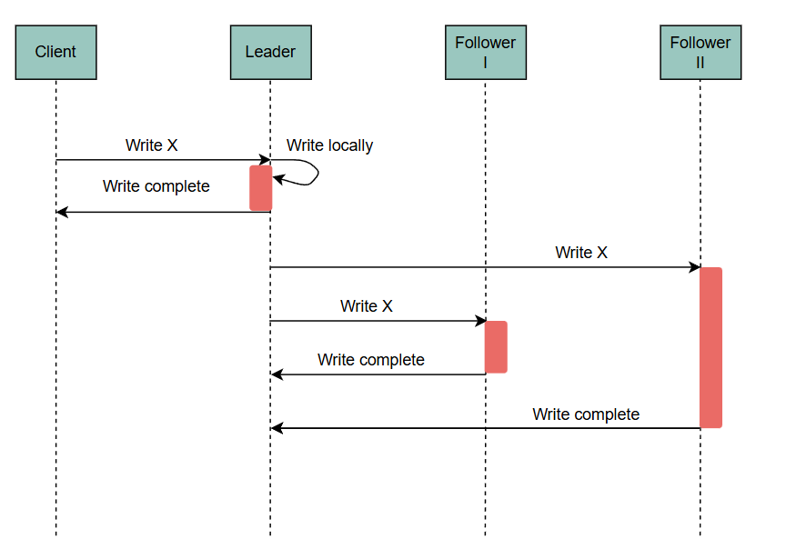
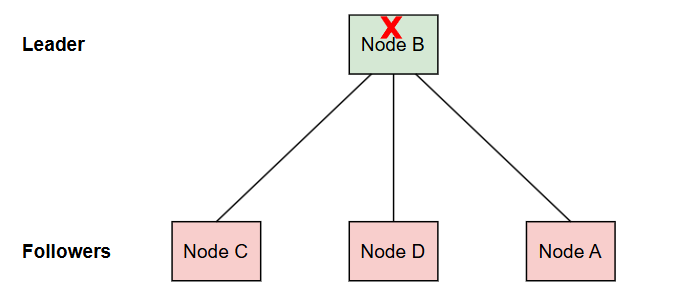

# Алгоритм репликации «основной-резервный»
Узнайте о первично-резервной репликации, ее практическом применении, преимуществах и недостатках.

# Первично-резервная репликация
Первично-резервная репликация — это метод, при котором мы назначаем один узел среди реплик в качестве лидера или основного, который получает все обновления.

> Этот метод также известен как репликация с одним мастером .

Мы обычно называем оставшиеся реплики последователями или вторичными. Они могут обрабатывать только запросы на чтение. Каждый раз, когда лидер получает обновление, он выполняет его локально, а также распространяет обновление на другие узлы. Это гарантирует, что все реплики поддерживают согласованный вид данных.

# Методы распространения обновлений
Существует два способа распространения обновлений: синхронный и асинхронный.

## Синхронная репликация
При синхронной репликации узел отвечает клиенту, чтобы указать, что обновление завершено — только после получения подтверждений от других реплик, что они также выполнили обновление в своем локальном хранилище. Это гарантирует, что клиент сможет просмотреть обновление при последующем чтении после его подтверждения, независимо от того, с какой реплики клиент читает.

Кроме того, синхронная репликация обеспечивает повышенную долговечность . Это связано с тем, что обновление не теряется, даже если лидер выходит из строя сразу после того, как он подтверждает обновление.

Однако эта техника может замедлить запросы на запись. Это связано с тем, что лидеру приходится ждать, пока он получит ответы от всех реплик.

# Асинхронная репликация
При асинхронной репликации узел отвечает клиенту сразу после выполнения обновления в своем локальном хранилище, не дожидаясь ответов от других реплик.

Эта техника значительно увеличивает производительность для запросов записи. Это происходит потому, что клиент больше не платит штраф за сетевые запросы к другим репликам.

Однако это достигается ценой снижения согласованности и снижения долговечности . После того, как клиент получает ответ на запрос на обновление, он может прочитать более старые (устаревшие) значения при последующем чтении. Это возможно только в том случае, если операция происходит в одной из реплик, которые еще не выполнили обновление. Более того, если ведущий узел выходит из строя сразу после того, как он подтверждает обновление, и запросы распространения на другие реплики теряются, любое подтвержденное обновление в конечном итоге теряется.

> Наиболее широко используемые базы данных, такие как PostgreSQL или MySQL , используют технологию репликации с первичным резервным копированием, которая поддерживает как асинхронную, так и синхронную репликацию.

# Преимущества первично-резервной репликации
1) Его легко понять и реализовать.
2) Параллельные операции, сериализованные в ведущем узле, устраняют необходимость в более сложных, распределенных протоколах параллелизма. В целом, это свойство также упрощает поддержку транзакционных операций 
3) Масштабируемость для рабочих нагрузок с большим объемом чтения обусловлена ​​тем, что емкость для запросов на чтение может быть увеличена путем добавления дополнительных реплик чтения. 
# Недостатки первично-резервной репликации
1) Он не очень масштабируем для рабочих нагрузок с большим объемом записи, поскольку емкость одного узла (емкость лидера) определяет емкость для записи. 
2) Это налагает очевидный компромисс между производительностью, долговечностью и постоянством. 
3) Масштабирование пропускной способности чтения путем добавления дополнительных узлов-подписчиков может создать узкое место в пропускной способности сети ведущего узла, если имеется большое количество подписчиков, прослушивающих обновления. 
4) Процесс перехода на узел-последователь при выходе из строя узла-лидера не происходит мгновенно. Это может привести к простою и также ввести риск ошибок

# Отказоустойчивость
Отказоустойчивость происходит, когда ведущий узел выходит из строя и его функции берет на себя ведомый узел.

Когда ведущий узел выходит из строя, нам нужно выбрать другой ведущий узел. Ниже приведены подходы для выполнения отказоустойчивости .

# Управление отказоустойчивостью
В целом существует два подхода к выполнению аварийного переключения: ручной и автоматизированный .

## Ручной подход
При ручном подходе оператор выбирает новый ведущий узел и соответствующим образом инструктирует все узлы. Это самый безопасный подход, но он влечет за собой значительное время простоя.

## Автоматизированный подход
Альтернативой является автоматизированный подход, когда узлы-последователи обнаруживают, что узел-лидер вышел из строя (например, с помощью периодических сердечных сокращений ), и пытаются выбрать новый узел-лидер. Это быстрее, но довольно рискованно. Это связано с тем, что существует множество различных способов, которыми узлы могут запутаться и прийти в неправильное состояние.

> В главе о консенсусе эта тема, называемая выборами лидера , будет рассмотрена более подробно.