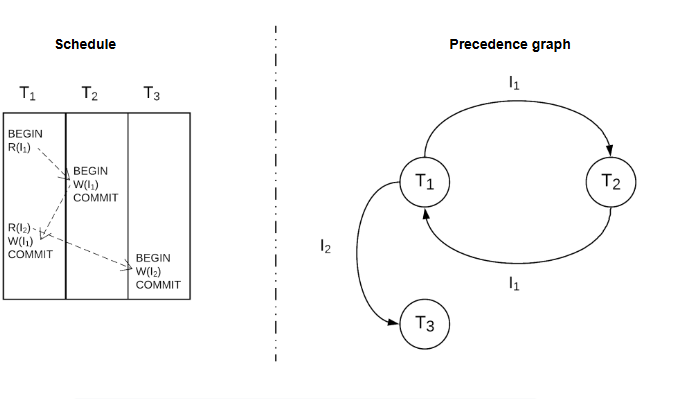
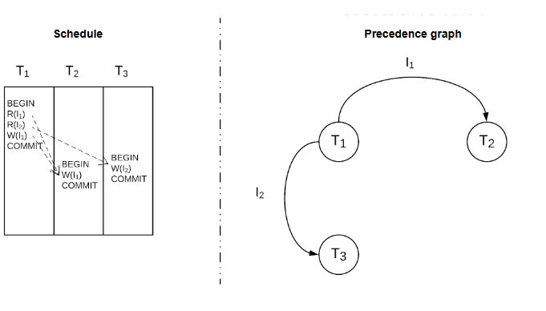

# Достижение сериализуемости
Давайте узнаем, как достичь сериализуемости. Рассмотрим механизмы управления параллелизмом и случаи, когда каждый из них работает хорошо.

Мы знаем, что существуют некоторые потенциальные аномалии, возникающие из-за одновременных транзакций, которые не изолированы должным образом.

> Существуют различные уровни изоляции, которые предотвращают эти аномалии. Более сильные уровни изоляции предотвращают больше аномалий за счет производительности.

Мы также привели несколько примеров, иллюстрирующих реальные последствия этих аномалий.

Как объяснялось в предыдущем уроке «Последовательность и изоляция », система должна быть строго сериализуемой , чтобы быть полностью защищенной от любой из этих аномалий.

> Строго сериализуемый — самый сильный уровень изоляции. Затем следует сериализуемость , которую мы увидим в этом уроке.

Система, обеспечивающая сериализуемость, гарантирует, что результат любого разрешенного выполнения транзакций будет таким же, как и результат некоторого последовательного выполнения тех же транзакций (отсюда и ее название).

> В контексте изоляции выполнение нескольких транзакций, соответствующих порядку связанных операций, также называется расписанием .

Вы можете спросить: что означает то же самое в предыдущем предложении? Давайте объясним.

# Типы сериализуемости
Существует два основных типа сериализуемости, которые устанавливают два различных понятия сходства.

# Просмотр сериализуемости
Расписание — это представление , эквивалентное последовательному расписанию с теми же транзакциями, когда все операции из транзакций в двух расписаниях считывают и записывают одни и те же значения данных («просмотр» одних и тех же данных).

# Конфликт сериализуемости
Расписание является конфликтным эквивалентом последовательного расписания с теми же транзакциями, когда каждая пара конфликтующих операций между транзакциями упорядочена одинаково в обоих расписаниях.

> Оказывается, вычисление того, является ли расписание сериализуемым представлением, является очень сложной вычислительной задачей. Точнее, это NP-полная задача. Это означает, что время, необходимое для решения задачи с использованием любого известного в настоящее время алгоритма, быстро увеличивается по мере роста размера задачи. Поэтому мы не будем далее анализировать сериализуемость представления.

Однако определить, является ли расписание сериализуемым при конфликтах, гораздо проще, что является одной из причин широкого использования сериализуемости конфликтов.

# Определение того, является ли расписание сериализуемым конфликтом
Чтобы понять сериализуемость конфликтов, нам сначала нужно определить, что означает, что две операции являются конфликтующими.

Две операции конфликтуют (или конфликтуют), если:

1) Они принадлежат к разным транзакциям
2) Они относятся к одному и тому же элементу данных, и по крайней мере одна из них представляет собой операцию записи, где операция записи вставляет, изменяет или удаляет объект.
В результате мы можем иметь три различные формы конфликтов:

1) Конфликт чтения-записи
2) Конфликт записи-чтения
3) Конфликт «написать-написать»
# Тривиальный способ
Простейший способ проверить, является ли расписание сериализуемым по конфликтам, — это вычислить все возможные последовательные расписания, выявить в них конфликтующие операции и проверить, совпадает ли их порядок с порядком в рассматриваемом расписании.

> Это требует больших вычислительных затрат, поскольку требует вычисления всех возможных перестановок транзакций.

Более практичный способ определения того, является ли расписание сериализуемым при конфликтах, — это использование графа приоритетов .

# График приоритета
Граф приоритетов — это ориентированный граф, где:

1) Узлы представляют транзакции в расписании.
2) Края представляют собой конфликты между операциями.
Ребра на графике обозначают порядок, в котором транзакции должны выполняться в соответствующем последовательном расписании.

> В результате расписание является сериализуемым конфликтом тогда и только тогда, когда его граф приоритетов зафиксированных транзакций является ациклическим .

Давайте рассмотрим пример, чтобы лучше понять это правило.

Пример
На следующем рисунке представлен график трех транзакций.
представляют собой операцию чтения и записи, соответственно, над элементом

Как мы видим на иллюстрации выше, конфликтующие операции в этом расписании образуют граф приоритетов с циклом. Это означает, что это расписание не является сериализуемым конфликтом . Цикл между
означает, что должен быть последовательный график, где
и наоборот, что невозможно.

На следующем рисунке представлено немного иное расписание тех же транзакций, которые теперь являются конфликтно сериализуемыми, поскольку в соответствующем графике приоритетов нет циклов .

> Описанный выше метод — один из способов определить, является ли расписание сериализуемым . Однако на самом деле нам нужен способ сгенерировать расписание, которое сериализуемо заранее.

# Создание расписания, которое можно сериализовать
Здесь полезно использовать понятие графа приоритетов.

Все, что нам нужно сделать, это убедиться, что цикл не образуется при выполнении операций в расписании. Мы можем добиться этого двумя основными способами.

1) Не допускайте продолжения транзакций, если существует риск возникновения конфликта, способного создать цикл.
2) Позвольте транзакциям выполнить все свои операции и проверьте, может ли фиксация этой транзакции привести к циклу. В этом случае транзакцию можно прервать и перезапустить с нуля.
> Эти два подхода приводят к двум основным механизмам управления параллелизмом.

# Механизмы управления параллелизмом
Существует два основных механизма управления параллелизмом:

# Пессимистический контроль параллелизма
При таком подходе транзакция блокируется, если ожидается, что она приведет к нарушению сериализуемости, и возобновляется, когда это становится безопасным.

Обычно это достигается путем блокирования транзакциями обрабатываемых ими данных, чтобы предотвратить одновременную обработку тех же данных другими транзакциями.

Название «пессимистический» происходит от того факта, что этот подход предполагает, что большинство транзакций будут конфликтовать друг с другом, поэтому принимаются соответствующие меры для предотвращения возникновения проблем.

# Оптимистичный контроль параллелизма
Такой подход откладывает проверку того, соответствует ли транзакция правилам, до конца транзакции. Транзакция прерывается, если фиксация нарушает какие-либо правила сериализуемости, а затем перезапускается и выполняется заново с самого начала.

Название «оптимистический» происходит от того факта, что этот подход предполагает, что большинство транзакций не будут иметь конфликтов, поэтому меры принимаются только в тех редких случаях, когда они возникают.

Основной компромисс между пессимистичным и оптимистичным управлением параллельным выполнением заключается в дополнительных накладных расходах, связанных с механизмами блокировки, и напрасных вычислениях из-за прерванных транзакций.

# Случаи, когда оптимистичные методы работают хорошо
В целом ожидается, что оптимистичные методы будут эффективны в случаях, когда между транзакциями не так много конфликтов.

Это может иметь место в рабочих нагрузках с большим количеством транзакций только для чтения и лишь несколькими транзакциями для записи или в случаях, когда большинство транзакций затрагивают разные данные.

# Случаи, когда пессимистические методы работают хорошо
Пессимистические методы влекут за собой некоторые накладные расходы из-за использования блокировок. Тем не менее, они могут работать лучше в рабочих нагрузках, содержащих много конфликтующих транзакций. Это происходит потому, что они уменьшают количество прерываний и перезапусков, тем самым уменьшая напрасные усилия.

