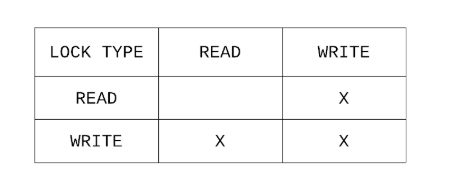
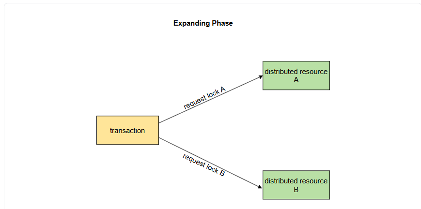
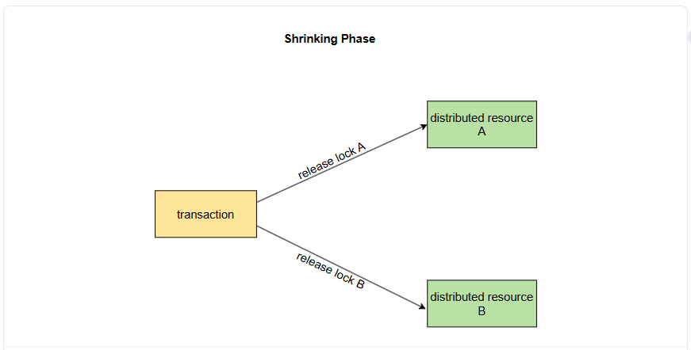
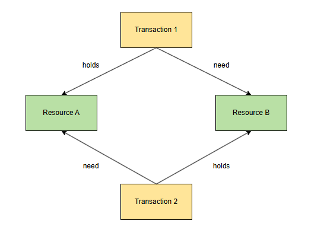

# Пессимистическое управление параллелизмом (PCC)
На этом уроке мы рассмотрим двухфазную блокировку — пессимистический протокол управления параллелизмом.

# 2-фазная блокировка (2PL)
2-фазная блокировка (2PL) — это пессимистический протокол управления параллелизмом, который использует блокировки для предотвращения вмешательства параллельных транзакций. Эти блокировки указывают, что запись используется транзакцией, так что другие транзакции могут определить, безопасно ли ее использовать или нет.

# Типы замков
В этом протоколе используются два основных типа блокировок:

Блокировки записи (исключительные) : эти блокировки устанавливаются, когда запись будет записана (вставлена/обновлена/удалена).
Блокировки чтения (совместные) : эти блокировки устанавливаются при чтении записи.

# Взаимодействие между блокировками записи (исключительными) и блокировками чтения (совместными)
1) Блокировка чтения не блокирует чтение из другой транзакции. Вот почему она также называется общей , поскольку несколько блокировок чтения могут быть получены одновременно.
2) Блокировка чтения блокирует запись из другой транзакции. Другая транзакция должна будет дождаться завершения операции чтения и снятия блокировки чтения. Затем ей придется получить блокировку записи и выполнить операцию записи.
3) Блокировка записи блокирует как чтение , так и запись из других транзакций, поэтому ее также называют исключительной . Другим транзакциям придется ждать завершения операции записи и снятия блокировки записи; затем они попытаются получить надлежащую блокировку и продолжить.

> Если замок блокирует другой замок, они называются несовместимыми . В противном случае они называются совместимыми .

В результате описанные выше отношения можно визуализировать в матрице совместимости, как показано на следующем рисунке.

> Проницательный читатель может заметить сходство между этой матрицей и определением конфликтов в сериализуемости конфликтов . Это не совпадение. Протокол двухфазной блокировки использует эти блокировки для предотвращения образования циклов этих конфликтов, как описано ранее.

Каждый тип конфликта представлен несовместимой записью в приведенной выше матрице.

# Фазы, на которых транзакции устанавливают или снимают блокировки
В протоколе двухфазной блокировки транзакции устанавливают и снимают блокировки в два отдельных этапа:

# Фаза расширения
На этом этапе транзакции разрешено только устанавливать блокировки, но не снимать их.

# Фаза сокращения
На этом этапе транзакции разрешено только снимать блокировки, но не устанавливать какие-либо блокировки.

На следующем рисунке показаны эти фазы.

 

> До сих пор подразумевалось, что блокировки удерживаются на запись. Однако важно отметить, что если связанная база данных поддерживает операции на основе предикатов, должен быть также способ заблокировать диапазоны записей (блокировка предикатов), например, всех клиентов в возрасте от 23 до 29 лет. Это необходимо для предотвращения аномалий, таких как фантомные чтения.

Как доказал Франкинг , этот протокол допускает только сериализуемые исполнения.

> Расписание, сформированное с помощью двухфазной блокировки, будет конфликтно эквивалентно последовательному расписанию, в котором транзакции сериализуются в том порядке, в котором они завершили свою фазу расширения.

Существуют некоторые небольшие изменения протокола, которые могут обеспечить некоторые дополнительные свойства, такие как:

1) Строгая двухфазная блокировка (S2PL)
2) Сильная строгая двухфазная блокировка (SS2PL)

# Тупики
Механизм блокировки вводит риск взаимоблокировок, когда две транзакции могут ждать друг друга для снятия блокировки, таким образом, никогда не достигая прогресса. Это показано на следующей иллюстрации.

# Способы борьбы с взаимоблокировками
В общем случае существует два способа решения таких тупиковых ситуаций.

# Профилактика
Этот метод изначально предотвращает возникновение тупиковых ситуаций.

Например, это можно сделать, если транзакции заранее знают все необходимые им блокировки и получают их в упорядоченном виде. Обычно это делается приложением, поскольку многие базы данных поддерживают интерактивные транзакции и, таким образом, не знают обо всех данных, к которым транзакция получит доступ.

# Обнаружение
Этот метод обнаруживает возникающие взаимоблокировки и устраняет их. Например, этого можно добиться, отслеживая, какую транзакцию ожидает транзакция, используя эту информацию для обнаружения циклов, представляющих взаимоблокировки, а затем принудительно прерывая одну из этих транзакций. Обычно это делает база данных, и приложению не нужно делать ничего дополнительного.