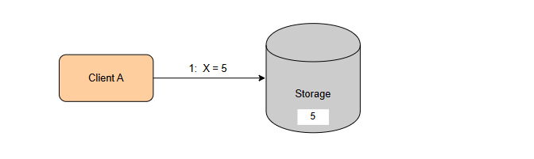
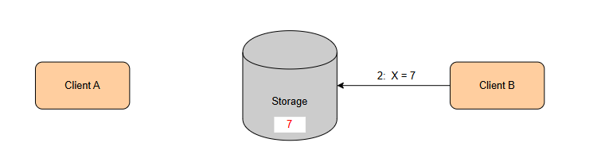
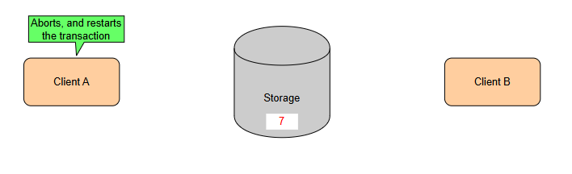

# Оптимистичное управление параллелизмом (OCC)
В этом уроке мы опишем способ, с помощью которого метод оптимистического управления параллелизмом управляет параллельными операциями.

Оптимистическое управление параллелизмом (OCC) — это метод управления параллелизмом, впервые предложенный в 1981 году Кунгом и др. , при котором транзакции могут получать доступ к элементам данных без установки на них блокировок.

В этом методе транзакции выполняются в следующие три этапа:

Начинать
Читать и изменять
Проверить и зафиксировать/откатить
# Начало фазы
На этом этапе транзакциям присваивается уникальная временная метка , которая отмечает начало транзакции и называется начальной временной меткой .

# Прочитать и изменить
На этом этапе транзакции выполняют свои операции чтения и записи предварительно . Это означает, что при изменении элемента копия элемента записывается во временное локальное хранилище. Операция чтения сначала проверяет наличие копии элемента в этом месте и возвращает ее, если она существует. В противном случае она выполняет обычную операцию чтения из базы данных.

# Фаза проверки и фиксации/отката
Транзакция переходит в эту фазу после выполнения всех операций.

На этом этапе транзакция проверяет, есть ли другие транзакции, которые изменили данные, к которым эта транзакция получила доступ, и начались после времени начала этой транзакции. Если есть, то транзакция прерывается и перезапускается с самого начала, получая новую временную метку. В противном случае транзакция может быть зафиксирована.

Это показано на следующей иллюстрации.

  

Фиксация транзакции выполняется путем копирования всех значений из операций записи из локального хранилища в общее хранилище базы данных, к которому обращаются другие транзакции.

> Важно отметить, что проверки валидности и связанная с ними операция фиксации должны выполняться в рамках одного атомарного действия в рамках критической секции .

Для этого требуется некая форма механизма блокировки, поэтому существуют различные оптимизации этого подхода, которые пытаются сократить продолжительность этой фазы для повышения производительности.

# Способы реализации логики проверки
Существует два способа реализации логики проверки.

# Проверка версии
Один из способов — проверка версий, где каждый элемент данных помечается номером версии. Каждый раз, когда транзакция обращается к элементу, она может отслеживать номер версии, который у нее был на тот момент.

На этапе проверки транзакция может проверить, совпадает ли номер версии. Если это так, это будет означать, что никакая другая транзакция не обращалась к элементу в это время.

# Отметка времени, упорядоченная
Другой способ — использование временных меток, назначаемых транзакциям, метод, также известный как упорядочение временных меток, поскольку временная метка указывает порядок, в котором транзакция должна выполняться относительно другой транзакции.

При таком подходе каждая транзакция отслеживает элементы, к которым осуществляется доступ посредством операций чтения или записи, известные как набор чтения и набор записи .

Во время проверки транзакция выполняет следующие действия внутри критической секции:

Он записывает новую временную метку, называемую временной меткой окончания , и выполняет итерацию по всем транзакциям, которым была назначена временная метка между временной меткой начала и окончания транзакции.

> По сути, это все транзакции, которые начались после текущей транзакции и уже были зафиксированы.

Для каждой из этих транзакций текущая транзакция проверяет, пересекается ли их набор записи с ее собственным набором чтения . Если это верно для любой из этих транзакций, это означает, что транзакция по сути считывает значение «из будущего».

В результате транзакция становится недействительной и должна быть прервана и перезапущена с самого начала с новой временной меткой. В противном случае транзакция фиксируется и ей назначается следующая временная метка.