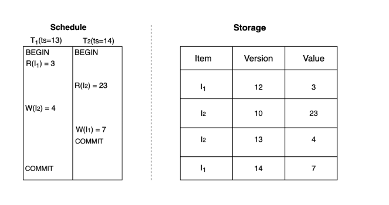

# Достижение изоляции моментального снимка
На этом уроке мы изучим механизм управления многоверсионным параллелизмом и обсудим, как он помогает добиться изоляции моментальных снимков.

# Многоверсионный параллельный контроль (MVCC)
Multiversion Concurrency Control (MVCC) — это метод, при котором для одного логического элемента данных поддерживаются несколько физических версий. В результате операции обновления не перезаписывают существующие записи, а записывают новую версию этих записей. Операции чтения затем могут выбрать определенную версию записи, возможно, более старую.

> Это отличается от предыдущих методов, где обновления выполняются на месте, и для каждого элемента данных существует отдельная запись, к которой можно получить доступ с помощью операций чтения.

Рид предложил оригинальный протокол в своей диссертации в 1978 году, но с тех пор Зильбершатц и Стернс с соавторами предложили множество различных вариаций первоначальной идеи

Как следует из названия, этот метод фокусируется на аспекте многоверсионности хранилища, поэтому его можно использовать, теоретически, как с оптимистичными , так и с пессимистическими схемами.

> Однако большинство вариаций используют метод оптимистичного управления параллелизмом, позволяющий использовать несколько версий элемента из транзакций, которые выполняются одновременно.

# Достижение изоляции моментального снимка с помощью MVCC
На практике MVCC обычно используется для реализации уровня изоляции моментального снимка .

Изоляция моментального снимка (SI) — это уровень изоляции, который гарантирует, что все чтения, выполненные в транзакции, видят согласованный снимок базы данных с момента ее начала, и транзакция фиксируется успешно, если никакая другая транзакция не обновила те же данные с момента этого снимка. В результате, на практике проще добиться изоляции моментального снимка, используя технику MVCC.

Шаги
Это работает следующим образом:

Каждой транзакции в начале присваивается уникальная временная метка.
Каждая запись для элемента данных содержит версию, которая соответствует временной метке транзакции, создавшей эту новую версию.
Каждая транзакция в начале регистрирует следующую информацию:
- Транзакция с самой высокой временной меткой, которая была зафиксирована на данный момент (например,
- Количество активных транзакций, которые начались, но еще не были завершены.

# Выполнение операции чтения
При выполнении операции чтения для элемента транзакция возвращает запись с последней версией, которая более ранняя, чем Ts, и не принадлежит ни одной из транзакций, которые были активны в начале этой транзакции. Это предотвращает грязные чтения, поскольку могут быть возвращены только зафиксированные значения из других транзакций.

> Из этого правила есть исключение: если транзакция уже обновила этот элемент, то вместо этого возвращается это значение.

Нечеткие чтения также предотвращаются, поскольку все чтения возвращают значения из одного и того же снимка и игнорируют значения из транзакций, которые были зафиксированы после начала данной транзакции.

# Выполнение операции записи
При выполнении операции записи для элемента транзакция проверяет, существует ли запись для того же элемента, удовлетворяющая одному из следующих критериев: ее версия выше временной метки этой транзакции или ее версия ниже временной метки этой транзакции, но эта версия принадлежит одной из транзакций, которые были активны в начале этой транзакции.

В любом из этих случаев транзакция прерывается и может быть перезапущена с нуля с большей временной меткой.

Во втором случае транзакция прерывается, чтобы предотвратить аномалию потери обновлений.

> Хотя это предотвращает множество аномалий, это все еще не сериализуемо, и некоторые аномалии все еще возможны.

# Не все аномалии можно предотвратить в MVCC
Примером аномалии, которую нельзя предотвратить, является перекос записи .

Пример перекоса записи
На следующем рисунке показано, почему мы не можем предотвратить возникновение перекоса записи.

В графике, показанном на иллюстрации выше, ни одна из транзакций не видит версий, записанных другой транзакцией. Однако это было бы невозможно при последовательном выполнении.

