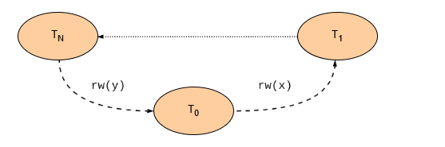
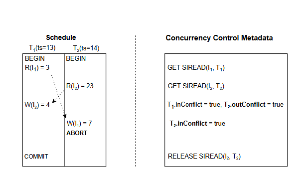

# Достижение полной сериализуемой изоляции моментальных снимков
Давайте рассмотрим, как алгоритм изоляции сериализуемого снимка помогает достичь полной сериализуемости, предотвращая все аномалии.

Исследования в области механизма управления параллелизмом для достижения уровня изоляции моментальных снимков привели к созданию улучшенного алгоритма, называемого сериализуемой изоляцией моментальных снимков (SSI) , который может обеспечить полную сериализуемость и был интегрирован в коммерческие, широко используемые базы данных Портсом и др.

> Этот алгоритм по-прежнему оптимистичен и просто добавляет некоторые расширения к тому, что мы описали в предыдущем уроке.

# Сериализуемая изоляция моментальных снимков (SSI)
Механика решения основана на ключевом принципе предыдущего исследования, которое показало, что все несериализуемые выполнения в условиях изоляции моментального снимка имеют общую характеристику.

# Заявление
SSI утверждает следующее: в графе предшествования любого несериализуемого выполнения есть два ребра зависимости rw , которые формируют последовательные ребра в цикле. Они включают две транзакции, которые были активны одновременно, как показано на следующей иллюстрации.

Зависимость rw — это зависимость данных между транзакциями Т и T1 , где Т 0 читает версию элемента xи Т1 создает версию элемента x, которая находится позже в порядке версий, чем версия, прочитанная Т0.

# Подход
Подход SSI обнаруживает эти случаи и прерывает цикл, когда они вот-вот произойдут. Он предотвращает их формирование, прерывая одну из задействованных транзакций. Для этого SSI выполняет следующие шаги:

Он отслеживает входящие и исходящие ребра зависимости rw каждой транзакции.

Если есть транзакция, которая имеет как входящие, так и исходящие ребра, алгоритм прерывает одну из транзакций и повторяет ее позже.

> Обратите внимание, что это может привести к прерываниям, которые являются ложными срабатываниями , поскольку алгоритм не проверяет, есть ли цикл. Это сделано намеренно, чтобы избежать вычислительных затрат, связанных с отслеживанием циклов.

Таким образом, достаточно поддерживать два булевых флага на транзакцию T.inConflictи T.outConflict, которые обозначают, есть ли входящее и исходящее ребро зависимости rw. Эти флаги можно поддерживать следующим образом:

Когда транзакция T выполняет чтение, он может обнаружить, существует ли версия того же элемента, которая была записана после начала транзакции, например, другой транзакцией У . Это будет подразумевать наличие зависимости rw, поэтому алгоритм может обновить T.outConflictи U.inConflictдо true.
> Однако это не обнаружит случаи, когда запись происходит после чтения. Алгоритм использует другой механизм для обнаружения и этих случаев.

Каждая транзакция создает блокировку чтения, называемую блокировкой SIREAD , когда она выполняет чтение. В результате, когда транзакция выполняет запись, она может прочитать существующие блокировки SIREAD и обнаружить параллельные транзакции, которые ранее читали тот же элемент. Таким образом, она обновляет те же самые логические флаги соответствующим образом.
Обратите внимание, что это более мягкая форма блокировок, поскольку они не блокируют работу других транзакций, а существуют в основном для сигнализации о зависимостях данных между ними. Это означает, что алгоритм сохраняет свою оптимистичную природу.

# Предотвращение аномалии перекоса записи с помощью SSI
На следующем рисунке показано, как этот подход предотвращает аномалию перекоса записи, которую мы наблюдали на предыдущем уроке.

Когда транзакция Т2 выполняет операцию записи, проверяет наличие существующих блокировок SIREAD на элементе я1 . Т1 удерживает такую ​​блокировку, поэтому транзакция Т2 обновляет свой inConflictфлаг на true. Если и inConflictфлаги outConflictдля и Т2 в trueданный момент эта транзакция отменена.

> Для краткости это объяснение опустило некоторые детали SSI. Для получения дополнительной информации мы можем взглянуть на соответствующие статьи Cahill et al. и Ports et al.