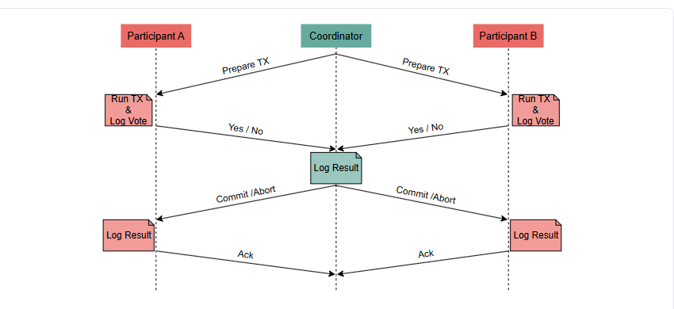

# Двухфазная фиксация (2PC)
Давайте рассмотрим, как алгоритм двухфазной фиксации помогает достичь атомарности.

В распределенной системе с ненадежной сетью просто отправить сообщение вовлеченным узлам будет недостаточно для выполнения распределенной транзакции. Узел, инициирующий транзакцию, не будет знать, были ли другие узлы успешно зафиксированы или прерваны из-за какого-либо сбоя, чтобы принять окончательное решение о результате транзакции.

> Когда мы думаем об этом, самая простая идея — добавить еще один раунд сообщений и проверить, какой результат был на каждом узле. Это по сути протокол двухфазной фиксации (2PC) .

# Фазы
Протокол двухфазной фиксации состоит из двух фаз, отсюда и название.

Протокол содержит две различные роли. Их названия отражают их фактические обязанности в протоколе.

1) Координатор отвечает за координацию различных этапов протокола .
2) Участники соответствуют всем узлам, участвующим в транзакции .

> Обратите внимание, что один из участников также может выполнять роль координатора.

# Этап голосования
На этом этапе координатор отправляет транзакцию всем участникам. Участники выполняют транзакцию до того момента, когда они должны ее зафиксировать.

> В некоторых случаях операции каждой транзакции выполняются отдельно и до фазы голосования, которая начинается после выполнения всех операций транзакции. Протоколы соглашений, подобные этому, обычно включают в себя также некоторый протокол блокировки, так что другие параллельные транзакции не могут заставить участников, которые уже проголосовали, изменить свое решение относительно того, могут ли они фиксировать транзакцию или нет. Например, протокол 2-фазной фиксации транзакции можно объединить с протоколом 2-фазной блокировки .

Затем участники отвечают координатору голосованием, которое показывает, были ли операции транзакции выполнены успешно (голос «Да») или возникла какая-то ошибка, из-за которой транзакция не может быть зафиксирована (голос «Нет»).

# Фаза фиксации
На этом этапе координатор собирает все голоса участников. Если все голоса «Да», то координатор снова отправляет участникам сообщение с инструкцией о совершении транзакции.

В противном случае, если хотя бы один голос «Нет», координатор дает указание участникам прервать транзакцию. Наконец, участники отвечают подтверждением и закрывают эту фазу.

> Тот факт, что для фиксации требуется единогласное положительное голосование, означает, что транзакция либо будет зафиксирована для всех участников, либо будет прервана для всех из них ( свойство атомарности ).

Координатор и участники используют журнал предварительной записи , в котором они сохраняют свои решения на различных этапах , чтобы иметь возможность восстановиться в случае сбоя.

Координатор также использует тайм-аут при ожидании ответов от первой фазы. Если тайм-аут истекает, координатор интерпретирует этот тайм-аут как голосование «Нет» и считает узел неисправным.

С другой стороны, участники не применяют никаких тайм-аутов, ожидая сообщений координатора, поскольку это может привести к тому, что участники придут к разным выводам из-за проблем со временем.

На следующем рисунке показано, как выглядит этот поток.

# Обработка сбоев
Поскольку счастливый путь прост, давайте рассмотрим, как протокол обрабатывает различные виды сбоев.

# Неудача участника на этапе голосования
Если участник не проходит этап голосования до ответа координатору, координатор прекращает ожидание и предполагает, что участник проголосовал « Нет» .

Это означает, что протокол в конечном итоге прервет транзакцию.

# Отказ участника на этапе фиксации
В этом сценарии участник голосует на этапе голосования, но затем терпит неудачу до того, как получит сообщение от координатора и завершит транзакцию (либо подтвердив, либо отменив ее).

В этом случае протокол завершится без этого узла. Если этот узел восстановится, позже он идентифицирует эту ожидающую транзакцию и свяжется с координатором , чтобы узнать, каков был результат, и завершит ее таким же образом.

Таким образом, если результат транзакции успешен, любой участник, потерпевший крах, в конечном итоге узнает об этом при восстановлении и зафиксирует ее. Протокол не позволяет отменить ее в одностороннем порядке. Таким образом, атомарность сохраняется.

Некоторые читатели могли заметить, что существует вероятность того, что участники могут потерпеть неудачу в момент, когда они попытаются зафиксировать транзакцию, и нарушить свое обещание, например, потому что у них закончилось место на диске. Действительно, это правда. Таким образом, участники должны выполнить минимально возможную работу в рамках фазы фиксации, чтобы избежать этого. Например, участники могут записать все необходимые данные на диск во время первой фазы, чтобы они могли сигнализировать о фиксации транзакции, выполнив минимальную работу во время второй фазы (например, перевернув бит).

# Сбои сети
Сбои в работе сети приводят к результатам, аналогичным описанным ранее, поскольку тайм-ауты делают их эквивалентными сбоям узлов.

> Несмотря на то, что двухфазная фиксация может изящно справиться со всеми вышеупомянутыми сбоями, существует одна точка отказа: координатор.

Блокирующий характер протокола двухфазной фиксации
Из-за блокирующей природы протокола сбои координатора на определенных этапах протокола могут привести к остановке всей системы. Более конкретно, если координатор выйдет из строя после отправки подготовленного сообщения участникам, участники заблокируются. Участники будут ждать, пока координатор восстановится и узнает результат транзакции, чтобы они могли зафиксировать или отменить ее по мере необходимости.

Это означает, что сбои координатора могут значительно снизить доступность системы. Более того, если данные с диска координатора не могут быть восстановлены (например, из-за повреждения диска), результат ожидающих транзакций не может быть обнаружен, и может потребоваться ручное вмешательство для разблокировки протокола.

# Использование протокола двухфазной фиксации
Несмотря на блокирующую природу протокола, двухфазная фиксация широко используется. Также была выпущена спецификация, называемая eXtended Architecture (XA ) .

В этой спецификации каждый из узлов-участников называется ресурсом, и они должны реализовывать интерфейс менеджера ресурсов.

Спецификация также определяет концепцию менеджера транзакций , который действует как координатор, начинающий, координирующий и завершающий транзакции.

# Заключение
Протокол 2PC удовлетворяет свойству безопасности , которое гарантирует, что все участники всегда приходят к одному и тому же решению ( атомарность ). Однако он не удовлетворяет свойству жизнеспособности, которое подразумевает, что он всегда будет продвигаться.