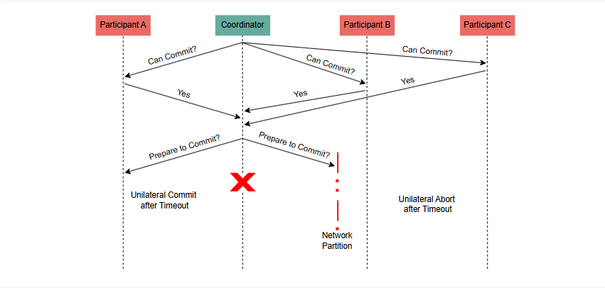

# 3-фазная фиксация (3PC)
В этом уроке мы рассмотрим, как протокол трехфазной фиксации решает проблему протокола двухфазной фиксации.

# Проблема с протоколом двухфазной фиксации
Как мы уже описывали ранее , основным узким местом протокола двухфазной фиксации были сбои координатора, приводившие систему в заблокированное состояние.

В идеале мы хотели бы, чтобы в этом случае участники могли каким-то образом взять на себя инициативу и продолжить выполнение протокола, но это не так просто.

Основная причина заключается в том, что на этапе фиксации участники не знают о состоянии других участников — об этом знает только координатор . Поэтому взятие на себя инициативы без ожидания координатора может привести к нарушению свойства атомарности .

Например, представьте себе следующий сценарий: на этапе фиксации протокола координатору удается отправить сообщение о фиксации (или отмене) одному из участников, но затем происходит сбой, и этот участник также терпит неудачу. Если один из других участников возьмет на себя инициативу, он сможет только опрашивать живых участников. Таким образом, он не сможет принять правильное решение, не дождавшись восстановления отказавшего участника (или координатора).

# Решение проблемы 2PC с помощью протокола 3-фазной фиксации
Проблему двухфазного подтверждения можно решить, разделив первый раунд (фазу голосования) на два подраунда, где координатор сначала передает результаты голосования узлам, ждет подтверждения, а затем отправляет сообщение о подтверждении или отмене.

В этом случае участники будут знать результат голосования и завершать протокол самостоятельно в случае отказа координатора. По сути, это протокол 3-фазного подтверждения (3PC) .

> Википедия содержит подробное описание различных этапов протокола и хорошую визуальную демонстрацию. Не стесняйтесь обращаться к этому ресурсу для дополнительного изучения протокола.

# Преимущество 3PC
Главное преимущество этого протокола в том, что координатор перестает быть единой точкой отказа.

В случае выхода из строя координатора участники могут взять на себя управление и завершить протокол.

Участник, принимающий управление, может зафиксировать транзакцию, если он получает сообщение о готовности к фиксации , зная, что все участники проголосовали «Да». Если он не получает сообщение о готовности к фиксации, он может прервать транзакцию, зная, что ни один участник не зафиксировал транзакцию, без предварительного получения всеми участниками сообщения о готовности к фиксации.

В результате протокол 3PC повышает доступность и исключает возможность превращения координатора в единую точку отказа.

Однако это достигается за счет потери корректности , поскольку протокол уязвим к сбоям, таким как сетевые разделы.

# Ошибка сетевого раздела в 3PC
Пример такого случая отказа показан на следующем рисунке.

В этом примере разделение сети происходит в момент, когда координатору удается отправить сообщение о готовности к фиксации только некоторым участникам. Между тем, координатор дает сбой сразу после этого момента, поэтому участники выходят из строя и должны завершить протокол самостоятельно.

В этом случае на одной стороне раздела есть участники, которые получают сообщение о готовности к фиксации и продолжают фиксацию транзакции. Однако участники на другой стороне раздела не получают сообщение о готовности к фиксации и, таким образом, в одностороннем порядке прерывают транзакцию.

> Это может показаться случаем сбоя, который вряд ли произойдет. Однако последствия будут катастрофическими, если это произойдет, поскольку система находится в несогласованном состоянии после исправления сетевого раздела. Свойство атомарности транзакции было нарушено.

# Заключение
Протокол 3PC удовлетворяет свойству жизнеспособности , которое гарантирует, что он всегда будет развиваться, ценой нарушения свойства безопасности атомарности .

