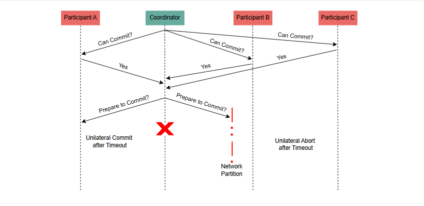
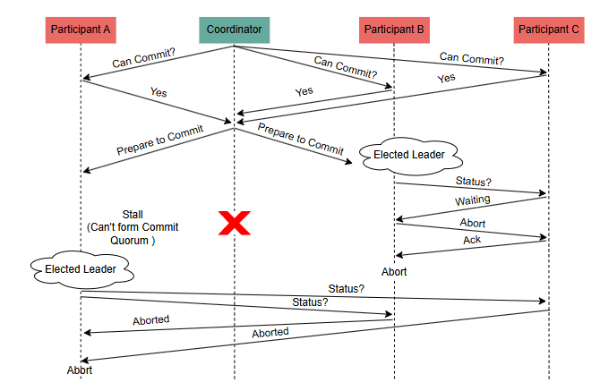

# Протокол фиксации на основе кворума
Давайте рассмотрим, как протокол, основанный на кворуме, решает проблему протокола трехфазной фиксации.

# Проблема с протоколом 3-фазной фиксации
Как мы наблюдали в предыдущем уроке, основная проблема с протоколом 3PC возникает в конце второй фазы, где потенциальное разделение сети может привести систему в несогласованное состояние.

Это может произойти, когда участники попытаются разблокировать протокол, взяв на себя инициативу, не имея представления о всей системе в целом, что приведет к ситуации «расщепления мозга» .

# Справляемся с проблемой
В идеале мы хотели бы справиться с этим разделением сети, не ставя под угрозу безопасность протокола. Это можно сделать, используя концепцию, которую мы уже изучили в этом курсе: кворум.

Этот подход используется в протоколе фиксации на основе кворума .

> Этот протокол значительно сложнее по сравнению с двумя другими протоколами, которые мы описали ранее, поэтому нам следует внимательно изучить исходную статью, чтобы рассмотреть все возможные пограничные случаи. Однако мы попытаемся дать общий обзор протокола в этом разделе.

Как мы уже упоминали ранее, этот протокол использует концепцию кворума, чтобы гарантировать, что разные стороны раздела не придут к противоречивым результатам.

Протокол устанавливает концепцию кворума коммита.(ВС) и кворум для отмены(ВА).

Узел может продолжить фиксацию только в том случае, если сформирован кворум фиксации , в то время как узел может продолжить прерывание только в том случае, если сформирован кворум отмены .

Значения кворумов отмены и фиксации должны быть выбраны таким образом, чтобы соблюдалось следующее свойство:

ВА+ВС>В

В общее количество участников сделки.

> Учитывая тот факт, что узел может находиться только в одном из двух кворумов, невозможно, чтобы оба кворума были сформированы по разные стороны раздела и привели к противоречивым результатам.

# Подпротоколы в протоколе фиксации на основе кворума
Протокол фиксации на основе кворума состоит из трех различных подпротоколов, используемых в разных случаях:

1) Протокол фиксации , который используется при начале новой транзакции
2) Протокол завершения , который используется при разделении сети
3) Протокол слияния , который используется при восстановлении системы после сетевого раздела.
# Протокол фиксации
Этот протокол очень похож на протокол 3PC. Единственное отличие в том, что координатор ждет ВС количество подтверждений в конце третьей фазы для продолжения фиксации транзакции.

Если на этом этапе происходит разделение сети, координатор может оказаться неспособным завершить транзакцию. В этом случае участники с каждой стороны раздела будут исследовать, могут ли они завершить транзакцию, используя следующий протокол.

# Протокол завершения
Первоначально из числа участников будет выбран (замещающий) координатор путем выборов лидера.

> Обратите внимание, что не имеет значения, какой алгоритм выбора лидера используется. Даже если выбрано несколько лидеров, корректность протокола не нарушается.

Избранный координатор запрашивает у узлов раздела их статус.

Если есть хотя бы один участник, который подтвердил (или отменил) транзакцию, координатор подтверждает (или отменяет) ее, сохраняя свойство атомарности .

Если хотя бы один участник находится в состоянии готовности к совершению сделки и хотя бы ВС участники ждут результатов голосования, координатор отправляет участникам запрос на подготовку к выполнению и переходит к следующему шагу.

В качестве альтернативы, если нет ни одного участника в состоянии готовности к совершению и по крайней мере ВA участники ждут результатов голосования, координатор отправляет сообщение о подготовке к отмене.

> Обратите внимание, что это сообщение отсутствует в протоколе фиксации , а присутствует только в протоколе завершения .

Последняя фаза протокола завершения ожидает подтверждения и пытается завершить транзакцию аналогично протоколу фиксации.

# Протокол слияния
Протокол слияния прост. Он включает выборы лидера среди лидеров двух разделов, которые объединяются, а затем выполнение протокола завершения, который мы описали.

Пример
Давайте рассмотрим, что произойдет в примере с разделением сети из предыдущего урока. Ниже мы показали ту же иллюстрацию.

В данном случае у нас есть три участника(В = 3), и мы предполагаем, что протокол будет использовать кворумы размером ВА = 2 и ВС = 2 . В результате, во время разделения сети, участник на левой стороне раздела не может сформировать кворум фиксации. С другой стороны, участники на правой стороне раздела могут сформировать кворум отмены и продолжить отмену транзакции, и предположить, что больше не произойдет никаких разделов.

Позже, когда раздел сети восстанавливается, выполняется протокол слияния. Протокол слияния гарантирует, что участник с левой стороны раздела также отменит транзакцию, поскольку новый координатор идентифицирует по крайней мере один узел, который отменил транзакцию.

Следующая иллюстрация содержит визуализацию этого исполнения. Интересное свойство протокола заключается в том, что мы можем настраивать значения кворумов ВA, ВС и эффективно корректировать тенденцию протокола завершать транзакцию посредством фиксации или отмены при наличии раздела.

# Заключение
Протокол фиксации на основе кворума удовлетворяет свойству безопасности , которое гарантирует, что все участники всегда придут к одному и тому же решению ( атомарность ). Он не удовлетворяет свойству жизнеспособности , которое гарантирует, что он всегда будет достигать прогресса, поскольку всегда существуют вырожденные, экстремальные случаи сбоя (например, множественные, непрерывные и небольшие разделы). Однако протокол фиксации на основе кворума гораздо более устойчив, чем 2PC и другие протоколы, и может достигать прогресса в наиболее распространенных типах сбоев.